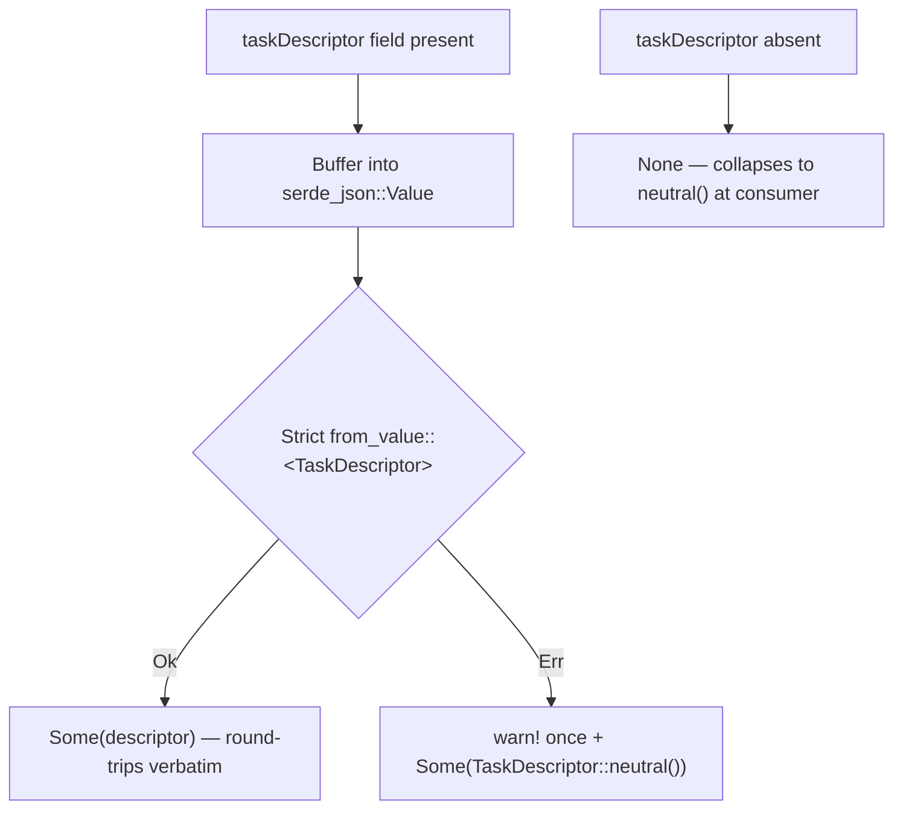

# PR Summary — Issue #1402

## Summary

A malformed or wrong-cased `taskDescriptor` no longer fails the whole
discovery FFI JSON parse. Previously, Issue #1314 plumbed the optional
`task_descriptor` field through with a strict `serde` derive: an **absent**
field defaulted to `None`, but a **present-but-invalid** field aborted the
*entire* request deserialisation. When NEAT-AI (#2785) forwarded the internal
TypeScript descriptor shape (`"outputSquashFamily": "unbounded"`, lowercase)
instead of the documented PascalCase wire shape, `analyze_parallel` failed
with an `unknown variant "unbounded"` input JSON parse error, silently
disabling Rust synapse/neuron analysis for the selected focus neurons.

This change adds a permissive consumer-side adapter
(`deserialize_permissive_task_descriptor`) on the three external FFI input
structs — `RecordDiscoveryInput`, `AnalyzeParallelInput`, and
`RankFocusNeuronsInput`. The field is buffered into a `serde_json::Value` and
then strictly converted; on any error it logs once (`tracing::warn!`) and
falls back to `TaskDescriptor::neutral()` rather than failing the call. Valid
wire payloads still round-trip verbatim. The real producer-side fix remains
NEAT-AI#3012; this is the defensive hardening so a future producer mistake
cannot silently break analysis again.

Closes #1402.

## Evidence

This is a backend/library change with no web interface, so no screenshot
applies. Verified via the new regression tests (red → green) and the full
`./quality.sh` gate (clippy, type check, tests, docs, release build — all
green).

### Deserialisation flow

### TDD red → green

Before the fix, all six new tests failed with the
`unknown variant "unbounded"` input JSON parse error. After applying
the permissive adapter, all six pass and the existing #1314 contract tests
remain green.

## Test Plan

New file `tests/ffi/issue_1402_lowercase_task_descriptor_regression.rs`:

- `analyze_parallel_input_with_lowercase_task_descriptor_falls_back_to_neutral`
  — the exact NEAT-AI MSE producer payload deserialises and collapses to
  `neutral()`.
- `analyze_parallel_internal_does_not_return_input_json_parse_error` — drives
  the real `analyze_parallel_internal` entry point and asserts no
  `Failed to parse input JSON` error.
- `record_discovery_input_with_lowercase_task_descriptor_falls_back_to_neutral`
  and `rank_focus_neurons_input_with_lowercase_task_descriptor_falls_back_to_neutral`
  — same hardening on the other two external inputs.
- `lowercase_enum_strings_never_fail_top_level_parse` — explicit regression
  guard over several malformed enum strings, unknown fields, and a
  `numOutputs` type mismatch.
- `non_object_task_descriptor_falls_back_to_neutral` — a non-object
  descriptor (bare string) also falls back rather than failing.

Unchanged contract tests (`tests/ffi/issue_1314_task_descriptor_plumbing.rs`)
confirm valid PascalCase/camelCase payloads still round-trip verbatim and
absent fields still deserialise to `None`.
