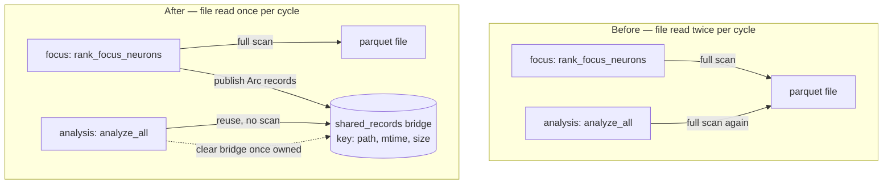

# Eliminate cross-phase parquet reload (Issue #1406)

## Summary

Focus selection (`rank_focus_neurons`) and the analysis phase (`analyze_all`)
are two separate FFI calls that each **fully read the same parquet file from
scratch**. On large files the second full scan — the "parquet reload" — consumed
a meaningful slice of the analysis deadline before any synapse/neuron analysis
began, a primary driver of the GRQ-23 starvation.

This PR loads the grouped discovery records **once per discovery cycle** and
shares them across the two phases via a small process-side bridge
(`analysis::cache::shared_records`), keyed by `(path, mtime, size)`:

- The **first** phase to load a parquet (normally focus selection) publishes the
  grouped, `obs_index`-sorted records — one `Arc<Vec<DiscoverRecord>>` per neuron
  — into a single-entry global.
- The **second** phase (analysis) reuses them when the file is unchanged,
  bypassing the second full scan. The analysis `RecordCache` builds from the
  shared map with cheap `Arc` clones, then **releases** the bridge so it owns the
  records itself — preserving the pre-#1406 memory lifetime (records freed when
  the analysis cache drops).
- When the file changes — a new cycle writing a fresh temp parquet — the
  `(mtime, size)` key misses and a fresh load occurs. Only the most recent entry
  is retained.

Loading-strategy selection (#1376) is untouched: the bridge is only used on the
preload path. Memory-constrained hosts that choose lazy mode keep their existing
on-demand behaviour.

`Closes #1406`

## Evidence

This is a backend/library change with no web interface — no screenshot
applicable. Verification is via tests (below) and a before/after load
measurement.

### Data flow before vs after

### Before/after load measurement

Ad-hoc measurement (300 neurons × 800 obs, 240k records) comparing the two
full-read sequence (old) against load-then-reuse (new):

| Sequence | Time |
|----------|------|
| OLD — two full grouped reads | ~40.5 ms |
| NEW — load + bridge reuse | ~16.9 ms |
| **Speedup** | **~2.4×** |

The second full scan is structurally eliminated; the remaining time is a single
read. The saving scales with file size — on the large parquet files that drove
GRQ-23 starvation, this reclaims the whole second-scan slice of the analysis
deadline.

## Test Plan

New file `tests/issue_1406_cross_phase_parquet_reload.rs`:

- `focus_then_analysis_reads_parquet_once` — runs focus ranking then builds the
  analysis `RecordCache` on the same file and asserts (via `Arc::as_ptr`
  identity) that the analysis cache serves the **same record allocation** the
  focus phase loaded. A second full read would allocate fresh `Vec`s with
  different pointers, so pointer equality proves a single read. Also asserts the
  bridge is released after the analysis cache is built.
- `shared_cache_reuses_records_for_unchanged_file` — two loads of an unchanged
  file return the same `Arc` (no reload); records are grouped and sorted by
  `obs_index`.
- `shared_cache_invalidates_when_file_changes` — overwriting the file with a
  different record count misses the cache and reloads into a fresh allocation
  reflecting the new contents.

Regression coverage: existing focus and cache suites pass unchanged
(`cache_missing_parquet`, focus unit tests, `neuron` integration tests). The
full `./quality.sh` gate passes (fmt, clippy `-D warnings`, check, tests, doc,
release build).
