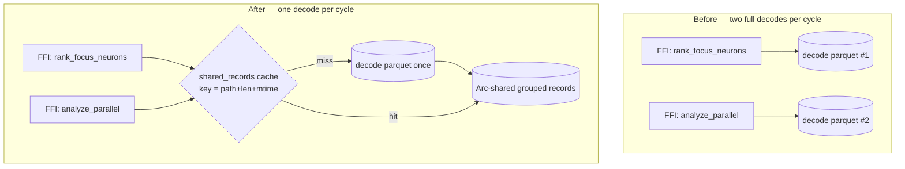

# PR Summary — Issue #1406

## Summary

Eliminate the cross-phase parquet reload. Focus selection
(`rank_focus_neurons`) and the analysis phase (`analyze_all` →
`RecordCache::new_adaptive`) are two separate FFI calls that each fully decoded
the same parquet file from scratch. On large files that second full scan — the
"parquet reload" — consumed a meaningful slice of the analysis deadline before
any synapse/neuron work began, a primary driver of the GRQ-23 starvation.

This introduces a **process-side single-decode cache** (Issue option 2): a
single entry keyed by the parquet file's path, byte length, and modification
time (`src/parquet_format/shared_records.rs`). When focus selection decodes the
file on the preload path, it populates the cache; when the analysis phase loads
records for the same file moments later, it reuses that decode instead of
scanning the file again. A changed file (new recording → new size/mtime)
invalidates the entry automatically, and an explicit `invalidate()` is exposed
for control and tests.

Records are stored behind nested `Arc`s so the analysis cache reuses each
neuron's records with a cheap `Arc` clone (zero record copy). Focus ranking
keeps sorting its own copy by `obs_index`, and the analysis cache keeps decode
order — both orderings are byte-identical to the pre-cache behaviour, so neither
focus nor analysis output changes.

Closes #1406.

## Evidence

This is a backend/Rust change with no web interface — no screenshot applies.
Verification is via tests and the per-file decode counter
(`shared_records::decodes_for_path`), which mirrors the acceptance criterion
"the parquet is read once across the two phases".

### Data flow — before vs after

### Acceptance criteria

- **Single full record load across the two phases** — verified by
  `focus_then_analysis_decodes_parquet_once`: after focus selection then the
  analysis `RecordCache::new_adaptive`, `decodes_for_path(path) == 1`. The
  analysis phase's `profile.record_phase("parquet_loading", …)` therefore drops
  to near-zero on the cache hit.
- **No behavioural change to focus/analysis outputs** — focus keeps its
  `obs_index` sort, analysis keeps decode order; existing focus (165) and
  recording/cache (84) integration tests pass unchanged.
- **Loading-strategy decisions (#1376) remain correct** — only the *preload*
  paths share their decode; lazy/streaming/LRU low-memory paths are untouched.
- **A test asserts the parquet is read once across the two phases** — added (see
  Test Plan).

## Test Plan

New integration binary `tests/issue_1406_shared_parquet_decode.rs` (its own
process, `#[serial]`, so the process-global cache has a single user at a time
and the decode counter is deterministic):

- `second_load_is_a_cache_hit` — a repeat load of the same file does not decode
  again and hands back the identical shared decode (`Arc::ptr_eq`); `invalidate`
  clears the slot.
- `changed_file_invalidates_cache` — rewriting the file with a different length
  decodes fresh and never serves stale records.
- `focus_then_analysis_decodes_parquet_once` — the acceptance-criterion test:
  `rank_focus_neurons` then `RecordCache::new_adaptive` on the same parquet
  decode the file exactly once.

Regression coverage: existing `tests/focus` and `tests/recording`
(including `issue_648_deadline_aware_parquet_loading`) suites pass with the
shared cache in place.
