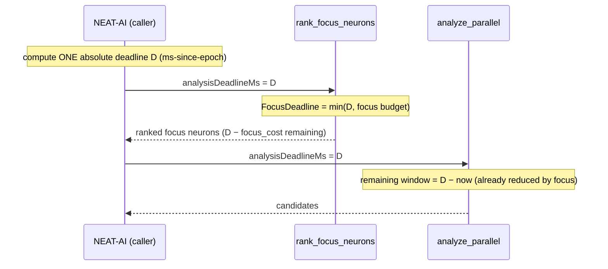

# Unify focus selection under the shared analysis deadline (Issue #1407)

## Summary

Focus selection (`rank_focus_neurons`) ran as a separate FFI call **before**
`analyze_parallel` and enforced its **own** wall-clock budget
(`focus_ranking_budget_ms`) derived from a fresh `Instant::now()`. That budget
was independent of the analysis deadline, so the time focus selection (plus its
parquet load) consumed was never billed against the discovery budget — synapse
/neuron analysis could begin with far less wall-clock than the configured
budget implied.

This change extends the absolute-deadline model from #1097 across the
focus→analysis boundary so both phases bill against **one** budget:

- `rank_focus_neurons` now accepts the same absolute discovery deadline
  (`analysisDeadlineMs`, ms-since-epoch) that `analyze_parallel` already
  enforces. The caller computes the deadline once and passes it to both FFI
  calls.
- `FocusDeadline` derives its expiry from that shared absolute deadline rather
  than a fresh per-call relative window. Focus selection aborts at whichever is
  **sooner**: the shared deadline or the
  `NEAT_AI_DISCOVERY_FOCUS_RANKING_BUDGET_MS` wall-clock budget (now a safety
  net, not an independent window).
- A new shared accounting primitive `remaining_ms_until` lives alongside
  `build_deadline` / `deadline_to_absolute_ms` in `analysis/utils/deadline.rs`,
  applying the same year-2000 epoch heuristic so both phases interpret the
  deadline identically.

Because the deadline is absolute, time spent in focus selection naturally
shrinks the window left for analysis — the later phase sees the remainder, not
a fresh full window. When `analysisDeadlineMs` is omitted from the focus call,
the legacy budget-only behaviour applies (backwards compatible).

Closes #1407.

## Evidence

This is a backend/FFI change with no web interface to screenshot. Verified via
unit and integration tests (`./quality.sh` passes cleanly).

### Data flow

### Acceptance criteria

- **Aggregate cannot exceed the discovery budget** — both phases abort at the
  same absolute deadline; focus is additionally capped by its budget+grace.
  Covered by `resolve_uses_shared_deadline_when_sooner_than_budget` and
  `resolve_uses_budget_when_shared_deadline_is_distant`.
- **Focus time reduces the analysis window** — proven deterministically by
  `shared_absolute_deadline_reduces_remaining_window_for_later_phase`: an 80s
  focus cost against a 100s shared budget leaves analysis exactly 20s, not a
  fresh 100s.
- **`NEAT_AI_DISCOVERY_FOCUS_RANKING_BUDGET_MS` reconciled & documented** —
  doc comment in `config/user_facing.rs` and `docs/FFI_API.md` now describe it
  as a safety-net cap on the shared deadline, no longer an independent window.
- **A passed shared deadline aborts focus immediately** —
  `resolve_with_passed_deadline_aborts_immediately`.

## Test Plan

New tests (all calling real functions and asserting on results — no source
grepping):

- `src/analysis/utils/deadline_tests.rs`
  - `remaining_ms_until_passes_through_relative_durations`
  - `remaining_ms_until_subtracts_now_for_absolute_timestamps`
  - `remaining_ms_until_saturates_to_zero_when_deadline_passed`
  - `remaining_ms_until_none_without_deadline`
  - `shared_absolute_deadline_reduces_remaining_window_for_later_phase`
    (the core acceptance-criterion test)
- `src/focus/ranking/mod.rs` (inline — `FocusDeadline` and `resolve` are
  private)
  - `resolve_uses_shared_deadline_when_sooner_than_budget`
  - `resolve_uses_budget_when_shared_deadline_is_distant`
  - `resolve_with_passed_deadline_aborts_immediately`
- `tests/ffi/issue_1407_focus_shared_deadline.rs` (FFI deserialisation contract)
  - `rank_focus_input_omits_analysis_deadline_to_none`
  - `rank_focus_input_supplied_analysis_deadline_round_trips`
  - `rank_focus_input_accepts_relative_deadline_duration`

`./quality.sh` passes cleanly (fmt, clippy `-D warnings`, check, tests, doc,
release build).

## Files Changed

- `src/analysis/utils/deadline.rs` — new `remaining_ms_until` shared primitive.
- `src/analysis/utils/mod.rs` — re-export `remaining_ms_until`.
- `src/focus/ranking/mod.rs` — `FocusDeadline::resolve` / `from_shared_deadline`
  (replacing `from_config`); new `rank_focus_neurons_with_descriptor_and_deadline`
  entry point; `shared_deadline_ms` threaded through `RankCoreArgs`.
- `src/focus/mod.rs` — re-export the new entry point.
- `src/ffi_types/requests.rs` — `analysisDeadlineMs` field on
  `RankFocusNeuronsInput`.
- `src/ffi_internal/analysis.rs` — wire `analysisDeadlineMs` into the focus call.
- `src/config/user_facing.rs` — document the budget/shared-deadline reconciliation.
- `docs/FFI_API.md` — document the shared deadline across focus selection.
- `Cargo.toml` — version bump `0.74.88` → `0.74.89`.
