# Reserve a guaranteed minimum analysis budget (Issue #1408)

## Summary

Synapse and neuron analysis previously skipped **all** remaining work once the
shared discovery deadline was exhausted by focus selection and parquet loading
(`synapse/orchestration.rs`, `neuron/preparation.rs`), so analysis could
complete 0 of N targets — the GRQ-23 symptom reported in #1405. The only
safeguard was a soft warning when <60s remained.

This PR introduces an **enforced floor** that guarantees synapse/neuron analysis
a minimum slice of the discovery budget:

- **Curtail loading, not analysis.** Parquet loading is now capped at
  `overall_deadline − reserve`, so the reserved analysis window survives even
  when loading is slow. Analysis still bills against the full shared deadline.
- **Fraction-capped reserve.** The effective reserve is
  `min(reserve_ms, remaining × fraction)`. The fraction cap means the reserve
  shrinks on tight budgets rather than starving loading to zero — a 10s window
  with a 60s floor and a 0.5 fraction reserves 5s, not 60s.
- **Fail fast when truly exhausted.** If focus selection and parquet loading
  have already consumed so much that less than the 1s hard floor would remain,
  `analyze_all` returns a clear, actionable error (suggesting a larger
  `discoveryAnalysisTimeoutMinutes`, or opting out) instead of analysing 0/N
  targets.
- **Configurable with sensible defaults**, documented in `README.md` and
  `src/config/mod.rs`:
  - `NEAT_AI_DISCOVERY_ANALYSIS_RESERVE_MS` (default `60000`, `0` disables,
    clamped `[1, 3600000]`).
  - `NEAT_AI_DISCOVERY_ANALYSIS_RESERVE_FRACTION` (default `0.5`, honoured in
    `(0.0, 0.9]`).

Builds on the unified shared deadline (#1097/#1407) and degrades safely: with no
deadline supplied or the reserve disabled, behaviour is unchanged.

Closes #1408.

## Evidence

Backend/CLI change — no web interface to screenshot. Verified via unit and
integration tests (below) plus `cargo build --release --lib` and `cargo doc`.

Reserve flow within `analyze_all`:

```mermaid
flowchart TD
    A[Shared absolute deadline] --> B{Reserve enabled?}
    B -- "reserve = 0" --> L[Loading uses full deadline<br/>pre-1408 behaviour]
    B -- "reserve > 0" --> C[effective = min&#40;reserve_ms, remaining × fraction&#41;]
    C --> D{effective &lt; 1s hard floor?}
    D -- yes --> E[Fail fast: actionable error<br/>raise discoveryAnalysisTimeoutMinutes]
    D -- no --> F[Curtail loading at deadline − effective]
    F --> G[Parquet load by curtailed deadline]
    G --> H[Synapse / neuron analysis<br/>keeps ≥ effective reserve → completes &gt; 0 targets]
```

## Test Plan

**New unit tests — `src/analysis/utils/deadline_tests.rs` (Issue #1408):**
- `effective_reserve_uses_absolute_floor_on_generous_budget`
- `effective_reserve_capped_by_fraction_on_small_budget`
- `effective_reserve_zero_floor_disables`
- `effective_reserve_clamps_fraction_above_one`
- `loading_deadline_leaves_reserve_for_analysis`
- `loading_deadline_never_before_now`
- `loading_deadline_none_without_deadline`
- `reserve_shortfall_none_when_window_is_ample` — the core #1408 scenario:
  focus/parquet consumed most of the budget, yet analysis still receives its
  reserved window (a positive 45s slice → completed targets > 0).
- `reserve_shortfall_some_when_budget_exhausted` — fail-fast trigger.
- `reserve_shortfall_disabled_when_reserve_zero`
- `reserve_shortfall_none_without_deadline`
- `reserved_loading_deadline_systemtime_subtracts_reserve`
- `reserved_loading_deadline_passthrough_when_disabled`
- `reserved_loading_deadline_none_without_deadline`

**New config-accessor tests — `tests/analysis/issue_1408_analysis_reserve.rs`:**
default, `0`-disable, custom value, clamping, and invalid-input fallback for
both `analysis_reserve_ms()` and `analysis_reserve_fraction()`.

**Regression coverage:** the full `tests/analysis` binary (602 tests) and the
lib `deadline` suite (72 tests) pass, confirming the loading-deadline
curtailment and fail-fast path do not break existing `analyze_all` runs with
30s/60s budgets (#1097, #1098).

## Known pre-existing issue (out of scope)

`tests/issue_1406_cross_phase_parquet_reload.rs` does **not compile** on the
`milestone/1405-…` branch — it imports `analysis::cache::shared_records` and
calls `shared_records::get` / `get_or_load_with_deadline`, an API that does not
exist in the merged #1406 code (only `load_grouped_records_shared`,
`decodes_for_path`, `invalidate` exist). This breakage predates this PR
(confirmed by stashing these changes) and belongs to issue #1406, so it is left
untouched here. It is the sole reason a full `cargo test --tests` cannot
compile; every other test binary builds and passes.
