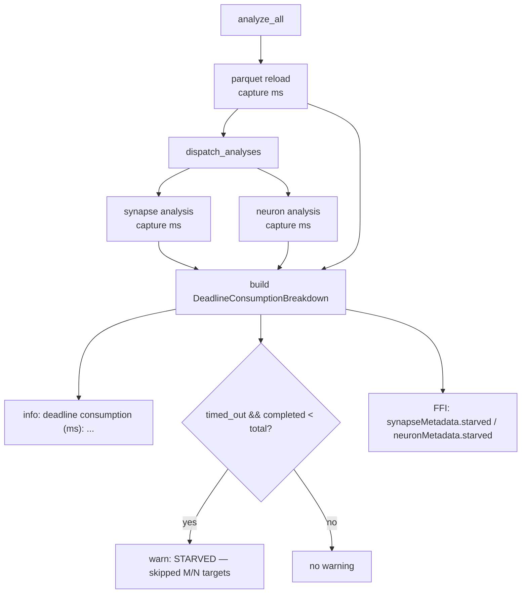

## Summary

Surfaces synapse/neuron **starvation** and a consolidated **per-cycle
deadline-consumption breakdown** so the production logs can attribute *where* the
analysis deadline went and show *that* synapse/neuron analysis was curtailed.
This is **observability only** — no analysis math changed. Closes #1409.

The data needed to diagnose #1405 already existed but was scattered: per-phase
timings lived in `ProfileData`, while the starvation signals (`timed_out`,
`completed_focus_neurons`, `total_focus_neurons`) lived on the per-phase
metadata and were never emitted as an explicit, greppable warning. This PR
consolidates them.

### What changed

- **New `analysis::deadline_breakdown` module** — a small, pure
  `DeadlineConsumptionBreakdown` (+ `PhaseCompletion`) that:
  - renders one greppable summary line (a stable deadline-consumption marker) attributing ms
    to parquet reload, synapse analysis, neuron analysis, and total analysis,
    plus `completed/total` focus-neuron ratios per phase;
  - emits an explicit `STARVED` `warn!` with skipped/total counts when a phase
    timed out **and** left focus neurons unanalysed.
- **`analysis::orchestration`** — `dispatch_analyses` now returns per-phase
  wall-clock durations; `analyze_all` captures the parquet-reload and total
  durations and emits the breakdown once per invocation, just before returning.
- **FFI metadata** — added a `starved` boolean to both
  `synapseMetadata` and `neuronMetadata` so the production TypeScript layer can
  detect starvation programmatically without recomputing
  `timedOut && completedFocusNeurons < totalFocusNeurons`. The completion
  ratios themselves were already present.
- **README** — added a troubleshooting row pointing at the production deadline /
  `STARVED` log markers and the `starved` flag.

The focus phase (parquet load + focus ranking) runs in the separate
`rank_focus_neurons` FFI call; its mode + elapsed are surfaced there
(Issue #1377) and combined by the production layer. Per-phase ms for disabled phases
render as `n/a` rather than fabricated zeroes.

### Out of scope

Fixing the underlying consumption (reload-dedup, budget-unification,
reserved-floor) — those are the sibling sub-issues. This PR only makes the
problem measurable.

## Evidence

Backend/CLI library change — no web interface to screenshot. Verified via the
new unit/integration tests (`cargo test --test deadline_breakdown_test`, 8
passing) plus `cargo clippy`, `cargo check`, `cargo doc`, and the release build,
all clean for the changed code.

## Test Plan

New integration test `tests/deadline_breakdown_test.rs` (8 cases), covering the
observable behaviour (not implementation):

- `phase_completion_starved_when_timed_out_with_remaining` /
  `phase_completion_not_starved_when_all_completed` /
  `phase_completion_not_starved_without_timeout` — the starvation predicate.
- `simulated_timeout_emits_starved_warning_with_counts` — a simulated timeout
  produces the `STARVED` warning naming skipped/total per phase, and `emit()`
  does not panic.
- `starved_warning_only_names_curtailed_phase` — only the curtailed phase is
  named.
- `completed_run_has_no_starvation_warning` — no warning on a clean run.
- `summary_line_attributes_all_phases` /
  `summary_line_marks_disabled_phases_as_not_applicable` — the consolidated,
  greppable summary line.

## Pre-existing unrelated breakage (not introduced here)

The milestone branch already fails to compile the test crate
`tests/issue_1406_cross_phase_parquet_reload.rs`: it imports
`analysis::cache::shared_records`, but Issue #1406's cross-phase bridge module
is present yet never declared in `cache/mod.rs`, and its production integration
(focus phase populating the bridge) is unimplemented. This is sibling Issue
#1406's work — explicitly out of scope for #1409 — so this PR deliberately does
not touch it. As a result `./quality.sh`'s aggregate `cargo test --lib --tests`
cannot go green on this branch until #1406 lands. All other gates (clippy,
check, doc, release build, and this PR's new tests) pass cleanly. Verified the
failure pre-exists this PR via `git stash`.
