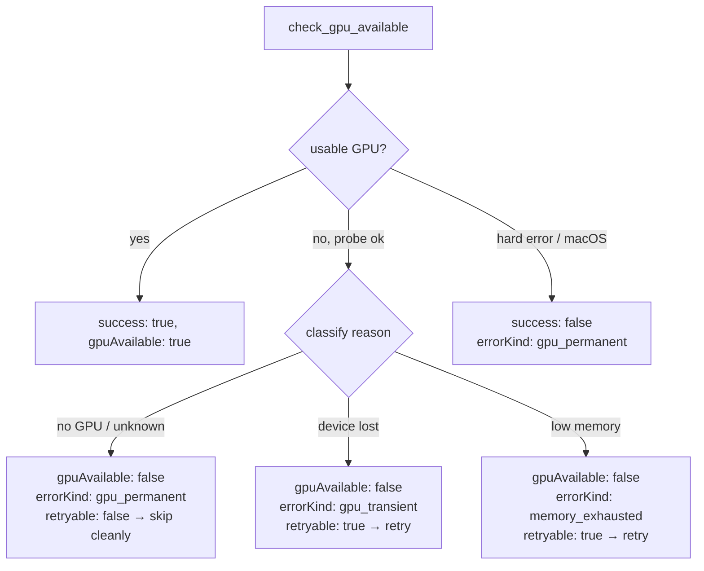

## Summary

On a host with no usable GPU, discovery hard-requires a GPU for synapse/neuron
analysis, so every pass completed with `0 candidates` — indistinguishable from
genuine search exhaustion. The crate already fails `analyze_parallel` fast with a
structured `GpuUnavailable` error, but the **pre-pass capability probe**
(`check_gpu_available()`) only returned `gpuAvailable: false` plus a free-text
`reason` on the graceful-disable path. The caller had no programmatic way to tell
a permanent "discovery-unsupported-on-host" skip from a transient, retryable
error *before* starting a pass.

This change (Option A — honest gate) makes `check_gpu_available()` emit a
**distinct, structured capability verdict**: when no usable GPU is present, the
response now carries `errorKind` (`gpu_permanent` / `gpu_transient` /
`memory_exhausted`) and `retryable` alongside the existing `gpuAvailable` and
`reason`. Callers branch on this verdict to skip discovery cleanly (permanent) or
retry (transient) — never running a guaranteed 0-candidate pass.

No "CPU fallback" claim exists anywhere in the Rust source (confirmed by grep);
the false message is emitted by the out-of-scope calling layer. Docs were updated
to state plainly there is no CPU fallback and that callers must branch on the
verdict before scheduling a pass.

Closes #1419.

## Changes

- `src/ffi_internal/gpu.rs` — extracted a pure, testable `build_check_gpu_output()`
  that maps a `GpuAvailabilityResult` into `CheckGpuOutput`. The GPU-less path now
  classifies the unavailability `reason` into a structured `errorKind`/`retryable`
  pair (defaulting to non-retryable `gpu_permanent` when the reason is unknown or
  absent — a host with no usable GPU is unsupported, not worth retrying).
- `docs/FFI_API.md`, `README.md` — documented the structured verdict and
  reaffirmed there is no CPU fallback.
- `Cargo.toml` — version bump `0.74.89` → `0.74.90`.

## Capability verdict flow



## Evidence

Backend/CLI change with no web interface — verified via unit tests rather than a
screenshot.

```
running 5 tests
test ffi_internal::gpu::tests::available_gpu_yields_clean_success ... ok
test ffi_internal::gpu::tests::hard_error_reports_unsuccessful_permanent_verdict ... ok
test ffi_internal::gpu::tests::gpu_less_host_yields_distinct_permanent_verdict ... ok
test ffi_internal::gpu::tests::missing_reason_defaults_to_permanent ... ok
test ffi_internal::gpu::tests::transient_gpu_failure_is_retryable ... ok

test result: ok. 5 passed; 0 failed
```

`./quality.sh` passes cleanly (fmt, clippy `-D warnings`, check, full test suite,
doc build, release build).

## Test Plan

New unit tests in `src/ffi_internal/gpu.rs` exercise `build_check_gpu_output()`
against simulated `GpuAvailabilityResult` inputs (the no-GPU environment the issue
requires):

- `gpu_less_host_yields_distinct_permanent_verdict` — a GPU-less host yields the
  distinct verdict (`gpuAvailable: false`, `gpu_permanent`, `retryable: false`),
  never a silent "available" answer.
- `transient_gpu_failure_is_retryable` — device-lost/creation-failure classifies
  as `gpu_transient` and `retryable: true`.
- `hard_error_reports_unsuccessful_permanent_verdict` — macOS-style hard error
  keeps `success: false` with a permanent classification and an error message.
- `available_gpu_yields_clean_success` — a usable GPU yields a clean success with
  no error classification.
- `missing_reason_defaults_to_permanent` — an unexplained no-GPU host defaults to
  the non-retryable permanent verdict.

## Acceptance criteria

- [x] A GPU-less host cleanly receives a distinct, logged verdict (Option A);
  the existing `analyze_parallel` fail-fast (`GpuUnavailable`, `gpu_permanent`)
  is retained.
- [x] No log path claims a "CPU fallback" — confirmed absent from the Rust source.
- [x] The crate exposes a programmatic capability verdict (usable-GPU: yes/no,
  with reason **and** structured `errorKind`/`retryable`) the caller can branch
  on before starting a pass.
- [x] Test: a simulated no-GPU environment yields the distinct verdict, never a
  silent `found 0 candidates`.
