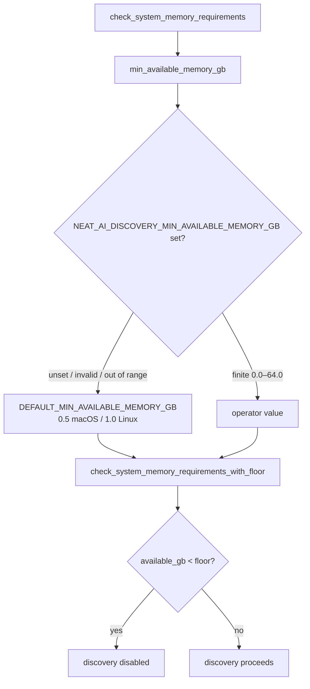

## Summary

Made the discovery available-memory floor configurable at runtime so a
small-but-capable ~8GB host is no longer gated off every pass. On such hosts the
discovery runtime itself already holds most of the RAM by the time analysis
starts, so the fixed platform floor (0.5GB macOS / 1.0GB Linux) almost always
fails the check — the second environmental contributor to the #1418
discovery-drought root cause.

Operators can now raise or lower the floor via the new
`NEAT_AI_DISCOVERY_MIN_AVAILABLE_MEMORY_GB` environment variable without
recompiling. `0` disables the available-memory gate entirely; invalid or
out-of-range values (`0.0–64.0`) fall back to the unchanged platform default.
The 4GB total-memory minimum is intentionally left untouched.

Closes #1420.

### What changed

- `src/analysis/utils/memory.rs`
  - Renamed `MINIMUM_AVAILABLE_MEMORY_GB` → public `DEFAULT_MIN_AVAILABLE_MEMORY_GB`
    (platform-specific default unchanged).
  - Split `check_system_memory_requirements` into an env-resolving wrapper and a
    new pure `check_system_memory_requirements_with_floor(available, total, min_available_gb)`
    so the threshold boundary is unit-testable without mutating global env.
  - The gate's failure message now points operators at
    `NEAT_AI_DISCOVERY_MIN_AVAILABLE_MEMORY_GB`.
- `src/config/user_facing.rs`
  - Added pure `resolve_min_available_memory_gb(raw, default_gb)` and the cached-free
    accessor `min_available_memory_gb()` (reads the env var, validates, clamps to
    `0.0–64.0`, falls back to the platform default).
- `src/analysis/utils/mod.rs` — re-exported the new symbols.
- Documentation: README env-var table + troubleshooting row, `config/mod.rs` doc
  table, and AGENTS.md env-var table.

### Default vs override flow

## Evidence

Backend/library change with no web interface — no screenshot applicable.
Verified via the test suite below and the full `./quality.sh` gate (fmt, Clippy
`-D warnings`, check, doc build, lib+integration tests, release build) passing
cleanly.

Recommended setting for the documented 8GB-host scenario (production host: ~0.15GB free):
`NEAT_AI_DISCOVERY_MIN_AVAILABLE_MEMORY_GB=0.1` lets discovery proceed; `0`
disables the gate. If the host is genuinely too small it should be excluded by
the scheduler rather than aborting silently every pass.

## Test Plan

Added unit tests (all passing):

- `src/config/mod.rs`
  - `min_available_memory_gb_unset_returns_default`
  - `min_available_memory_gb_accepts_valid_overrides` (lower / disable / raise / whitespace)
  - `min_available_memory_gb_rejects_invalid_overrides` (empty, non-numeric, negative, NaN, inf, out-of-range)
  - `min_available_memory_gb_boundary_values` (max bound inclusive/exclusive)
  - `min_available_memory_gb_accessor_returns_sane_default`
- `src/analysis/utils/memory_tests.rs`
  - `floor_check_passes_above_explicit_floor`
  - `floor_check_fails_below_explicit_floor`
  - `floor_check_boundary_is_inclusive`
  - `floor_lowered_lets_small_host_proceed` (reproduces the #1420 ~8GB / 0.15GB-free scenario)
  - `floor_check_total_memory_gate_still_applies`

Existing `check_system_memory_requirements` tests remain unchanged and pass
(env unset → platform default → identical behaviour).
