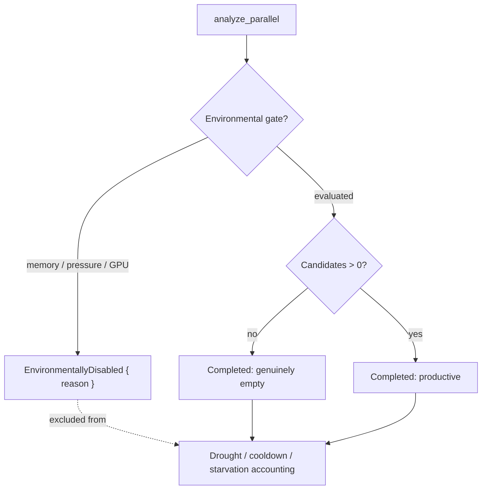

## Summary

Fixed the drought-signal conflation where a discovery pass gated by an
environmental check (memory budget, system memory pressure, or a missing GPU
adapter) returned `0 candidates` — the **same** surface as a genuinely-exhausted
search. Drought counters, the drought diagnostic (#1202), and the per-target /
per-module trackers therefore treated *"this host can't run discovery"* as
*"the creature has no improving move"*, corrupting every downstream mitigation
decision. **Closes #1421.**

The change introduces a distinct, countable outcome category and guards the
accounting trackers so environmentally-disabled passes are excluded — without
silencing genuine droughts.

### What changed

- **New `AnalysisOutcome` model** (`src/analysis/analysis_outcome.rs`):
  - `AnalysisOutcome::{Completed { candidates }, EnvironmentallyDisabled { reason }}`.
  - `EnvironmentalDisableReason::{MemoryGated, MemoryPressure, GpuUnavailable}`.
  - `PassOutcomeCounts` — separates `productive` / `genuinelyEmpty` /
    `environmentallyDisabled` for the discovery summary.
  - `AnalysisOutcome::from_result` (memory budget / pressure) and
    `gpu_unavailable()` (the GPU early-return `Err`) classifiers.
- **Tracker guards** that no-op on a gated pass and return `false`:
  - `DiscoveryOutcomeLog::record_outcome` — gated passes bump
    `environmentallyDisabledPasses` instead of extending the trailing-failure
    streak (with `#[serde(default)]` for backward compatibility).
  - `TargetFailureTracker::record_failure_unless_disabled`.
  - `ModuleStarvationTracker::record_failure_unless_disabled`.
  - `CandidateOutcomeCache::record_unless_disabled`.
- **Distinct, countable surface**: `environmentallyDisabled` on
  `AnalyzeParallelOutput` (set on the memory/pressure/GPU paths) plus a
  dedicated `tracing::warn!` (`Issue #1421: discovery pass environmentally
  disabled`, with a `reason=` field) separate from the #1202 drought warn.
- **Docs**: new section + flow diagram in `docs/DROUGHT_PLAYBOOK.md`.

### Flow

## Evidence

Backend/library change — no UI to screenshot. Verified by the test suite and a
clean `./quality.sh` run (fmt, clippy `-D warnings`, check, full test suite,
doc build, release build all pass).

Acceptance criteria mapping:

- **A memory/GPU-gated pass does not increment any drought / target-failure /
  module-starvation counter** → `record_*_unless_disabled` /
  `record_outcome` guards + their unit tests.
- **Logs/metrics report environmentally-disabled passes as a distinct,
  countable category** → `environmentallyDisabled` FFI field, the dedicated
  warn, `DiscoveryOutcomeLog::environmentally_disabled_passes`, and
  `PassOutcomeCounts`.
- **N consecutive gated passes do not trip the drought diagnostic, target
  cooldown, or module starvation** → `tests/issue_1421_environmental_disable.rs`.

## Test Plan

- `tests/issue_1421_environmental_disable.rs` (new): 25 consecutive gated
  passes leave the trailing-failure streak, target cooldown, module starvation,
  and candidate-cache suppression untouched; genuine empty passes still trip
  all three; `PassOutcomeCounts` separates the categories.
- `src/analysis/analysis_outcome.rs::tests` — classifier + predicate + counter
  coverage.
- `src/analysis/discovery_mode.rs::tests` — `record_outcome` ignores gated
  passes, counts genuine empties, gated passes between failures don't break the
  streak, serde round-trip, and legacy payloads without the new field.
- `src/analysis/target_failure_tracker.rs::tests` and
  `module_starvation_tracker.rs::tests` — gated passes never trip
  cooldown/starvation; genuine empties still do.
- `src/analysis/candidate_cache.rs::issue_1421_tests` — gated pass does not
  suppress; genuine failure is recorded.
