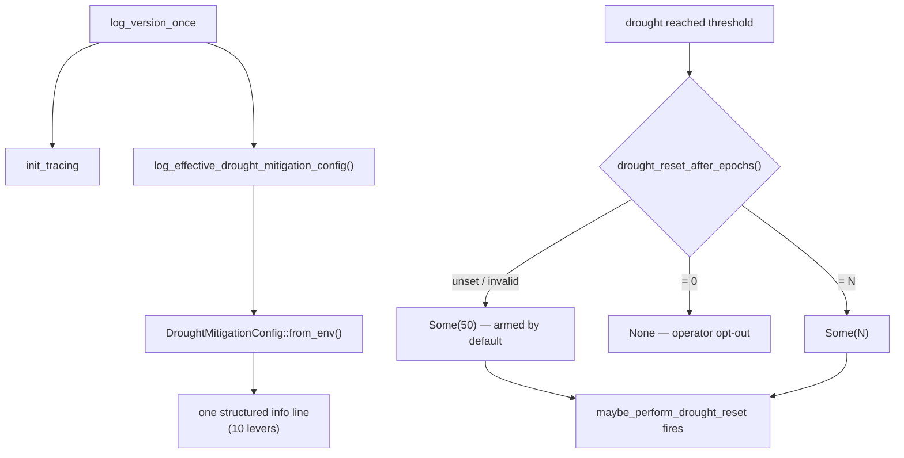

## Summary

Arms the #1205 drought escape hatch by default and makes the whole
drought-mitigation stack diagnosable from a single startup log line. Closes #1422.

Two changes:

1. **Escape hatch armed by default.** `drought_reset_after_epochs()` previously
   returned `None` (off) unless `NEAT_AI_DISCOVERY_DROUGHT_RESET_AFTER_EPOCHS`
   was set, so in production the one-shot reset never fired during the
   weeks-long drought it was built for. It now defaults to
   `DEFAULT_DROUGHT_RESET_AFTER_EPOCHS = 50` consecutive empty passes (2.5× the
   conservative-mode cap of 20, giving the gentler adaptive levers time to
   recover before the heavier cache flush). An explicit `0` is the deliberate
   opt-out; unparsable values fall back to the armed default rather than
   silently disabling the hatch.

2. **Effective config logged at startup.** A new
   `config::log_effective_drought_mitigation_config()` emits one structured
   `info` line enumerating every drought-mitigation lever, called once from
   `log_version_once()`. The values are snapshotted by the testable
   `DroughtMitigationConfig::from_env()`.

```text
INFO Issue #1422: effective drought-mitigation config
    drought_reset_after_epochs="50" drought_log_threshold=5
    low_success_rate_threshold=0.2 conservative_mode_max_epochs=20
    conservative_gain_multiplier=10 target_cooldown_failures=3
    target_cooldown_epochs=10 staleness_conservative_divisor=2
    staleness_extended_drought_divisor=4 module_starvation_failure_streak=15
```

### Acceptance criteria

- [x] With no env overrides, the escape hatch is armed (default `50`).
- [x] Discovery emits a single structured line enumerating the effective
  drought-mitigation config at startup.
- [x] Test: with defaults, `drought_reset_after_epochs()` returns the intended
  value (`Some(50)`).

> **Note on the plateau-novelty dependency:** the issue flags that clearing the
> failed-candidate cache *alone* can make a plateaued creature re-propose the
> same losing edits, and recommends pairing the reset with the plateau-novelty
> follow-up. That follow-up is independent (a separate search-diversification
> change) and out of scope here; this PR delivers the arming + observability
> half. The existing one-shot semantics (the reset fires at most once per
> failure streak, re-arming only after a successful pass) bound how often the
> cache is flushed in the interim.

## Evidence

Backend/CLI library change — no web UI to screenshot. Verified via the new unit
tests and the full `./quality.sh` gate (fmt, clippy `-D warnings`, check, doc
build, tests, release build) — **all quality checks passed**.



## Test Plan

New file `tests/issue_1422_drought_mitigation_config.rs`:

- `escape_hatch_armed_by_default_when_unset` — unset env ⇒ `Some(50)` (the
  acceptance-criterion test).
- `explicit_zero_disables_escape_hatch` — `0` ⇒ `None`.
- `positive_override_is_honoured` — `7` ⇒ `Some(7)`.
- `unparsable_value_falls_back_to_armed_default` — garbage ⇒ `Some(50)`.
- `whitespace_padded_override_is_parsed` — `"  12  "` ⇒ `Some(12)`.
- `from_env_reports_compiled_defaults_when_unset` — snapshot equals all
  compiled defaults; drought lever renders as its threshold.
- `from_env_reflects_overrides` — env overrides reflected; disabled lever
  renders as `"disabled"`.

Modified `tests/issue_1205_drought_reset_escape_hatch.rs`: updated only the
docstring of `lever_disabled_when_threshold_zero` to note the lever is now
armed by default and `0` is the opt-out. The test body is unchanged (it still
exercises the disabled path via `drought_reset_after = 0`).
