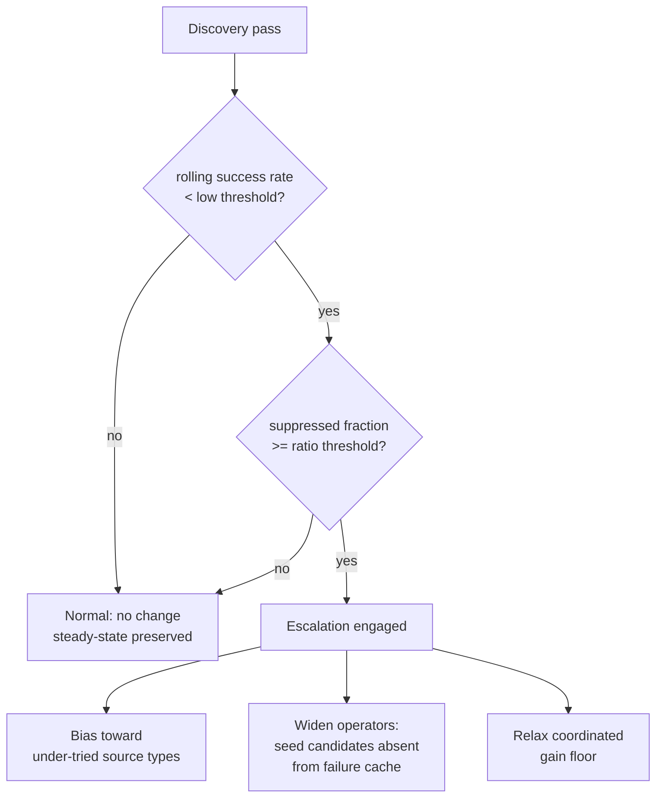

## Summary

Adds a **novelty / diversification escalation** lever for plateaued creatures.
Closes #1423.

Follow-up to #1418. The drought escape hatch (#1205) clears the *memory* of past
rejections, but on a genuinely search-exhausted creature the next pass simply
re-proposes the same losers once the candidate-cache suppression ages out — so a
reset just restarts the same doomed loop. This change escalates **what** is
proposed when the search is plateaued, rather than only forgetting what failed.

A new self-contained module, `src/analysis/novelty_escalation.rs`, operates on
the existing `CandidateOutcomeCache` and `DiscoveryMode` types (mirroring the
design of `drought_reset`) and exposes three inert-until-plateaued levers:

1. **Source-type novelty bias** — `rank_source_types_by_novelty()` orders
   candidates to favour under-tried source types, using the cache's existing
   `SourceTypeStats`. Complements the success-rate-driven `source_type_boost()`.
2. **Operator widening** — `seed_forced_novel_candidates()` detects when every
   standard operation on a `(source, target)` pair is suppressed and proposes an
   alternative operation from the widened operator set that has **never** been
   recorded in the cache (guaranteed absent from the failure cache). Operators
   are spread across pairs to maximise operation-type diversity.
3. **Gain-floor relaxation** — `gain_floor_multiplier()` loosens the
   coordinated-structural expected-gain floor when escalation engages, opposing
   conservative mode's tightening so structurally-novel candidates survive.

The escalation decision (`decide_escalation()`) only engages when the rolling
success rate is below the conservative-mode threshold **and** the suppressed
fraction of the candidate pool is at or above a configurable ratio — so a
healthy, steadily-accepting creature is unaffected.

Two operator-configurable env vars were added (documented in `README.md` and
`AGENTS.md`):

- `NEAT_AI_DISCOVERY_NOVELTY_SUPPRESSION_RATIO` (default `0.8`)
- `NEAT_AI_DISCOVERY_NOVELTY_GAIN_RELAXATION` (default `0.5`)

### Escalation decision flow

## Evidence

Backend/CLI library change — no web interface to screenshot. Verified via the
new tests, which exercise the real `CandidateOutcomeCache` and assert on
observable outcomes (candidate identity, cache membership, diversity counts),
not implementation details.

Acceptance criteria, each covered by a test in
`tests/issue_1423_novelty_escalation.rs`:

- **AC1** (`ac1_emits_novel_candidate_not_in_failure_cache`) — on a fully
  cache-suppressed pool, escalation emits ≥1 candidate whose
  `(source, target, operation)` is absent from the failure cache.
- **AC2** (`ac2_increases_candidate_diversity_under_drought`) — the escalated
  set spans strictly more distinct operation types and ≥2 distinct source types
  than the suppressed pool's single repeated operation.
- **AC3** (`ac3_no_escalation_on_non_plateaued_creature`) — a healthy rolling
  success rate keeps escalation inert (gain-floor multiplier stays `1.0`) even
  when candidates happen to be suppressed.

All tests pass under `./quality.sh` (fmt, clippy `-D warnings`, check, doc, full
test suite at `--test-threads=2`, release build).

> Note: `issue_1202_drought_diagnostic::six_empty_passes_...` is a pre-existing
> flake (a global tracing-subscriber log-capture race under parallel execution);
> it passes in isolation and on re-run, and is unrelated to this change, which
> touches neither orchestration nor the diagnostic path.

## Test Plan

- `tests/issue_1423_novelty_escalation.rs` (new) — AC1/AC2/AC3 + gain-floor
  relaxation, exercising the real cache.
- `src/analysis/novelty_escalation.rs` `#[cfg(test)]` unit tests — decision
  gating (engaged / not-plateaued / few-suppressed / empty pool), gain-floor
  clamping, source-type novelty ranking, eligible-vs-forced seeding, operator
  widening, and `max` / empty-input handling.
