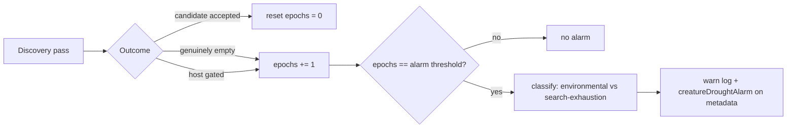

## Summary

Emit a durable, creature-level **drought alarm** when a creature goes weeks with
no accepted candidate. Closes #1424.

Until now the per-pass drought diagnostic (#1202, fires at a short trailing
streak) and the per-(creature, module) starvation tracker (#1273) both logged at
WARN, but nothing surfaced a creature-level signal when the *time since the last
accepted candidate* crossed a "weeks" threshold. Droughts were therefore
invisible until a human noticed — which is exactly how #1418 was found.

This adds that missing signal. A new module
`src/analysis/creature_drought_alarm.rs` emits **exactly one** structured alarm
on the pass where the creature's `epochs_since_last_accepted_candidate` crosses a
configurable threshold. The alarm carries:

- the creature identity (derived deterministically from the persistent
  output-neuron uuids, since the FFI `CreatureJson` carries no creature uuid);
- the epochs since the last acceptance; and
- an **environmental vs search-exhaustion** classification, reusing the #1421
  disambiguation (`environmentally_disabled_passes` vs genuinely-empty passes).

The payload is emitted both as a `tracing::warn!` line and as a
`creatureDroughtAlarm` field on `synapseMetadata` / `neuronMetadata`, so the
surrounding automation can raise an alert/issue without scraping logs.

### Behaviour

- **Threshold**: `NEAT_AI_DISCOVERY_DROUGHT_ALARM_EPOCHS`, default **100**, set
  `0` to disable. Unparsable values fall back to the default.
- **Exactly once**: the orchestrator advances the counter by one per pass, so
  the alarm fires only on the pass equal to the threshold — one alarm per
  drought, not one per pass.
- **Classification**: `environmental` when host-gated passes dominate (fix the
  host); `search_exhaustion` otherwise (escalate the creature). Ties favour
  search exhaustion.

### Out of scope (per the issue)

- The downstream alerting / issue-filing channel (lives in the surrounding
  automation).
- The disambiguation mechanism itself (#1421) — this issue consumes it.



## Evidence

Backend Rust/FFI library change — no web interface to screenshot. Verified via
unit + integration tests and the full quality gate (`./quality.sh` passes
cleanly: fmt, clippy `-D warnings`, check, tests, doc build, release build).

Key structured-log shape emitted on the crossing pass:

```text
WARN Issue #1424: creature-level discovery drought — no accepted candidate
for 100 epochs (search_exhaustion)
    creature_uuid="creature-…" epochs_since_last_accepted=100
    genuinely_empty_passes=100 environmentally_disabled_passes=0
    classification="search_exhaustion" alarm_threshold=100
```

## Test Plan

- **`src/analysis/creature_drought_alarm.rs`** (unit) — threshold crossing fires
  exactly once; below/above threshold stays silent; both classifications
  (`SearchExhaustion`, `Environmental`); tie-breaking; camelCase serde
  round-trip; `derive_creature_id` determinism / order-independence / empty
  handling; threshold `0` never fires.
- **`tests/issue_1424_creature_drought_alarm.rs`** (integration) — public-API
  exactly-once crossing across a simulated drought; both classification
  payloads; classification helper; camelCase JSON for automation; config
  resolver (default / override / `0` disables).
- **`src/config/mod.rs`** (unit) — `resolve_drought_alarm_epochs` default,
  positive override, `0` disables, invalid fallback.
- **`tests/issue_1422_drought_mitigation_config.rs`** (extended) — the new lever
  appears in the effective-config snapshot (armed default + `"disabled"`
  rendering when set to `0`).

All new and existing tests pass under `./quality.sh`.
