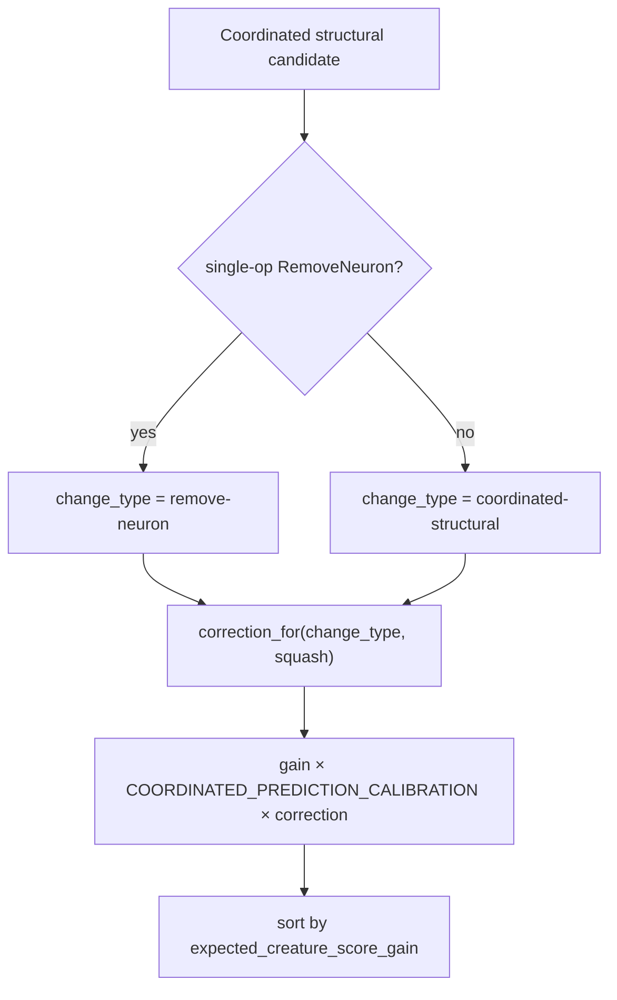

## Summary

Harmful-neuron (`remove-neuron`) candidates over-predicted their score gain by
~800× (failure bucket `247b83ab`, production discovery cache): predicted `+0.166` vs actual
`≈0`. Because `expected_creature_score_gain` is the candidate ranking key
(`src/analysis/discovery_dispatch.rs`), these inflated predictions crowded the
top of the candidate list every pass, failed scoring, and landed in the failure
cache only to be regenerated next pass — directly sustaining the discovery
drought.

The failure-cache calibration correction (`CalibrationCorrection::correction_for`,
Issues #1131 / #1162) was applied to the add-neuron and add-synapse paths but
**not** to the harmful-neuron path, so repeated remove-neuron misses never
shrank future remove-neuron predictions.

This PR wires the failure-cache correction into the harmful-neuron path:

- Added `CHANGE_TYPE_REMOVE_NEURON = "remove-neuron"`
  (`src/analysis/scoring/calibration_correction.rs`). The `from_failure_cache`
  EWMA already groups by `change_type`, so the new constant makes the
  remove-neuron bucket a first-class, documented key.
- In `apply_impact_to_coordinated`
  (`src/analysis/synapse/post_processing.rs`), a single-op `RemoveNeuron`
  coordinated candidate — functionally a `remove-neuron` change, recorded under
  that change type in the failure cache — is now calibrated with
  `correction_for(CHANGE_TYPE_REMOVE_NEURON, …)` instead of the generic
  `coordinated-structural` correction. Multi-op groups and non-removal single
  ops keep the `coordinated-structural` key (regression preserved). The
  corrected gain is used by the existing sort, so re-ranking follows
  automatically.

With nine cached `remove-neuron` failures replayed, the learnt correction
collapses to the floor (`≈0.001`), shrinking the predicted gain by ~1000× so
these doomed removals no longer dominate ranking.

Closes #1425.

## Evidence

Backend/CLI change — no web interface to screenshot. Verified by tests and the
full quality gate (`./quality.sh` → "✅ All quality checks passed!").

Before: a single-op `RemoveNeuron` used the `coordinated-structural` correction,
which never learns from `remove-neuron`-keyed failures → gain stayed inflated.
After: it uses the `remove-neuron` correction, which the nine cached failures
drive to the floor → gain shrinks toward the observed `≈0`.

## Test Plan

New unit tests — `src/analysis/synapse/post_processing.rs`
(`remove_neuron_calibration_tests`):

- `single_remove_neuron_is_keyed_as_remove_neuron` — a single-op `RemoveNeuron`
  is keyed `remove-neuron`; multi-op groups and non-removal single ops stay
  `coordinated-structural`.
- `remove_neuron_failures_shrink_predicted_gain` — replaying nine cached
  remove-neuron failures shrinks a fresh candidate's calibrated gain by >20×
  versus a neutral cache (criteria 1 & 2).
- `coordinated_structural_unaffected_by_remove_neuron_failures` — regression
  guard: remove-neuron failures do not discount coordinated-structural
  candidates.

New integration tests — `tests/analysis/issue_1425_remove_neuron_calibration.rs`:

- `nine_remove_neuron_failures_drive_correction_to_floor` — `correction_for`
  for the `remove-neuron` change type collapses toward the floor (criteria 2 & 3).
- `remove_neuron_and_coordinated_structural_are_independent` — the two change
  types are tracked independently.
- `remove_neuron_json_round_trip` — a `remove-neuron` failure-cache JSON entry
  round-trips and feeds the correction.

All new tests pass; full `./quality.sh` passes (fmt, Clippy `-D warnings`,
check, lib+integration tests, doc build, release build).
