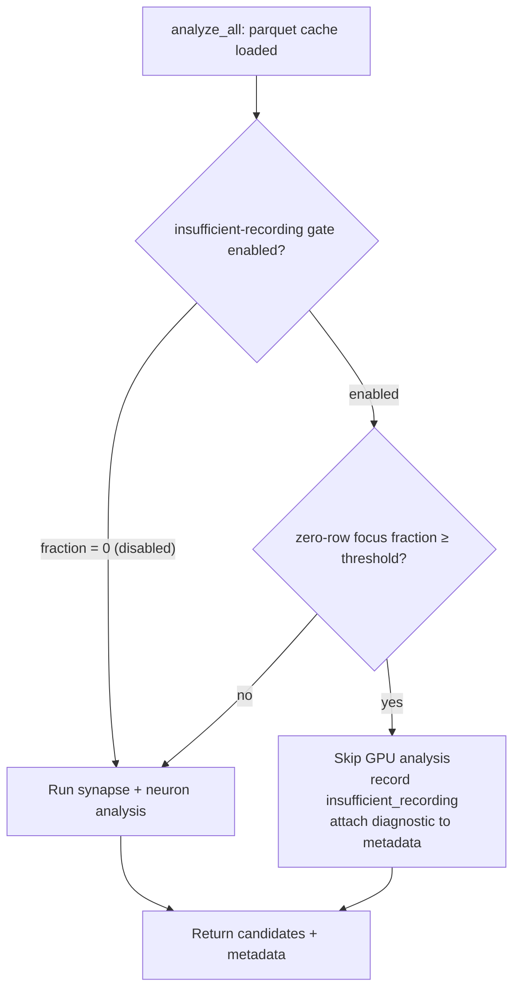

# Fail-fast analysis when the record phase times out with insufficient Parquet coverage

## Summary

When the discovery record phase times out, the selected focus neurons can end
up with **zero** rows in the Parquet file. The downstream synapse/neuron
analysis then correctly returns nothing (every target reports
`no_target_records`, Issue #1101) — but only after spending the **entire**
analysis budget (~15 min of combined GPU analysis on a large dataset). The
operator pays the full wall-clock cost and gets no actionable signal that
**recording**, not search, failed (the production weeks-long drought, Issue #1418).

This PR adds a cheap, fail-fast coverage gate in `analyze_all`. Immediately
after the parquet cache loads — and **before** any GPU work — it scans the
record counts of the selected focus neurons (an in-memory lookup). When the
fraction of focus neurons with zero rows reaches the configured threshold, it
skips synapse/neuron analysis entirely and surfaces `insufficient_recording`
as the dominant rejection reason plus a structured `insufficientRecording`
diagnostic on `synapseMetadata` / `neuronMetadata`.

Closes #1444.

### Behaviour

- **Default `1.0`**: the gate fires only when **every** selected focus neuron
  has zero rows — the unambiguous "record phase produced no usable data for any
  target" case. Conservative by design to avoid suppressing useful partial
  analysis.
- Tunable via `NEAT_AI_DISCOVERY_INSUFFICIENT_RECORDING_FRACTION` (honoured in
  `(0.0, 1.0]`; `0` disables the gate so analysis always runs).
- The skipped pass returns `success: true` with zero candidates and a
  structured diagnostic — it is a recording failure, not an error.

### Diagnostic fields (in the Discovery Performance Summary metadata)

`insufficientRecording`: `focusNeuronsTotal`, `focusNeuronsWithZeroRows`,
`focusNeuronRecordsTotal`, `records_processed`, `threshold_fraction`.

### Flow



## Evidence

Backend/FFI change only — no web interface to screenshot. Verified via the new
integration and unit tests (run on a GPU-equipped host):

```
running 2 tests
test issue_1444_insufficient_recording_fail_fast::partial_record_phase_fails_fast_with_insufficient_recording ... ok
test issue_1444_insufficient_recording_fail_fast::full_recording_does_not_trigger_fail_fast_gate ... ok

running 5 tests (src/analysis/insufficient_recording.rs)  ... ok
running 4 tests (config::tests insufficient_recording_fraction*) ... ok
```

The partial-record test reproduces the production scenario: a creature whose
sole focus neuron (`output-0`) has zero Parquet rows while its inputs are
recorded. Before this change the pass would run the full GPU analysis and
return 0 candidates with no clear signal; now it skips analysis and reports
`insufficient_recording` as the dominant rejection reason.

## Test Plan

Added:

- `tests/analysis/issue_1444_insufficient_recording_fail_fast.rs`
  - `partial_record_phase_fails_fast_with_insufficient_recording` — reuses the
    Issue #1101 partial-record fixture; asserts the skip path surfaces
    `insufficient_recording` in `rejectionBreakdown`, the `topLevelSummary`, and
    the structured `insufficientRecording` diagnostic on both synapse and
    neuron metadata, with zero candidates.
  - `full_recording_does_not_trigger_fail_fast_gate` — guards against false
    positives: when the focus neuron has records the gate must not fire.
- `src/analysis/insufficient_recording.rs` unit tests — coverage assessment,
  threshold logic (all-missing, partial, fraction boundaries), and skip-result
  metadata construction.
- `src/config/mod.rs` unit tests — `resolve_insufficient_recording_fraction`
  parsing (default, `0` opt-out, in-range, invalid/out-of-range fallback).

## Acceptance criteria

- [x] Partial record phase with missing focus-neuron Parquet rows does **not**
  spend the full analysis budget (GPU dispatch + post-processing are skipped).
- [x] Performance summary / metadata names `insufficient_recording` as the top
  rejection reason (dominant in `rejectionBreakdown`, named in
  `topLevelSummary`).
- [x] Regression test reuses the `issue_1101_no_target_records_diagnostic.rs`
  pattern with a partial-record fixture.

## Files changed

- `src/analysis/insufficient_recording.rs` (new) — coverage assessment, gate
  decision, skip-result constructors, diagnostic type.
- `src/analysis/orchestration.rs` — fail-fast gate after parquet load, before
  dispatch.
- `src/analysis/cache/mod.rs` — `loaded_record_count()` for `records_processed`.
- `src/analysis/shared/metadata.rs` — `insufficient_recording` metadata field.
- `src/analysis/diagnostics/rejection_reasons.rs` —
  `REJECTION_INSUFFICIENT_RECORDING` constant + friendly phrasing.
- `src/ffi_types/responses/analysis.rs` + `src/ffi_internal/analysis.rs` —
  surface `insufficientRecording` in the FFI JSON for both metadata blocks.
- `src/config/user_facing.rs` — `insufficient_recording_fraction()` accessor.
- `src/analysis/{neuron/preparation,neuron/post_processing,synapse/post_processing}.rs`
  — initialise the new metadata field.
- `AGENTS.md`, `README.md`, `src/config/mod.rs` — document the new env var.
