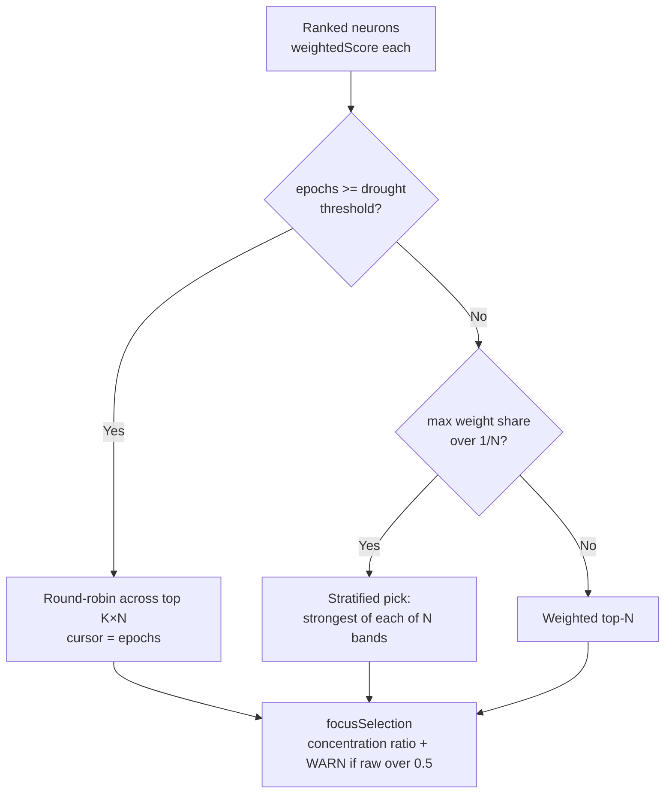

# Focus-selection diversity floor and drought rotation (Issue #1445)

## Summary

On a plateaued mature network the focus-selection roulette collapses to a
**single neuron**. On the production GRQ-3 creature one neuron held **~98.5%**
of the weight, so although focus selection nominally picks 6 neurons, five of
them were lottery noise and discovery revisited the same dominant neuron almost
every pass. Impact-weighted ranking (#1382) only *orders* neurons — it does not
enforce **diversity** in the final selected set.

This change adds a deterministic, diversity-aware selection layer over the
ranked neuron list and surfaces the concentration metric so the collapse is
observable:

- **`src/focus/selection.rs`** (`select_focus_neurons`) implements:
  - **Diversity floor** — when one neuron exceeds its even `1/N` share of the
    roulette weight, the focus set is picked **stratified** across the ranked
    list (strongest neuron of each of `N` contiguous bands), guaranteeing
    quartile-style coverage instead of "dominant + N−1 noise".
  - **Drought-aware rotation** — once `epochsSinceLastAcceptedCandidate` reaches
    the drought threshold (`NEAT_AI_DISCOVERY_DROUGHT_LOG_THRESHOLD`, #1202),
    selection switches to **round-robin** across the top `K × N` ranked neurons
    (K = 3), seeded by the epoch count so successive passes pick fresh targets.
  - **`weight_concentration_ratio`** (max ÷ sum) reporting.
- The `rank_focus_neurons` FFI now returns a `focusSelection` block
  (`selected`, `rawWeightConcentrationRatio`, `weightConcentrationRatio`,
  `diversityFloorApplied`, `rotationApplied`, `poolSize`), each ranked neuron
  carries its `weightedScore` (the roulette weight, computed once and shared by
  the sort and the selection), and a `focus_selection_weight_concentration_high`
  **WARN** fires when the raw concentration exceeds `0.5`.
- New optional FFI inputs `epochsSinceLastAcceptedCandidate` and `focusSetSize`
  (default 6 = NEAT-AI's `discoveryMaxNeurons`); both are backwards compatible
  when omitted.

Fixes #1445.

## Acceptance criteria

- [x] `weight_concentration_ratio` is logged and `< 0.5` after the diversity
  floor applies; the raw (pre-floor) ratio is reported separately and a WARN
  documents the collapse. Verified by
  `focus_selection_is_surfaced_with_concentration_metrics`.
- [x] After the drought threshold, focus neurons rotate across the top-ranked
  pool instead of repeating the same id. Verified by
  `drought_rotation_rotates_focus_across_passes` and
  `drought_rotation_rotates_targets_across_passes`.
- [x] Unit test: a synthetic plateau where one neuron has 100× the error×impact
  of the others still yields ≥3 distinct focus targets across 3 consecutive
  selection calls
  (`ac3_three_consecutive_calls_yield_at_least_three_distinct_targets`).

## Evidence

Backend/FFI change — no web interface. Verified via unit + integration tests
(`cargo test`) and the full `./quality.sh` gate (fmt, clippy `-D warnings`,
`cargo deny`, type check, tests, docs, release build) passing cleanly.

## Test Plan

Unit tests (`src/focus/selection.rs`):
- `concentration_ratio_basic` — metric incl. empty/zero/NaN/negative inputs.
- `dominant_neuron_triggers_diversity_floor` — raw > 0.5, effective < 0.5, 6
  distinct targets, dominant retained.
- `ac3_three_consecutive_calls_yield_at_least_three_distinct_targets` — AC3.
- `drought_rotation_rotates_targets_across_passes` — AC2 rotation + pool size.
- `even_distribution_keeps_weighted_top_n`, `fewer_candidates_than_target_returns_all`,
  `empty_pool_is_safe`, `target_one_is_clamped_and_safe`,
  `drought_rotation_smaller_pool_than_target` — edge cases.

Integration tests (`tests/ffi/issue_1445_focus_selection_diversity.rs`):
- `rank_focus_input_new_fields_default_to_none` / `..._round_trip` — FFI input
  contract.
- `focus_selection_is_surfaced_with_concentration_metrics` — end-to-end via
  `rank_focus_neurons_internal` with a plateau parquet fixture (AC1 + AC3).
- `drought_rotation_rotates_focus_across_passes` — end-to-end drought rotation
  across 3 passes (AC2).

Updated `tests/analysis/issue_337_candidate_type_contract.rs` for the new
`focusSelection` output field.

## Docs

- `docs/FOCUS_SELECTION.md` — new section 6 (diversity floor and drought
  rotation) with the field table and a Mermaid flow.
- `CHANGELOG.md` — Unreleased / Added entry.
