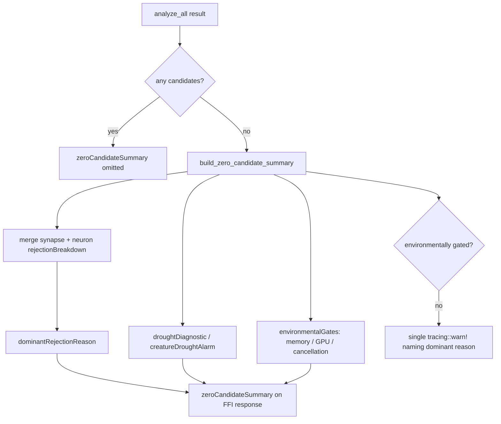

# Surface `zeroCandidateSummary` when a discovery pass returns no candidates (Issue #1446)

## Summary

When discovery found nothing, operators saw an unhelpful `Built 0 candidates`
block with **no visible reason**, even though the Rust side already populated
`rejectionBreakdown` (#1129), `droughtDiagnostic` (#1202), and
`creatureDroughtAlarm` (#1424) inside `synapseMetadata` / `neuronMetadata`.
Those signals had to be hunted for in `.discovery/` JSON sidecars or by enabling
verbose Rust logging.

This change consolidates them into a single `zeroCandidateSummary` object
attached to the top-level `analyze_parallel` response **only when the pass
produced no candidates of any kind** (no helpful/harmful synapses, no helpful
neurons, no synapse weight updates, no coordinated structural candidates). The
object carries:

- `dominantRejectionReason` — the most-frequent rejection reason merged across
  synapse and neuron analysis;
- `rejectionBreakdown` — the merged synapse + neuron rejection counts;
- `droughtDiagnostic` — present only while in drought (#1202);
- `creatureDroughtAlarm` — present only on the alarm-crossing pass (#1424);
- `environmentalGates` — memory / GPU / cancellation flags (#1421) so a
  host-gated pass is distinguishable from genuine search exhaustion.

For a genuinely-empty pass (not environmentally gated) a single
`tracing::warn!` event names the dominant rejection reason and drought streak,
so the outcome is also visible in logs. The field is documented in
`docs/FFI_API.md`, and new public types `ZeroCandidateSummary` /
`EnvironmentalGatesJson` plus the `build_zero_candidate_summary` helper are
re-exported from the crate root.

Closes #1446.

## Evidence

Backend/FFI change with no web interface to screenshot. Verified via the new
and existing Rust test suites (`./quality.sh` passes cleanly, including
`cargo clippy -D warnings`, the doc build, and the release build).

Data flow of the new field:

## Test Plan

New file `tests/issue_1446_zero_candidate_summary.rs`:

- `no_target_records_fixture_sets_dominant_reason` — acceptance criterion: a
  fixture whose dominant synapse rejection is `no_target_records` produces
  `dominantRejectionReason: "no_target_records"`.
- `merges_synapse_and_neuron_breakdowns` — synapse + neuron rejection counts
  merge so the dominant reason reflects the whole pass.
- `environmental_gates_are_surfaced` — memory/GPU/cancellation gates flow
  through; an environmentally-gated pass with no rejections has no dominant
  reason but still explains the zero outcome.
- `serialises_with_camel_case_field_names` — confirms `dominantRejectionReason`,
  `rejectionBreakdown`, and `environmentalGates.memoryBudgetExceeded` serialise
  with the camelCase names documented in `docs/FFI_API.md`.

Updated `tests/issue_1256_public_api_surface.rs` to assert the new public
surface (`ZeroCandidateSummary`, `EnvironmentalGatesJson`,
`build_zero_candidate_summary`).

Updated the existing full-struct constructors of `AnalyzeParallelOutput`
(`tests/analysis/issue_337_*`, `tests/ffi/issue_1028_*`,
`tests/infrastructure/issue_1047_*`, `tests/infrastructure/issue_1099_*`,
`benches/ffi_marshalling.rs`) for the added field — no behaviour change.
