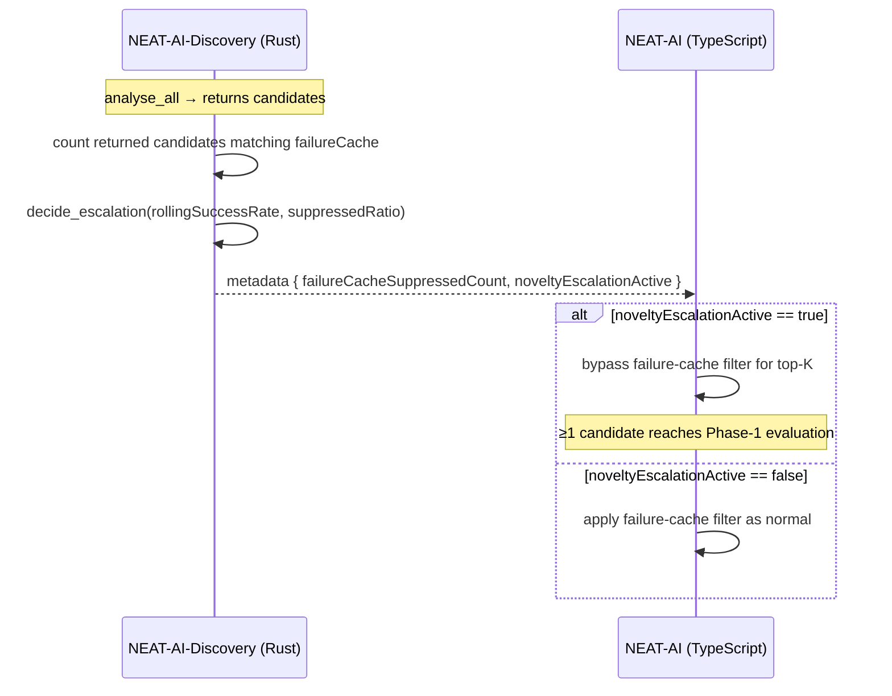

# PR Summary — Issue #1447

## Summary

Rust-side novelty escalation (#1423) stayed ineffective in production because of
a **cross-stack gap**: NEAT-AI (TypeScript) `CandidateFiltering.ts` drops every
candidate whose identity matches the per-creature failure cache *before* Phase-1
evaluation. Rust returned a full batch of "novel" candidates; TS suppressed them
all and the operator saw `Built 0 candidates`. Meanwhile
`REJECTION_DUPLICATE_OF_FAILURE_CACHE` was defined but never incremented, so the
suppression was invisible on the Rust side.

This PR computes the **Rust half of the handshake** so NEAT-AI can both observe
and act on the gap:

1. **New pure module `analysis/failure_cache_handshake.rs`** — matches returned
   candidate identities (`changeType` + target neuron + squash) against the
   inbound `failureCache`, counts how many TS will drop, and folds that count
   into the existing `decide_escalation` gate (#1423) to produce
   `noveltyEscalationActive`.
2. **FFI metadata** — both `synapseMetadata` and `neuronMetadata` now always
   carry `failureCacheSuppressedCount` and `noveltyEscalationActive`, so the
   host can log when Rust proposed candidates that TS then suppressed.
3. **Dead-constant cleanup** — the suppressed count is wired into
   `rejectionBreakdown` under the stable reason `duplicate_of_failure_cache`,
   so `REJECTION_DUPLICATE_OF_FAILURE_CACHE` is now counted rather than dead.
4. **Handshake documented** in `docs/FFI_API.md`: when `noveltyEscalationActive`
   is `true`, the NEAT-AI consumer should bypass its failure-cache filter for
   the top-K candidates so at least one reaches Phase-1 evaluation.

The TypeScript-side filter bypass is a separate NEAT-AI repository change (as the
issue notes); this PR delivers the Rust contract it depends on. The new
`noveltyEscalationActive` flag is **inert** unless the creature is plateaued
(`rollingSuccessRate < threshold`) and the failure cache suppresses the bulk of
the returned candidates, so steady-state behaviour is unchanged.

Closes #1447.

## Evidence

Backend/FFI change — no UI. Verified via unit tests (`cargo test`) and the full
`./quality.sh` gate (fmt, clippy `-D warnings`, check, tests, doc build, release
build) passing cleanly.

## Test Plan

New unit tests (`cargo test --lib failure_cache_handshake`, all passing):

- `analysis::failure_cache_handshake::tests`
  - `empty_cache_suppresses_nothing`
  - `change_type_must_match`
  - `entry_target_uuid_must_match_when_present`
  - `absent_entry_target_acts_as_wildcard` — target-agnostic entry wildcard
  - `target_squash_discriminates_add_neurons`
  - `evaluate_engages_escalation_when_all_built_candidates_are_cached` —
    reproduces the production "every built candidate is a cached failure" scenario
  - `evaluate_inert_when_not_plateaued` — steady-state guard
  - `evaluate_inert_when_no_candidates`
- `ffi_internal::analysis::failure_cache_handshake_wiring_tests`
  - `synapse_identities_cover_add_synapse_and_coordinated`
  - `neuron_identities_carry_target_and_squash`
  - `breakdown_wires_failure_cache_reason_when_suppressed` — verifies
    `duplicate_of_failure_cache` is now counted
  - `breakdown_omits_failure_cache_reason_when_none_suppressed`

## Acceptance Criteria

- [x] When novelty escalation is active, the Rust contract flags it
      (`noveltyEscalationActive`) so the host bypasses the TS failure-cache
      filter for the top-K candidates (TS bypass tracked as a NEAT-AI change).
- [x] Metadata reports how many candidates were cache-suppressed
      (`failureCacheSuppressedCount` per surface; `duplicate_of_failure_cache`
      in `rejectionBreakdown`).
- [x] `REJECTION_DUPLICATE_OF_FAILURE_CACHE` is now counted rather than dead.
