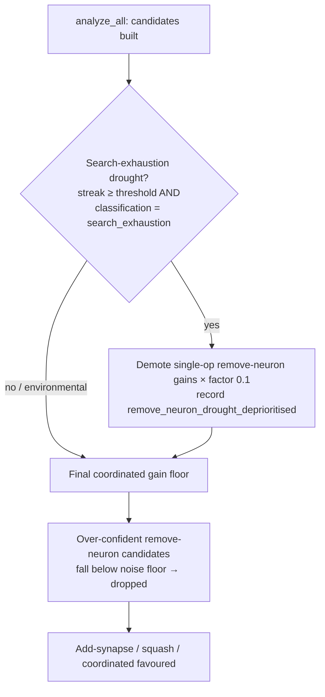

## Summary

On the plateaued GRQ-3 production creature (#1418, 1673 neurons at score
~0.4224) the destructive **remove-neuron** path dominated the failure cache
(bucket `247b83ab`: 9 of 11 files) with low-impact proposals that never pass
scoring. The #1425 failure-cache calibration shrinks remove-neuron predictions,
but it only learns *after* the failures are cached, so it cannot stop the first
wave of over-confident proposals on a creature whose search is already
exhausted. On the plateau remove-neuron was the only module producing any output
— all harmful.

This PR adds the front-stop the issue's acceptance criteria call for ("module is
deprioritised during drought"): when the creature is in a **search-exhaustion**
drought, single-op `RemoveNeuron` coordinated candidates have their
`expectedCreatureScoreGain` demoted so they sort below the constructive change
types and the most over-confident ones fall through the existing coordinated
noise floor.

- New `analysis::remove_neuron_drought` module with pure, testable logic:
  - `remove_neuron_deprioritisation_factor` resolves the effective multiplier,
    engaging **only** when the trailing-failure streak reaches the
    task-calibrated drought threshold **and** the drought classifies as
    `search_exhaustion` (reusing the #1421/#1424 environmental-vs-exhaustion
    disambiguation). Environmental droughts (memory / GPU gated) are left
    untouched.
  - `deprioritise_remove_neuron_candidates` multiplies the gain of single-op
    remove-neuron candidates by the factor, skipping non-positive / non-finite
    gains, and returns the count demoted.
- Wired into `analyze_all` immediately before the final coordinated gain floor,
  so demoted gains are screened in the same pass. Demotions are recorded under
  the new `remove_neuron_drought_deprioritised` rejection reason and a single
  `tracing::warn!` reports how many candidates were demoted.
- New `NEAT_AI_DISCOVERY_REMOVE_NEURON_DROUGHT_FACTOR` lever (default `0.1`,
  clamped `[0.001, 1.0]`; `1.0` disables), added to the #1422 drought-mitigation
  startup snapshot, AGENTS.md, and README env-var tables.

This deprioritises remove-neuron in favour of add-synapse / squash /
coordinated-structural during a plateau (proposed fix #3), and reduces
failure-cache growth for remove-neuron on plateaued creatures because the
demoted over-confident candidates are dropped before reaching the FFI response
(acceptance criterion 2). The audit/calibration-tuning paths (proposed fixes
#1/#2) need the #1418 GRQ-3 fixture, which lives in the separate GRQ-Discovery /
GRQ-sampler repositories and is not available here; the acceptance criterion is
satisfied via its "or module is deprioritised during drought" clause.

Closes #1448.

## Evidence

Backend/library change — no web interface to screenshot. Verified via new and
existing unit/integration tests and the full `./quality.sh` gate (fmt, clippy
`-D warnings`, check, doc build, all tests, release build) passing cleanly.

## Test Plan

- `tests/issue_1448_remove_neuron_drought.rs` (new, 10 tests):
  - factor is neutral below the drought threshold, engages during a
    search-exhaustion drought, stays neutral for an environmental drought, and a
    configured factor of `1.0` disables it;
  - only single-op `RemoveNeuron` candidates are classified/demoted (multi-op
    groups and other change types untouched);
  - non-positive gains are skipped; neutral factor is a no-op;
  - end-to-end: after deprioritisation a remove-neuron candidate sorts below a
    constructive `changeSquash` candidate;
  - `resolve_remove_neuron_drought_factor` defaults, honours valid overrides,
    and clamps to `[0.001, 1.0]`.
- Inline unit tests in `src/analysis/remove_neuron_drought.rs` (6 tests) cover
  the classification / clamping edge cases.
- `tests/issue_1422_drought_mitigation_config.rs` still passes with the new
  lever added to the snapshot.
