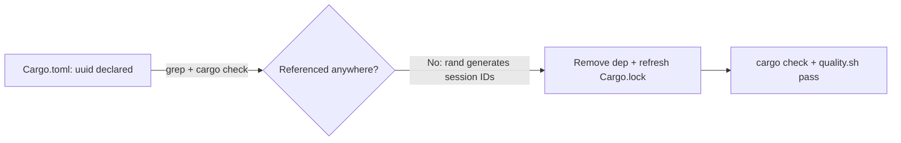

## Summary

Removed the dead `uuid` dependency from `Cargo.toml` and refreshed `Cargo.lock`. Closes #1455.

The `uuid` crate was declared at `Cargo.toml:26` with a stale comment claiming it powered session-ID generation for the streaming API. In reality, `src/streaming.rs` generates session IDs with `rand` (`rand::rng().sample_iter(&Alphanumeric)...`), so the `uuid` crate was unused dead weight — inflating build time and the supply-chain attack surface while misleading maintainers.

A repo-wide search confirmed no `use uuid`, `extern crate uuid`, `uuid::` path, or `Uuid::new_v4()` reference exists in any `*.rs` file. Every remaining `uuid` match is either a struct field name (`uuid:`, `source_uuid`, `from_uuid`), a comment about the neuron-identity *concept* (a `String`), or a benchmark file name (`uuid_hashing`, `impact_uuid_cloning`) — none reference the crate.

## Evidence

This is a backend dependency-removal change with no web interface to screenshot. Verification is compiler-backed:

- `cargo update -p uuid` reported `Removing uuid v1.23.3` and the crate no longer appears in `Cargo.lock` (`grep -c '^name = "uuid"' Cargo.lock` → `0`).
- `cargo check` succeeds — the compiler confirms nothing references the removed crate (an actually-used dependency would fail to resolve).
- `./quality.sh` passes cleanly: fmt, clippy (`-D warnings`), check, all 171+ unit/integration tests, doc build, and the optimised release build.

## Test Plan

No new unit test is added: the change removes a dependency, and the correct, compiler-backed verification is that the project still builds and all existing tests pass without `uuid`. A test asserting "uuid is not a dependency" would merely grep `Cargo.toml`, which the project's testing guidelines explicitly forbid (tests must exercise real behaviour, not inspect source text).

- `cargo check` — passes (proves no source references the removed crate).
- `./quality.sh` — full gate passes: fmt, clippy, check, 171+ tests across the suite, docs, release build.
