# Drop unmaintained `cap` allocator crate — inline a tracking allocator

## Summary

The `cap` crate (`cap = { version = "0.1", features = ["stats"] }`) was the
crate's global allocator but had been unmaintained for ~39 months (last release
`0.1.2`, 2023-03-26), flagged **ORPHAN-STALE** at severity:low. It was used
purely for its allocated-bytes counter — constructed with a `usize::MAX` cap, so
the limit-enforcement feature was never exercised.

This PR removes `cap` entirely and replaces it with a small in-repo
`TrackingAlloc` (`src/tracking_alloc.rs`): a `GlobalAlloc` wrapper around
`std::alloc::System` that maintains an `AtomicUsize` byte counter and exposes
`allocated()` — the exact API the call sites already used. No call site changed
beyond the global-allocator type swap in `src/lib.rs`.

Closes #1463.

## Changes

- **`src/tracking_alloc.rs`** (new): `TrackingAlloc` wrapping `System`, with
  `alloc`/`alloc_zeroed`/`dealloc`/`realloc` keeping the counter accurate
  (including realloc grow/shrink deltas), plus `new()`, `Default`, and
  `allocated()`.
- **`src/lib.rs`**: `#[global_allocator]` is now `TrackingAlloc::new()`;
  `pub mod tracking_alloc;` declared. The five existing call sites
  (`crate::ALLOCATOR.allocated()` in `analysis/orchestration.rs`,
  `analysis/utils/memory.rs`, `ffi/utilities.rs`) are unchanged.
- **`Cargo.toml`** / **`Cargo.lock`**: `cap` dependency removed.

```mermaid
flowchart LR
    subgraph Before
      A1[lib.rs ALLOCATOR] --> C[cap::Cap&lt;System&gt;]
      C --> S1[std::alloc::System]
    end
    subgraph After
      A2[lib.rs ALLOCATOR] --> T[TrackingAlloc]
      T --> S2[std::alloc::System]
      T --> N[AtomicUsize counter\nallocated&#40;&#41;]
    end
```

## Evidence

Backend/library change only — no web interface to screenshot. Verified via the
new unit tests and the full `./quality.sh` gate (clippy `-D warnings`, type
checks, tests, docs, release build) passing cleanly. `cap` no longer appears in
`Cargo.lock`.

## Test Plan

New unit tests in `src/tracking_alloc.rs::tests` (all real calls through the
`GlobalAlloc` trait, asserting on the counter):

- `new_starts_at_zero`, `default_starts_at_zero` — counter starts at 0.
- `alloc_then_dealloc_returns_to_zero` — alloc bumps, dealloc restores.
- `alloc_zeroed_tracks_and_zeroes` — counter tracked and memory zeroed.
- `multiple_allocations_accumulate` — concurrent live allocations sum correctly.
- `realloc_grow_increases_counter` / `realloc_shrink_decreases_counter` —
  realloc applies the correct size delta.
- `global_allocator_reports_live_usage` — the crate-wide global allocator
  reflects a live `Vec` allocation, proving the wiring in `lib.rs`.
