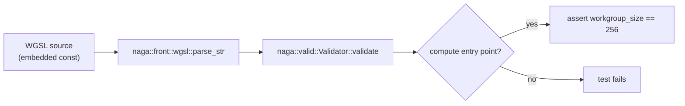

## Summary

Replaced the HOW-tests in `src/analysis/gpu/shaders.rs` that grepped the embedded
WGSL shader **source text** with genuine WHAT-tests that assert on behaviour.
The old tests asserted on internal helper names, WGSL keywords, and source
formatting — so a behaviour-preserving shader refactor (renaming a helper,
reformatting `@workgroup_size( 256 )`, or switching the reduction memory
strategy) would break the suite even though the GPU output a caller observes is
unchanged. They also gave false confidence: a shader containing `fn add_contributions`
only in a comment would pass. Closes #1467.

The four affected tests are resolved as follows:

| Old test (HOW) | Resolution |
|----------------|------------|
| `test_shader_sources_contain_workgroup_size` | Replaced by `test_compute_entry_points_declare_workgroup_size` — parses each shader with `naga` (the front-end wgpu uses) and asserts the validated compute entry point's **structured** `workgroup_size` equals `WORKGROUP_SIZE`. Immune to whitespace/formatting. |
| `test_shader_wgsl_syntax_basics` | Replaced by `test_shaders_are_valid_wgsl` — parses **and validates** each shader and asserts it exposes a `@compute` entry point. Unlike a `contains("fn ")` grep, this actually fails on malformed WGSL. |
| `test_reduction_shaders_contain_required_functions` | Removed — asserted internal helper names (`add_contributions`, `zero_contribution`, ...). Pure implementation detail. |
| `test_reduction_shaders_use_shared_memory` | Removed — asserted the `var<workgroup>` memory strategy. Pure implementation detail. |

### Why removal of the two reduce-shader tests is safe

The observable behaviour they stood in for — the reduce shaders produce correct
aggregated statistics — is already verified end-to-end by
`tests/gpu/gpu_workgroup_reduction.rs` (`test_helpful_reduction_correctness`,
`test_harmful_reduction_correctness`, `test_reduction_numerical_stability`, ...).
The reduce shaders' WGSL validity and workgroup size are additionally covered by
the two new naga tests, which run on CPU (no GPU required). A `// NOTE (Issue #1467)`
in the test module documents the removal and its replacement coverage.

### Approach

`naga = "29"` (matching wgpu 29, already a transitive dependency at 29.0.3) is
added as a dev-dependency with the `wgsl-in` feature. A `validate_wgsl` test
helper parses and validates a shader, panicking with a descriptive message on
failure; an `ALL_SHADERS` constant lists every embedded shader once (DRY).



## Evidence

Backend/library change with no web interface — no screenshot applicable.

Test run (`cargo test --lib --all-features shaders::tests`):

```
running 7 tests
test analysis::gpu::shaders::tests::test_gpu_reduction_threshold_is_valid ... ok
test analysis::gpu::shaders::tests::test_gpu_timeouts_are_valid ... ok
test analysis::gpu::shaders::tests::test_min_neuron_sample_count_is_valid ... ok
test analysis::gpu::shaders::tests::test_shader_sources_are_not_empty ... ok
test analysis::gpu::shaders::tests::test_shaders_are_valid_wgsl ... ok
test analysis::gpu::shaders::tests::test_compute_entry_points_declare_workgroup_size ... ok
test analysis::gpu::shaders::tests::test_workgroup_size_is_valid ... ok

test result: ok. 7 passed; 0 failed; ...
```

`./quality.sh` passes cleanly (fmt, clippy `-D warnings`, check, tests, doc, release build).

## Test Plan

- Added `test_compute_entry_points_declare_workgroup_size` — validates every
  shader with naga and asserts each compute entry point declares
  `workgroup_size == [256, 1, 1]`. Survives reformatting; fails on a wrong size.
- Added `test_shaders_are_valid_wgsl` — validates every shader compiles as WGSL
  and exposes a `@compute` entry point. Fails on malformed WGSL (a real signal
  the substring grep could not provide).
- Removed `test_reduction_shaders_contain_required_functions` and
  `test_reduction_shaders_use_shared_memory` (HOW-tests); reduction correctness
  remains covered by `tests/gpu/gpu_workgroup_reduction.rs`.
