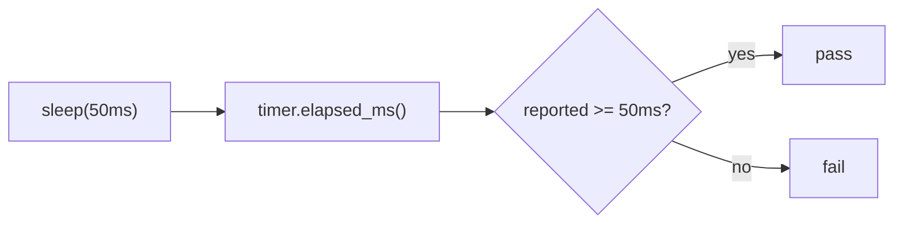

## Summary

Fixed the flaky wall-clock timing assertion in
`tests/infrastructure/observability.rs` (the `phase_timer_accuracy` test).
The original test measured host wall-clock time externally and asserted the
50ms sleep plus all scheduling overhead finished within a 50ms margin. That is
a "how-fast-is-the-host" assertion, not a behavioural one: thread-scheduling
jitter on a loaded CI runner or contended ARM box can breach a 50ms margin
without any regression in `PhaseTimer`. Closes #1468.

The test is now a "what" test (option (a) from the issue): it asserts on the
duration `PhaseTimer` itself reports via `elapsed_ms()`, keeping only the
behaviourally meaningful guarantee — monotonicity, i.e. having slept for at
least the requested duration, the timer must report at least that much. The
fragile host-speed upper bound is dropped. This aligns with the repository's
testing philosophy (AGENTS.md §4: test "what", not "how"; no
`Instant`/`elapsed` pass/fail thresholds in unit tests).

## Evidence

Backend/CLI change — no web interface to screenshot. Verified via the test
suite:

- `cargo test --test infrastructure phase_timer` — all 5 phase-timer tests pass.
- `./quality.sh` — passes cleanly (fmt, Clippy `-D warnings`, check, tests, doc,
  release build).

The new assertion reads the value the timer *reports* (`elapsed_ms`), not
externally-measured wall-clock, so it carries a real correctness signal
(monotonicity) and cannot flip red purely on host load.

## Test Plan

- Modified `tests/infrastructure/observability.rs::phase_timer_accuracy`:
  replaced the external wall-clock measurement and the flaky `< sleep + 50ms`
  upper bound with an assertion on `PhaseTimer::elapsed_ms()` reporting at least
  the slept duration. No existing tests were removed; `phase_timer_respects_env_var`,
  `phase_timer_nested`, and `phase_timer_repeated_creation_and_drop` continue to
  cover the other paths.
- Bumped crate version `0.74.106` → `0.74.107` per the version-increment
  invariant.
