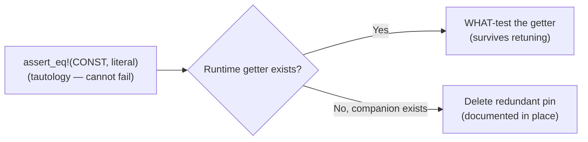

## Summary

Removed the recurring **tautological "constant equals its own literal"** test
pattern flagged across the config and GPU modules. Each removed assertion (e.g.
`assert_eq!(WORKGROUP_SIZE, 256)`) was circular — it passed if and only if the
source literal was unchanged, so it could never catch a bug, only flag a
deliberate retune and force a meaningless paired edit. Where a constant has a
runtime getter, the pin was rewritten as a behavioural WHAT-test; where a
behavioural companion (or compile-time guard) already existed, the redundant pin
was deleted. Both resolutions are explicitly endorsed by the issue.

Note: a pure `MIN <= DEFAULT <= MAX` assertion on `const` operands is itself
rejected by Clippy's `assertions_on_constants` lint (the comparison is a
compile-time constant), so a meaningful runtime test must exercise a
getter/function rather than the bare constants — reinforcing why the pins added
no value.

Closes #1469.

### Changes per call site

| File | Test | Resolution |
|------|------|------------|
| `src/config/mod.rs` | `block_size_defaults` | Rewritten → `block_size_getter_returns_value_within_bounds` (exercises the `block_size()` clamp; no prior companion) |
| `src/config/mod.rs` | `session_ttl_default_values` | Deleted — `session_ttl_returns_valid_value` is the behavioural companion |
| `src/config/mod.rs` | `wall_clock_minutes_default_values` | Deleted — `wall_clock_minutes_returns_valid_value` is the behavioural companion |
| `src/config/mod.rs` | `drought_log_threshold_default_is_five` | Rewritten → `drought_log_threshold_unset_resolves_to_default` (exercises the parser's fallback branch) |
| `src/analysis/gpu/analyzer.rs` | `test_workgroup_size_constant`, `test_min_neuron_sample_count`, `test_gpu_max_batch_alloc_bytes` | Deleted — `WORKGROUP_SIZE` invariants already guarded at compile time in `shaders.rs`; tiering behaviour covered by `test_batch_size_for_tier`. Unused import removed. |
| `src/analysis/gpu/queue/recovery.rs` | `test_default_retry_limit`, `test_default_backoff_constants`, `test_minimum_gpu_batch_size_constant` | Deleted — backoff behaviour covered by `test_backoff_delay_with_default_constants`; retry-limit parsing covered via `gpu_retry_limit()` |
| `src/analysis/utils/lock_contention.rs` | `default_threshold_is_100ms` | Deleted — covered behaviourally by the `traced_lock_default` tests |

Each deletion leaves an in-place comment recording the removal and its
behavioural/compile-time companion, per the "document any removed test"
requirement.

## Evidence

Backend/Rust change only — no web interface to screenshot. Verified via the
test suite and full quality gate.

The two rewritten tests pass and exercise real runtime code paths:

```
test config::tests::block_size_getter_returns_value_within_bounds ... ok
test config::tests::drought_log_threshold_unset_resolves_to_default ... ok
```



## Test Plan

- Rewrote `block_size_getter_returns_value_within_bounds` — asserts `block_size()`
  returns a value within `[MIN_BLOCK_SIZE, MAX_BLOCK_SIZE]`.
- Rewrote `drought_log_threshold_unset_resolves_to_default` — asserts the parser
  falls back to `DEFAULT_DROUGHT_LOG_THRESHOLD` when nothing is supplied.
- Deleted the redundant tautological pin tests listed above; each has a
  documented behavioural or compile-time companion that retains the coverage.
- Ran `./quality.sh` (fmt, Clippy `-D warnings`, check, lib/integration tests,
  doc build, release build) until clean.
