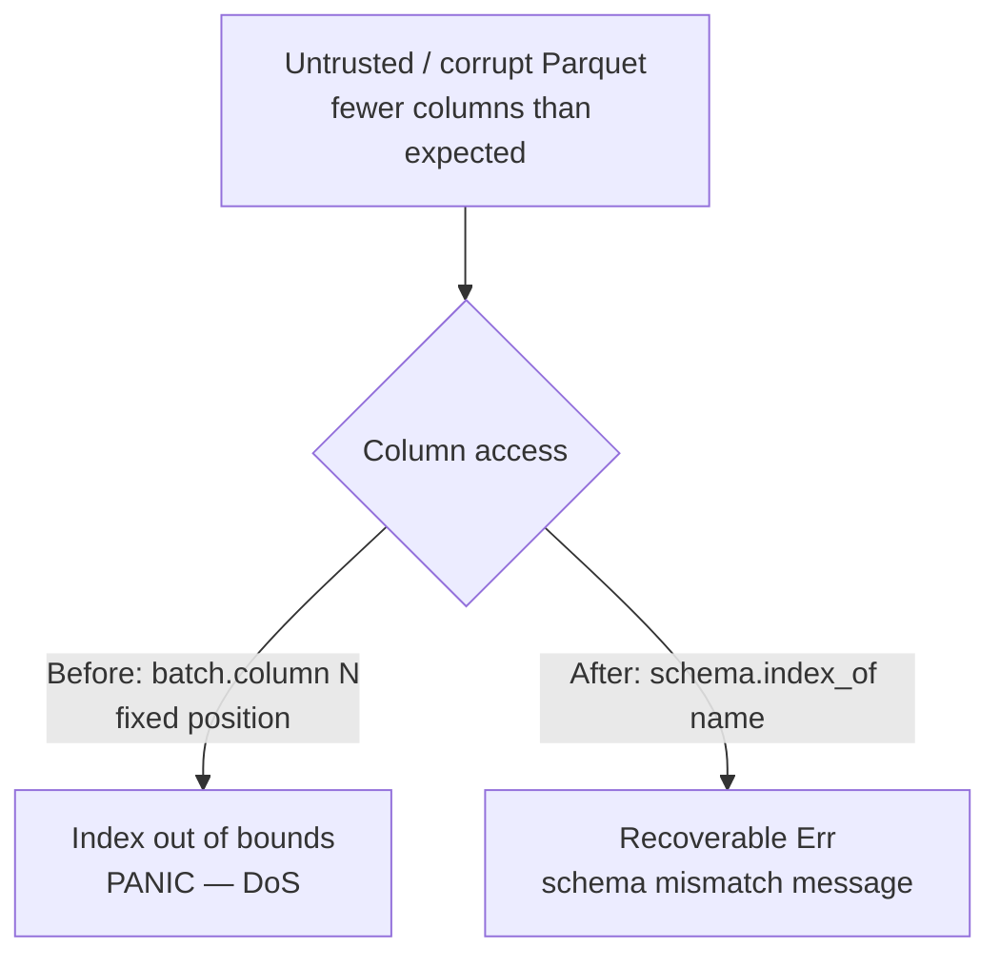

## Summary

Fixed an unvalidated positional Parquet column access that could panic (DoS)
in `src/analysis/streaming.rs`. The streaming reader accessed record-batch
columns by fixed position — `batch.column(1)` in `build_block_index` and
`batch.column(0)..column(4)` in `load_block_records`. Arrow's
`RecordBatch::column(index)` **panics** on an out-of-bounds index, so a
structurally valid Parquet whose batches expose fewer columns than expected
(fewer than 5 for `load_block_records`, fewer than 2 for `build_block_index`)
crashed the process instead of returning a recoverable error. A panic on the
spawned `streaming-prefetch` thread is outside the FFI `catch_unwind`, so it
silently kills that worker — or aborts the whole process under `panic=abort` —
a denial of service.

The fix resolves every column by name via `batch.schema().index_of(name)`,
matching the hardened sibling reader in `src/parquet_format/reader.rs`. A
missing or misnamed column now yields a recoverable `Err` with a clear
schema-mismatch message rather than an index-out-of-bounds panic. The only
behaviour change for valid files is none — the discovery schema columns
resolve to the same indices.

Closes #1482.

## Evidence

This is a backend/library change with no web interface to screenshot.
Verification is via the regression tests below.

Confirmed the tests fail against the unfixed code (panic) and pass with the
fix:

```
thread '...streaming_cache_get_rejects_missing_columns_without_panic' panicked at
arrow-array-59.0.0/src/record_batch.rs:626:22:
index out of bounds: the len is 2 but the index is 2
```

After the fix, both regression tests pass and the wider recording/parquet
suites remain green (`cargo test --test recording` → 81 passed;
`cargo test --test parquet_integrity_validation` → 9 passed;
`cargo test --lib streaming` → 18 passed). `cargo build`, `cargo fmt --check`
and `cargo clippy --all-targets --all-features -- -D warnings` are clean.



### Deno regression avoided

N/A — this is a Rust repository; no Deno/Node tooling was touched.

## Test Plan

Added two regression tests in
`tests/recording/issue_193_streaming_parquet.rs`:

- `streaming_cache_new_rejects_short_schema_without_panic` — a single-column
  Parquet (no `neuron_uuid`) makes `StreamingRecordCache::new` return `Err`
  from `build_block_index` instead of panicking on `column(1)`.
- `streaming_cache_get_rejects_missing_columns_without_panic` — a two-column
  Parquet (`obs_index` + `neuron_uuid`) builds the block index but makes
  `get()` return `Err` from `load_block_records` instead of panicking on
  `column(4)`.

Both were confirmed to panic against the unfixed code and to return a clear
schema-mismatch `Err` after the fix.

## Notes

`quality.sh`'s `cargo upgrade --incompatible` step force-bumped `wgpu` 29→30,
whose breaking API change broke unrelated GPU code (`src/analysis/gpu/*`). That
incompatible bump is out of scope for this security fix, so it was reverted;
`Cargo.toml`/`Cargo.lock` are unchanged by this PR. The substantive checks
(build, clippy, fmt, tests) were run against the pinned dependency set and pass
cleanly.
