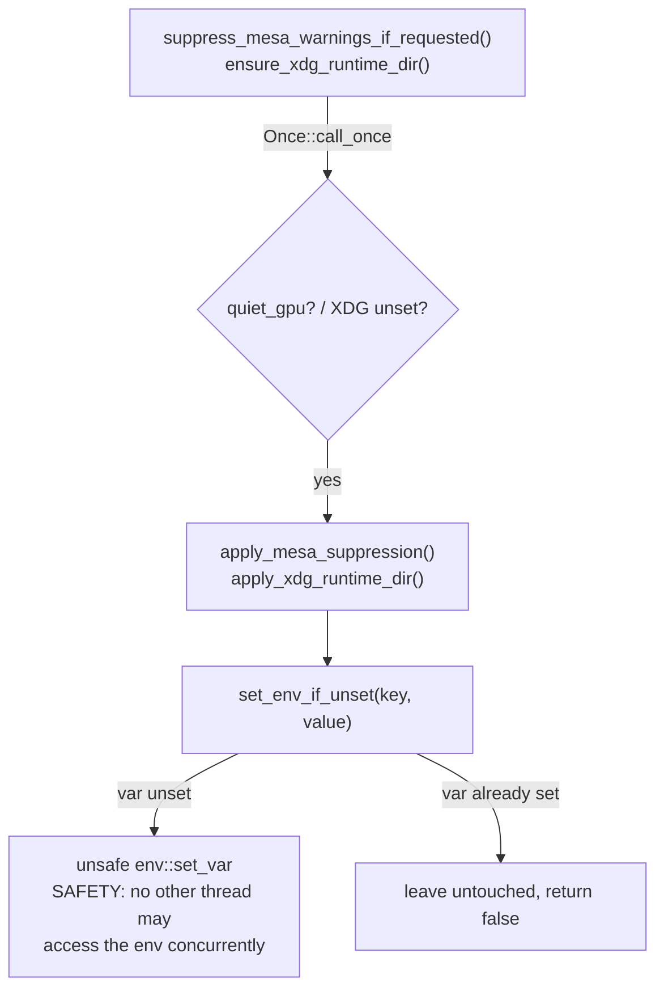

# Fix incorrect SAFETY invariant on `unsafe env::set_var` in `platform.rs`

## Summary

The `// SAFETY:` comments on the `unsafe env::set_var` calls in
`src/analysis/utils/platform.rs` justified the writes with *"single-threaded at
this point (Once guard)"*. That rationale is **false**: `std::sync::Once`
guarantees the closure runs *exactly once*, not that the whole process is
single-threaded. This crate ships as a `cdylib` linked into a possibly
multithreaded host, and `env::set_var` is `unsafe` in Rust 2024 precisely
because a concurrent environment read (`getenv`/`env::var`, common in C
GPU/graphics libraries) races the global `environ` table — undefined
behaviour. The comment therefore documented a precondition the code does not
uphold.

This change corrects the invariant to state the **real** precondition — *no
other thread may access the process environment concurrently* — and documents
the affected functions as early-init entry points that must be called before
any environment-touching thread is spawned. The four duplicated `unsafe`
blocks are consolidated behind a single `set_env_if_unset` helper so the
justification lives in exactly one place (DRY). Behaviour is unchanged: each
variable is still only written when currently unset, still guarded by `Once`.

Closes #1483.

## Approach

Per the issue's suggested fix, mutating the process environment from library
code cannot be soundly guaranteed safe by a `Once` guard alone, so the
accepted resolution is to (a) correct the `// SAFETY:` rationale to the true
precondition and (b) document the entry points as "call during early init".
The environment writes are retained because the Mesa/libEGL/XDG variables are
read by C libraries during GPU init and are not configurable via the wgpu API.

## Evidence

Backend Rust library change — no UI to screenshot. Verified via the quality
gate on the host (macOS): `cargo fmt --check`, `cargo clippy --all-targets
--all-features -D warnings`, `cargo test`, and `cargo doc -D warnings` all
pass. The Linux-only path (`#[cfg(target_os = "linux")]`) was additionally
type-checked standalone under `--edition 2024` and runs its new behavioural
tests in CI (which builds on Linux).

> **Note on the quality gate:** `./quality.sh` runs `cargo upgrade
> --incompatible`, which bumps `wgpu`/`naga` 29 → 30. wgpu 30 is an
> API-breaking release (e.g. `RequestAdapterOptions` gains `apply_limit_buckets`)
> and fails the build in GPU code unrelated to this issue. That migration is
> out of scope for this severity:low fix, so the dependency versions were left
> at the committed baseline (wgpu 29) and the remaining quality steps were run
> individually — all green.

### Deno regression avoided

N/A — this is a Rust (Cargo) repository, not a Deno repo.

## Test Plan

New behavioural tests in `src/analysis/utils/platform.rs` (Linux-gated,
`#[serial]` because they mutate the process environment):

- `test_set_env_if_unset_sets_when_absent` — writes the variable and reports
  `true` when it was unset.
- `test_set_env_if_unset_preserves_existing` — leaves an existing value
  untouched and reports `false`.
- `test_apply_xdg_runtime_dir_sets_when_unset` — sets `XDG_RUNTIME_DIR` to an
  existing directory when unset.

Existing cross-platform smoke tests (`..._does_not_panic`) are retained and
still pass on macOS.
