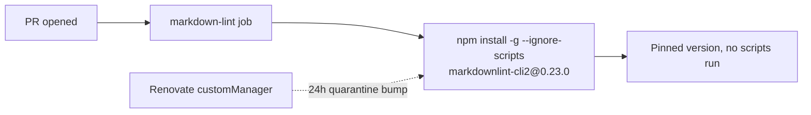

# PR Summary — Issue #1484

## Summary

Hardened the last unpinned tool install in the repository. The
`markdown-lint` workflow installed `markdownlint-cli2` with a bare
`npm install -g markdownlint-cli2`, resolving the latest release and its
full transitive npm tree fresh on every PR — the only tool install
neither version-pinned nor integrity-checked in an otherwise fully-pinned
supply chain (class A03, Software Supply Chain Failures).

Changes:

- **`.github/workflows/markdown-lint.yml`** — pin the exact version and
  disable lifecycle scripts:
  `npm install -g --ignore-scripts markdownlint-cli2@0.23.0`. A poisoned
  release can no longer silently bump the resolved version, and
  `--ignore-scripts` prevents any install/`postinstall` script from
  running on the runner.
- **`renovate.json`** — add a `customManagers` regex entry that tracks the
  `markdownlint-cli2@<x.y.z>` pin embedded in the workflow (there is no
  `package.json` manifest for the standard npm manager to find), plus a
  `packageRule` applying the same `minimumReleaseAge: 24h` quarantine used
  for every other external dependency. The pin therefore still receives
  managed, quarantined bumps.

`0.23.0` was published 2026-07-01, comfortably past the 24h quarantine
window as of this change.

Closes #1484.

## Evidence

Backend/CI change only — no web interface to screenshot. Verified via the
TDD test suite (`tests/issue_1484_markdownlint_pin.rs`), all passing:

```
test markdownlint_install_is_version_pinned ... ok
test markdownlint_install_disables_lifecycle_scripts ... ok
test renovate_manages_the_pinned_markdownlint_version ... ok
```

`renovate.json` remains valid JSON and the workflow remains valid YAML.
The existing workflow contract tests (`issue_1287_workflow_timeouts`,
`issue_1288_workflow_concurrency`, `issue_1234_quarantine_enforcement`)
continue to pass.



### Deno regression avoided

This is a Rust repository (no Deno markers at root); no Node tooling was
introduced — the fix only pins an already-present npm CLI install and
registers it with the existing Renovate config.

## Test Plan

- Added `tests/issue_1484_markdownlint_pin.rs`:
  - `markdownlint_install_is_version_pinned` — asserts the install line
    pins `markdownlint-cli2@<x.y.z>` (reproduces the finding: fails
    against the unpinned install).
  - `markdownlint_install_disables_lifecycle_scripts` — asserts
    `--ignore-scripts` is present.
  - `renovate_manages_the_pinned_markdownlint_version` — asserts
    `renovate.json` tracks the pin via a `customManagers` npm entry under
    a `minimumReleaseAge` quarantine.

### Out-of-scope note

`quality.sh` runs `cargo upgrade --incompatible`, which bumps
`wgpu`/`naga` 29→30. That breaking upgrade fails to compile
(`bytemuck::cast_slice` signature change in the GPU code) and is unrelated
to this issue; the `Cargo.toml`/`Cargo.lock` changes were reverted so this
PR stays scoped to the markdown-lint pin.
