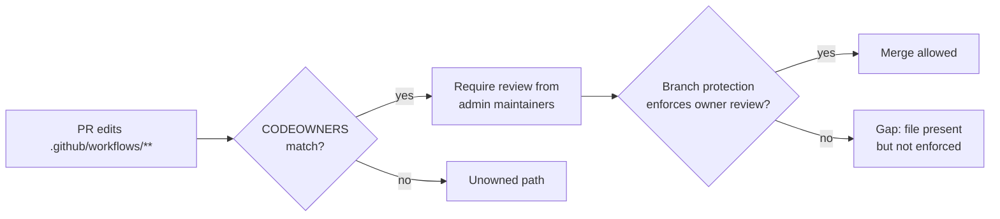

# PR Summary — Issue #1486

## Summary

Added `CODEOWNERS` coverage for the repository's high-blast-radius paths so a
pull request cannot merge them without review from a trusted team. The audit
(finding `BP-8be698853743`) flagged that no `CODEOWNERS` file existed while the
CI workflows run with privileged secrets beyond the default `GITHUB_TOKEN`:

- a write-capable PAT `secrets.ACTIONS_PUSH` used to push commits back to
  branches (`.github/workflows/ci.yml`);
- `secrets.SEMGREP_APP_TOKEN` (`.github/workflows/semgrep.yml`);
- `secrets.CODECOV_TOKEN` (`.github/workflows/cargo-quality.yml`).

Without owner review on `.github/workflows/`, a careless or malicious workflow
edit is a direct path to secret exfiltration or unauthorised pushes to protected
branches.

Changes:

- **`.github/CODEOWNERS`** — assigns the admin maintainers
  (`@Green-Beret @nleck @stservice`) as owners of the `*` default plus the
  sensitive paths: `.github/` and `.github/workflows/`, `Cargo.toml` /
  `Cargo.lock`, and the security-sensitive automation/policy (`deny.toml`,
  `renovate.json`, `SECURITY.md`).
- **`CONTRIBUTING.md`** — documents the code-owner policy and the
  branch-protection settings an admin must enable on `Develop` for `CODEOWNERS`
  to take effect.
- **`tests/issue_1486_codeowners.rs`** — repo-hygiene test asserting the real
  committed artefact.

### Owner choice — why named maintainers rather than a team

The issue's example used `@stSoftwareAU/maintainers`, but that team does not
exist in the org (verified via the GitHub API). The obvious substitute,
`@stSoftwareAU/developers`, is also unsuitable: the repo's teams endpoint
(`repos/stSoftwareAU/NEAT-AI-Discovery/teams`) is **empty**, meaning no org
team holds *direct* write access to this repo — its maintainers are individual
collaborators. GitHub requires a team named in `CODEOWNERS` to itself have
write access, so a team owner here would be treated as invalid and enforce
**nothing** — a false sense of protection. The three admin collaborators with
confirmed write access (`@Green-Beret`, `@nleck`, `@stservice`) are therefore
named directly so the rules are valid and immediately enforceable. A comment in
the file and in `CONTRIBUTING.md` notes the switch to a team reference once a
team is granted write access.

Closes #1486.

## Branch protection (repository setting — requires a human admin)

`CODEOWNERS` only enforces review once branch protection references it. These
are repository-level settings that cannot be committed as files; a repository
admin must enable them on the default branch (`Develop`), as now documented in
`CONTRIBUTING.md`:

- **Require a pull request before merging** with **Require review from Code
  Owners**.
- Block direct pushes and force-pushes.
- Require linear history.
- Confirm the `quality.sh` required status checks.
- (Defence-in-depth) Require signed commits.



## Evidence

Backend/repository-hygiene change — no web interface to screenshot. Verified via
the Rust test suite: the new test fails without a `CODEOWNERS` file and passes
once it is added.

```
running 5 tests
test codeowners_exists_and_is_non_empty ... ok
test every_rule_assigns_at_least_one_owner ... ok
test declares_a_default_fallback_owner ... ok
test covers_dependency_manifests ... ok
test covers_github_workflows ... ok

test result: ok. 5 passed; 0 failed; 0 ignored; 0 measured
```

The full `./quality.sh` gate (fmt, clippy `-D warnings`, check, doc, test, and
release build) passes cleanly. `Cargo.toml` / `Cargo.lock` are unchanged by
this PR.

## Test Plan

- Added `tests/issue_1486_codeowners.rs`:
  - `codeowners_exists_and_is_non_empty` — a `CODEOWNERS` file exists at the
    root, `.github/`, or `docs/` and is non-empty.
  - `every_rule_assigns_at_least_one_owner` — every rule names at least one
    `@user`, `@org/team`, or email owner.
  - `covers_github_workflows` — the privileged `.github/` CI paths are covered.
  - `covers_dependency_manifests` — `Cargo.toml` and `Cargo.lock` are covered.
  - `declares_a_default_fallback_owner` — a `*` default owner exists so no path
    is left unowned.
- Confirmed the test fails before `.github/CODEOWNERS` is added and passes after.
