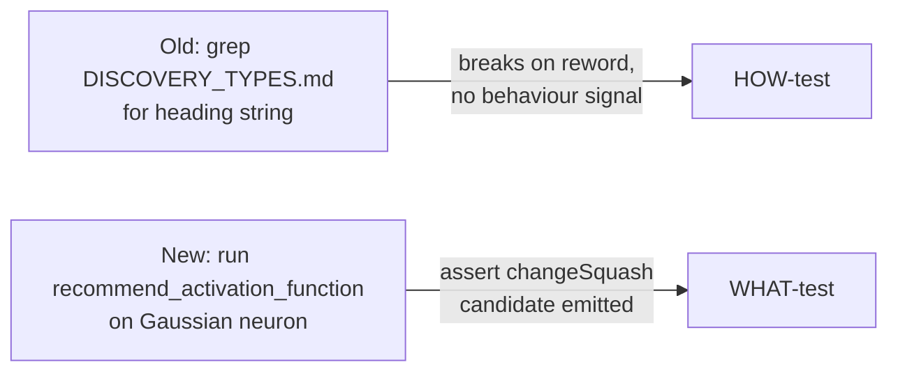

## Summary

Replaced the doc-prose grep test `test_activation_recommendation_documented` in
`tests/recommendation/issue_431_activation_recommendation.rs` with a behavioural
WHAT-test. The old test read `docs/DISCOVERY_TYPES.md` and asserted only that a
heading string appeared in the Markdown file — a HOW/editorial check that broke
on any doc rewording and gave no correctness signal, while a full removal of the
feature would have left it green as long as the heading survived.

The new test `test_activation_recommendation_produces_change_squash_candidate`
exercises the public recommender on the documented scenario (a Gaussian-input
neuron currently using `RELU`) and asserts the behaviour the documentation
promises: a recommendation is produced, it names a valid squash op distinct from
the current one, and it converts to the documented `changeSquash` candidate
operation carrying that op. This survives editorial doc changes and fails if the
recommendation behaviour regresses.

Closes #1503.

## Evidence

Backend/test-only change — no web interface to screenshot. Verified via the test
runner:

- New test passes: `cargo test --test recommendation issue_431` → 17 passed, 0
  failed (including the new behavioural test).
- Full quality gate `./quality.sh` passes cleanly (fmt, clippy, check, tests,
  doc build, release build).

## Test Plan

- Removed: `test_activation_recommendation_documented` (doc-prose grep).
- Added: `test_activation_recommendation_produces_change_squash_candidate` —
  asserts the recommender yields a `changeSquash` candidate naming a valid
  recommended squash op for a Gaussian-input `RELU` neuron.
- Ran `cargo test --test recommendation issue_431 -- --test-threads=2` — all 17
  tests pass.
- Ran `./quality.sh` — all checks pass.
