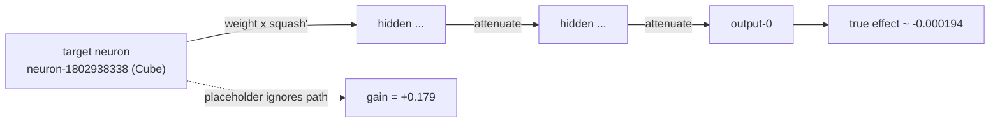

# PR Summary — Issue #1517

## Summary

TDD "test first" deliverable for the #1516 root cause: a **failing** executable
specification proving we can compute the effect on the network output of
removing a neuron that sits **many layers from the output**, where its
activation is diluted / transformed / squashed through every intervening weight
and activation function.

The recorded failure (`247b83ab` remove-neuron `neuron-1802938338`) carries a
fabricated placeholder gain of `+0.17882921`, while the empirically measured
effect is only `~-0.000194` — ~920× too large and opposite in sign. This PR
commits the fixtures, the ground-truth reference computation, and the red test
that pins the spec. The estimator implementation is intentionally **out of
scope** (it lands with #1516).

Closes #1517.

## What changed

- `tests/remove_neuron_propagation.rs` — new top-level integration test:
  - **`placeholder_gain_is_wrong_at_depth`** (runnable, the red-state guard):
    loads the committed failure fixture and asserts the recorded placeholder
    gain differs from the measured actual by **more than an order of magnitude**
    (~920×) and is **opposite in sign**. It also pins the recorded values, so if
    the placeholder is ever silently changed the guard turns CI red at that
    commit.
  - **`remove_neuron_effect_at_production_depth`** (`#[ignore = "red until #1516
    estimator lands"]`, the estimator spec): computes the propagation-aware
    reference live from the committed topology via the squash-aware downstream
    path product (`compute_impacts_public`), corroborates that the true effect
    is tiny (`~2.1e-5` — within one order of magnitude of the measured
    `~1.9e-4` and ~8000× below the placeholder), then specifies
    `estimate == measured_actual`. This is **red today** because the "current
    estimate" is still the placeholder.
- Hermetic fixtures under `tests/fixtures/remove_neuron_propagation/`:
  - `network.json` — production GRQ-cluster creature topology (target neuron is
    many steps from the single output).
  - `v2_remove-neuron_neuron-1802938338.json` — recorded GRQ-Discovery failure.
  - `README.md` — provenance and integrity notes.

## Evidence

Backend/CLI change — no web interface to screenshot. Verified via `cargo test`.

The red-state guard passes and the spec case is ignored in a normal run:

```text
running 2 tests
test remove_neuron_effect_at_production_depth ... ignored, red until #1516 estimator lands
test placeholder_gain_is_wrong_at_depth ... ok

test result: ok. 1 passed; 0 failed; 1 ignored; 0 measured; 0 filtered out
```

Forcing the ignored spec confirms it is genuinely **red** today (TDD):

```text
thread 'remove_neuron_effect_at_production_depth' panicked at
tests/remove_neuron_propagation.rs:
estimate 0.17882921185029582 must match the measured actual
-1.9447842987729835e-4 within one order of magnitude and in sign
test remove_neuron_effect_at_production_depth ... FAILED
```

### Scale of the discrepancy

| Quantity | Value | Ratio vs measured actual |
|----------|-------|--------------------------|
| Measured actual (`actualErrorReduction`) | `-1.94e-4` | 1× |
| Propagation-aware reference (topology) | `+2.14e-5` | ~9× (within one order) |
| Placeholder gain (`expectedCreatureScoreGain`) | `+1.79e-1` | ~920× (and wrong sign) |



## Test Plan

- Added `tests/remove_neuron_propagation.rs`:
  - `placeholder_gain_is_wrong_at_depth` — runs in CI, passes (green guard).
  - `remove_neuron_effect_at_production_depth` — `#[ignore]`, red today; becomes
    the permanent regression gate once the #1516 estimator lands and the
    `#[ignore]` is removed.
- Fixtures load at test start with explicit `expect`/`panic` carrying the
  fixture path, so a missing/corrupt fixture fails in the same CI run.
- Quality gates run against the committed lockfile: `cargo fmt --check`,
  `cargo clippy --all-targets --all-features -D warnings`, `cargo doc`, and the
  new test all pass.

### Note on the local quality gate

`./quality.sh` runs `cargo upgrade --incompatible`, which pulls `wgpu 30`; the
codebase is not yet ported to that major and the pre-existing GPU modules fail
to compile against it. This is unrelated to this test-only change (it reproduces
on a clean tree) and does not affect the CI `quality` job, which builds against
the committed `Cargo.lock` (wgpu 29). The dependency bump was reverted so this
PR is purely the new test and fixtures.
