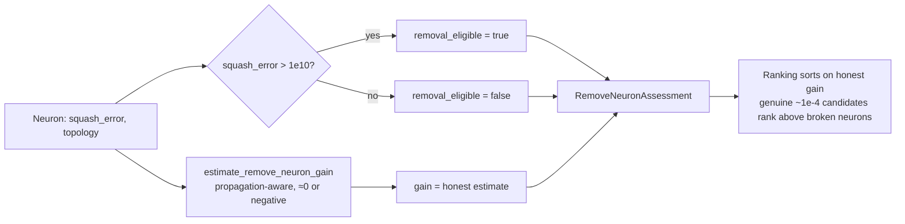

## Summary

Rank over-threshold hygiene neurons with an **honest** gain while keeping them
removal-eligible. Closes #1519.

Over-threshold "broken" neurons (baseline squash error `> 1e10`) still need to
be removed because they break WASM compilation of the exported network — the
NEAT-AI `#2483` hygiene guarantee must not regress. But they were ranked with a
fabricated `[0.1, 0.5]` floor gain that crowded out realistic (~`1e-4`)
improvement candidates.

This change adds a small decoupled model on top of the Issue #1518
propagation-aware estimator so the two concerns are independent:

- **Removal-eligibility** is derived from the hygiene threshold
  (`MAX_REASONABLE_SQUASH_ERROR = 1e10`) — a broken neuron is removed regardless
  of its estimated gain.
- **Ranking value** is the honest, propagation-aware
  `estimate_remove_neuron_gain` estimate (≈0 or negative), never the retired
  synthetic floor — so broken neurons no longer displace genuine `~1e-4`
  candidates.

### Changes

- `src/analysis/remove_neuron_gain.rs`
  - New `pub const MAX_REASONABLE_SQUASH_ERROR: f64 = 1e10` — mirrors the
    Deno-side threshold so both sides of the FFI boundary agree.
  - New `RemoveNeuronAssessment { removal_eligible, gain }` value type.
  - New `assess_remove_neuron(creature, neuron_uuid, squash_error)` — returns the
    hygiene eligibility (from the threshold) and the honest gain (from the
    estimator), fully decoupled. Returns `None` for output / absent neurons
    (never removal candidates).
- `src/analysis/mod.rs` — re-export the new constant, type, and function.

The Deno side already keeps the over-threshold promotion (`#2483`) and delegates
the gain to the injected estimator (`#1520`); this change makes the Rust engine
the single source of truth for "is this over threshold?" plus "what is the
honest gain?", and guards the decoupling with tests.

## Evidence

Backend/library change only — no web interface to screenshot. Verified via the
new unit tests plus the existing remove-neuron suites (all green):

```
tests/hygiene_removal.rs ... ok (5 tests)
tests/remove_neuron_gain.rs ... ok (5 tests)
tests/remove_neuron_propagation.rs ... ok (2 tests)
```

### Decoupling at a glance



## Test Plan

Added `tests/hygiene_removal.rs`:

- `over_threshold_neuron_removed_despite_nonpositive_gain` — a neuron with squash
  error `> 1e10` and a non-positive honest gain stays `removal_eligible`
  (hygiene / `#2483` guarantee).
- `over_threshold_gain_is_honest_not_floored` — the reported gain equals the
  propagation-aware estimate, is outside the retired `[0.1, 0.5]` floor, and a
  genuine `~1e-4` candidate ranks above it (no crowd-out).
- `below_threshold_neuron_is_not_hygiene_eligible` — proves eligibility is driven
  by the threshold, not the gain (decoupling in the other direction).
- `output_and_unknown_neurons_yield_no_assessment` — outputs / unknown UUIDs are
  never removal candidates.
- `assessment_fields_are_decoupled_values` — the assessment carries the two
  independent fields.

## Notes

- The quality gate's `cargo upgrade --incompatible` step attempted a `wgpu`
  `29 → 30` (and `naga` `29 → 30`) major bump, which introduces a breaking
  `BufferView`/`MapRangeError` API change requiring a separate GPU-code
  migration — out of scope for this issue. That bump was reverted; the remaining
  gate steps (fmt, clippy `-D warnings`, check, tests, doc, release build) pass
  on the committed dependency set.
