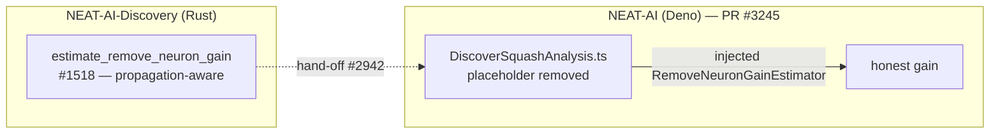

# Stop the Deno placeholder remove-neuron gain (cross-repo coordination)

## Summary

Issue #1520 is a **cross-repo** sub-issue of the #1516 milestone. The
propagation-aware remove-neuron gain estimator
(`estimate_remove_neuron_gain`) landed here in NEAT-AI-Discovery (Rust) via
#1518. Issue #1520 is the **consumer-side** change: the Deno repo
(`stSoftwareAU/NEAT-AI`) must stop fabricating the synthetic
`0.1 + (log10(err) − 10)/10 × 0.4` gain in `DiscoverSquashAnalysis.ts` and
instead consume the Discovery estimate (cross-repo per #2942).

Because `DiscoverSquashAnalysis.ts` lives in `stSoftwareAU/NEAT-AI`, the code
change lands there, not in this repository. The estimation authority (this
repo) already provides the propagation-aware estimator; nothing further is
required here for #1520 beyond this coordination record.

**Deno consumer PR:** stSoftwareAU/NEAT-AI#3245

What that PR does:

- Removes the two remove-neuron placeholder sinks in `DiscoverSquashAnalysis.ts`
  (`findCandidateSquash` and `analyzeSelectedNeuronsForHarmfulRemoval`).
- Adds an injected `RemoveNeuronGainEstimator` seam so the gain is consumed from
  the Discovery estimate; emits a non-fabricated neutral `0` when no estimate is
  wired (the benchmark surfaces zero as the sequencing signal per #1516).
- Preserves the #2483 WASM-hygiene behaviour — over-threshold neurons stay
  removal-eligible (removal is gated on error magnitude, not gain).
- Adds four TDD regression tests that fail against the old placeholder path.

Closes #1520

## Cross-repo flow

## Evidence

No Rust code change in this repository — the estimator (#1518) is already
merged. Verification of the Deno change is in stSoftwareAU/NEAT-AI#3245:
`DiscoverSquashAnalysis` tests (14 passed, incl. 4 new), project-wide
`deno lint` and `deno check` green.

## Test Plan

See stSoftwareAU/NEAT-AI#3245 for the four new regression tests in
`test/ErrorGuidedStructuralEvolution/DiscoverSquashAnalysis.ts`.
