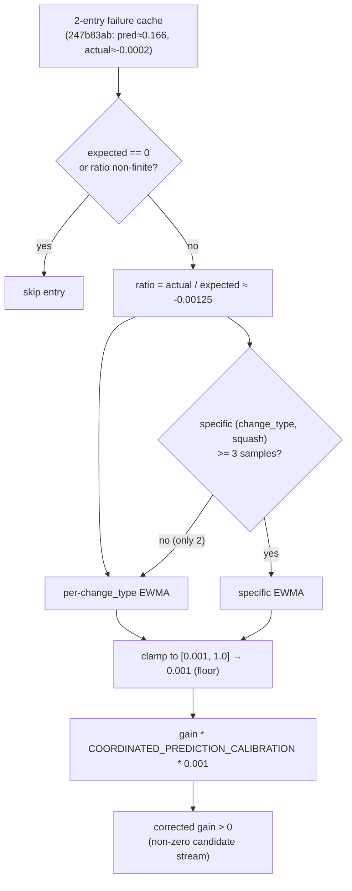

# PR Summary — Issue #1521

## Summary

Investigation of low remove-neuron candidate throughput and whether the thin
(2-entry) failure cache for creature `247b83ab` starves the #1131/#1162
calibration EWMA into suppressing candidate suggestion. **Closes #1521.**

**Finding (negative result on the "starvation" hypothesis).** The thin failure
cache does **not** starve the per-change-type calibration EWMA into collapsing
the remove-neuron candidate stream. Two existing safeguards in
`src/analysis/scoring/calibration_correction.rs` make a thin cache safe:

1. **Correction floor / clamp.** `CalibrationCorrection::from_failure_cache`
   clamps every per-`change_type` EWMA to
   `[MIN_CALIBRATION_CORRECTION, NEUTRAL_CORRECTION]` = `[0.001, 1.0]`. Even two
   ~800× over-predictions (the `247b83ab` shape: predicted ≈ 0.166, actual
   ≈ −0.0002) produce a correction of `0.001` — heavily discounted but strictly
   non-zero. `apply_prediction_calibration` is a plain multiply
   (`gain * factor`), so the corrected candidate gain stays strictly positive
   and the stream is never zeroed by this layer.
2. **Graceful fallback below the specific-sample threshold.** The per-
   `(change_type, target_squash)` specific layer requires
   `MIN_SPECIFIC_TARGET_SQUASH_SAMPLES` (= 3) usable entries. With only 2 the
   specific layer stays empty and `correction_for` falls back to the
   per-`change_type` EWMA (populated by any single usable entry) rather than
   leaving the correction undefined.

Low candidate throughput was therefore driven by the **placeholder gain**
(parent #1516) — the ~920× fabricated remove-neuron gain — which is addressed by
the propagation-aware estimate landed in #1517/#1518, **not** by the thin
failure cache. This is the "negative result … resolved by the estimator
sub-issues" outcome the issue explicitly allows.

**Remedy shipped.** Per the issue's failure-detection requirement, this PR ships
the regression test `tests/issue_1521_thin_failure_cache_calibration.rs` that
codifies the cold-start / warm-up fallback guarantee, plus a documentation note
in the calibration module. No behavioural code change was required — the floor
*is* the existing cold-start handling. The test prevents a future regression
(removing the floor, or gating corrections behind a minimum entry count) from
re-suppressing candidates.

## Evidence

Backend/Rust change only — no web interface to screenshot. Evidence is the test
suite: the new regression test passes and the existing calibration/drought
guards (`tests/analysis/issue_1425_remove_neuron_calibration.rs`,
`tests/issue_1448_remove_neuron_drought.rs`) remain green.

Calibration flow for a thin remove-neuron failure cache:

## Test Plan

Added `tests/issue_1521_thin_failure_cache_calibration.rs` (5 tests):

- `thin_two_entry_cache_yields_non_zero_floored_correction` — a 2-entry cache
  still populates the per-change-type correction with a strictly-positive,
  floored (`0.001`) value; the EWMA is not starved into silence.
- `thin_cache_corrected_gain_is_non_zero` — applying the correction to the
  fabricated gain yields a strictly-positive corrected gain (non-zero stream)
  that is still far below the raw gain.
- `thin_cache_falls_back_to_change_type_not_neutral` — with 2 squash-tagged
  entries the specific layer stays empty and lookup falls back to the non-zero
  per-change-type EWMA (not neutral 1.0).
- `thin_cache_ewma_reflects_observed_ratio` — two mild (ratio 0.5) entries yield
  ≈ 0.5, proving the EWMA tracks the data with only 2 samples.
- `thin_cache_matches_long_uniform_cache` — the 2-entry correction equals the
  20-entry uniform correction; the thin cache is not "under-warmed".

Also added a "Thin failure cache is safe (Issue #1521)" note to the module docs
in `src/analysis/scoring/calibration_correction.rs`.

Validation: `cargo fmt`, `cargo clippy --all-targets --all-features -D warnings`,
`cargo check --all-targets --all-features`,
`cargo test --lib --tests --all-features -- --test-threads=2` (all green,
including the existing #1425 / #1448 guards), and `cargo doc` all pass.

> Note: `quality.sh` runs `cargo upgrade --incompatible`, which pulls an
> incompatible `wgpu`/`naga` 29→30 major bump that breaks unrelated GPU code
> (`bytemuck::cast_slice` / `MapRangeError` API changes). That migration is out
> of scope for this investigation, so the dependency bump was reverted and the
> quality steps were run against the pinned dependencies.
