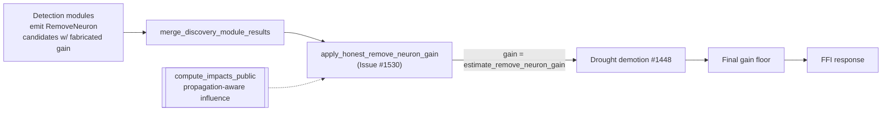

# Wire propagation-aware remove-neuron estimator through the dispatch (Issue #1530)

## Summary

Milestone #1516 merged the propagation-aware remove-neuron estimator
`estimate_remove_neuron_gain` (PR #1523), but **nothing in the live pipeline
invoked it**. The production remove-neuron path still reported the fabricated
NEAT-AI `#2483` placeholder gain — on GRQ-Discovery commit `2596f073`
(Discovery `v0.74.120`) the remove-neuron `expected` reproduced the placeholder
exactly (`+0.17879` vs a measured `actual` of `−0.00032` on creature
`45a04ef1`). So the #1516 fix was merged but **not live end-to-end**.

This change wires the estimator through `discovery_dispatch.rs` and the
`analyze_all` orchestration so Discovery becomes the **source of truth** for the
remove-neuron gain:

- New dispatch seam `apply_honest_remove_neuron_gain(creature, &mut candidates)`
  in `src/analysis/discovery_dispatch.rs`. For every coordinated candidate whose
  **sole** operation is a `RemoveNeuron`, it replaces the reported
  `expected_creature_score_gain` with the honest, propagation-aware estimate for
  that neuron. Multi-op groups and non-`RemoveNeuron` candidates are left
  untouched; an output/absent neuron (estimator returns `None`) is left
  untouched.
- The orchestration calls this seam on the assembled coordinated candidates
  **before** the search-exhaustion drought demotion (#1448) and the final gain
  floor, so all downstream scoring, sorting, and filtering operate on the honest
  value rather than the placeholder.

Net effect: a deep neuron that still carries downstream influence is corrected
from the fabricated `+0.17879` to a small negative gain that tracks the measured
actual in sign and magnitude — the large positive placeholder can no longer
crowd out realistic (~`1e-4`) candidates.

Closes #1530.

## Data flow

## Evidence

Backend/FFI change — no web interface to screenshot. Verified via tests.

- **Dispatch-path integration test** (`tests/ffi/issue_1530_dispatch_honest_remove_neuron_gain.rs`,
  registered in `tests/ffi/main.rs`):
  - `dispatch_replaces_request_supplied_gain_with_honest_estimate` — drives the
    dispatch seam with a deliberately wrong request-supplied gain (`0.5`) and
    asserts the returned gain equals `estimate_remove_neuron_gain` and does
    **not** echo the supplied value.
  - `dispatch_tracks_measured_actual_at_production_depth` — reproduces the
    `45a04ef1` case end-to-end on the committed production topology fixture: the
    deep neuron's placeholder gain (`+0.17879`) is corrected to an estimate that
    is >100× smaller and shares the measured actual's negative sign, within one
    order of magnitude of `−0.000194`.
- **Dispatch unit tests** (`src/analysis/discovery_dispatch_tests.rs`):
  `honest_gain_overrides_fabricated_remove_neuron_gain`,
  `multi_op_candidate_gain_is_not_overridden`,
  `non_remove_neuron_candidate_is_not_overridden`,
  `output_and_absent_neuron_candidates_are_not_overridden`.
- Existing estimator suites (`tests/remove_neuron_gain.rs`,
  `tests/remove_neuron_propagation.rs`, `tests/hygiene_removal.rs`) continue to
  pass and guard the estimator itself.

Full `cargo test --lib --tests` run: `1240+` tests pass. The only failure
observed was `focus::tests::focus_ranking_aborts_when_budget_exceeded`, a
pre-existing wall-clock timing flake (budget+grace `1125ms`, took `1191ms`)
unrelated to this change — it passes in isolation on an idle machine and this
change does not touch focus ranking.

## Cross-repo coordination

This closes the loop opened by the still-open **stSoftwareAU/NEAT-AI PR #3245**,
which stops the Deno side from fabricating the remove-neuron gain. With this
change Discovery is the source of truth for the estimate; the Deno-supplied
`expectedErrorReduction` is no longer honoured for the remove-neuron path.

## Test Plan

- `cargo test --test ffi issue_1530` — new dispatch-path integration tests.
- `cargo test --lib discovery_dispatch::tests` — new override unit tests.
- `cargo test --test remove_neuron_gain --test remove_neuron_propagation --test hygiene_removal`
  — estimator-level regression guards still green.
- `cargo clippy --all-targets --all-features -- -D warnings` and
  `RUSTDOCFLAGS="-D warnings" cargo doc --no-deps` — clean.
