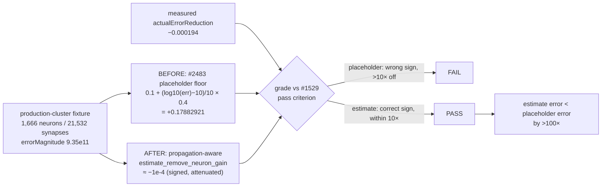

## Summary

Added an explicit **before/after accuracy** unit test proving the #1516/#1518
propagation-aware `estimate_remove_neuron_gain` beats the retired NEAT-AI #2483
placeholder floor formula at production scale. Closes #1531.

The user ask (parent #1529) was not "show the new estimator passes" but "prove
the fix yields a *more accurate* estimate than the old placeholder". The new
test computes both the retired placeholder and the propagation-aware estimator
against the recorded actual error change on the committed 1,666-neuron /
21,532-synapse production-cluster fixture, then asserts:

- the retired placeholder **fails** the #1529 pass criterion (wrong sign, >10×
  off), reproducing the fabricated `+0.17882921` gain from the recorded failure
  (creature 45a04ef1) via the topology-blind
  `0.1 + (log10(err) − 10)/10 × 0.4` floor formula on `errorMagnitude` alone;
- the propagation-aware estimator **passes** it (correct sign, within one order
  of magnitude of the measured `-0.000194`); and
- the estimator's absolute error is **strictly smaller** — in fact >100× smaller
  — so the fix is measurably more accurate, not merely passing.

This documents the exact regression the fix removed and turns CI red if the
estimator ever drifts back outside the pass criterion or the placeholder branch
degenerates into passing.

## Evidence

Backend/Rust test-only change — no web interface to screenshot. Verified with
`cargo test`, `cargo clippy -D warnings`, and `cargo fmt`.

```
running 3 tests
test placeholder_gain_is_wrong_at_depth ... ok
test propagation_estimate_beats_placeholder_at_production_scale ... ok
test remove_neuron_effect_at_production_depth ... ok

test result: ok. 3 passed; 0 failed; 0 ignored
```

Before/after accuracy on the committed production fixture:



## Test Plan

Added to `tests/remove_neuron_propagation.rs`:

- `propagation_estimate_beats_placeholder_at_production_scale` — the before/after
  accuracy proof. Reproduces the placeholder gain from `errorMagnitude`, asserts
  it fails the #1529 pass criterion (wrong sign + >10× off), asserts the
  propagation-aware estimator passes it, and asserts the estimator's absolute
  error is strictly smaller (>100×) than the placeholder's against the measured
  actual.
- Supporting helpers: `load_error_magnitude`, `placeholder_floor_gain` (the
  retired #2483 formula), and `meets_pass_criterion` (the #1529 grade).

Existing `placeholder_gain_is_wrong_at_depth` and
`remove_neuron_effect_at_production_depth` are unchanged and still pass.
