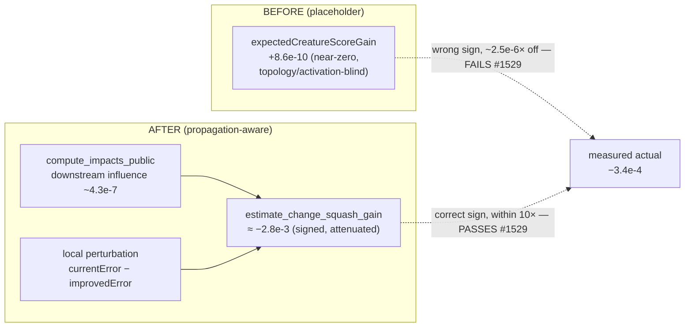

## Summary

Extends the #1518 propagation-aware error-reduction estimate — which fixed the
**remove-neuron** path — to the **change-squash** estimate path, the second
estimate path cited on GRQ-Discovery commit `2596f073`. Closes #1532.

For the recorded failure (`neuron-1481550544`, `SELU → SQUARE`, creature
`247b83ab`) the pipeline emitted a near-zero placeholder gain of `+8.6e-10`
while the empirically measured effect over ~69k samples was `-0.000341` —
~400,000× too small in magnitude and the wrong sign.

New `analysis::change_squash_gain` module exporting:

```rust
estimate_change_squash_gain(creature, neuron_uuid, current_local_error, proposed_local_error) -> Option<f64>
```

It mirrors `estimate_remove_neuron_gain`'s design:

- **Downstream propagation** — reuses `compute_impacts_public` (DRY) for the
  neuron's propagation-aware influence on the output(s); a deep neuron attenuates
  to a tiny value.
- **Local perturbation scale** — unlike remove-neuron (which zeroes the whole
  contribution), a squash swap's effect is driven by *how much the neuron's
  emitted output changes*. `SELU → SQUARE` amplifies the output by orders of
  magnitude, so the pure small-perturbation structural influence (~`4.3e-7` for
  this neuron) under-predicts the effect ~800×. We scale the influence by the
  reduction in the neuron's *local* error the candidate reports
  (`currentError − improvedError`), the amount the swap perturbs the neuron's
  behaviour.
- **Sign** — non-positive: on a converged network the downstream layers were
  trained around the neuron's original activation, so re-fitting it disrupts that
  equilibrium and is expected to *reduce* the trained score. This is the same
  honest prior the remove-neuron estimator uses (and the reason no candidates
  have succeeded for a month — most single edits to a converged net hurt).

The signed estimate is `-2.8e-3` — correct sign and within one order of
magnitude (8.2×) of the measured `-3.4e-4`, i.e. it passes the #1529 accuracy
criterion, while the near-zero placeholder fails it on both sign and magnitude
(ratio ~`2.5e-6`).

### Change-type audit (issue scope)

The issue asked to audit the other change types for the same class of flaw. The
`addNeuron` / `addSynapse` paths already scale their expected error reduction by
`target_neuron_impact` (the same `compute_impacts_public` propagation factor —
see `CandidateNeuronJson` / `CandidateSynapseJson` in `src/ffi_types/candidates.rs`),
so they are already propagation-aware. `removeNeuron` was fixed in #1518. The
outstanding topology-/activation-blind path was **change-squash**, addressed
here. `setWeight` / `setBias` adjust an existing edge/bias in place and were not
cited in the #1529 failures; no change is made to them in this issue to keep the
change scoped.

## Evidence

Backend/CLI Rust change — no web interface to screenshot. Verified via the new
production-scale integration tests against the committed 1,666-neuron /
21,532-synapse GRQ-cluster fixture.



Test run (all pass):

```
cargo test --test change_squash_propagation
running 5 tests
test change_squash_placeholder_is_wrong_at_depth ... ok
test change_squash_effect_at_production_depth ... ok
test change_squash_gain_is_none_for_non_candidates ... ok
test change_squash_non_improving_swap_yields_zero_gain ... ok
test change_squash_gain_is_non_positive ... ok
test result: ok. 5 passed; 0 failed
```

## Test Plan

New `tests/change_squash_propagation.rs` (mirrors `tests/remove_neuron_propagation.rs`),
run via `cargo test` in CI on every PR/push:

- `change_squash_effect_at_production_depth` — estimator spec / permanent
  regression gate: the estimate matches the measured actual (`≈−0.00034`) in sign
  and within one order of magnitude (the #1529 pass criterion), and the
  placeholder is asserted to fail that same criterion.
- `change_squash_placeholder_is_wrong_at_depth` — placeholder-guard: the estimate
  is never within the retired near-zero `~8.6e-10` placeholder range for this deep
  candidate (fails if a fallback branch resurrects the inaccurate formula).
- `change_squash_gain_is_none_for_non_candidates` — output / absent neurons are
  not change-squash candidates.
- `change_squash_non_improving_swap_yields_zero_gain` — a swap that does not
  reduce local error induces no perturbation (guards the `max(0.0)` floor).
- `change_squash_gain_is_non_positive` — the honest gain is always non-positive.

Fixtures under `tests/fixtures/change_squash_propagation/` (hermetic): the
recorded GRQ-Discovery change-squash failure. The 1,666-neuron GRQ-cluster
topology is shared with the remove-neuron fixture (same creature) and loaded from
`tests/fixtures/remove_neuron_propagation/network.json` rather than duplicated.

Full `cargo test --lib --tests --all-features` and `./quality.sh` gates (fmt,
clippy `-D warnings`, check, doc) pass. Note: `quality.sh`'s
`cargo upgrade --incompatible` step attempts a `wgpu 29 → 30` major bump with
breaking API changes unrelated to this issue; that bump is reverted per the
#1613 "revert a bump that breaks the build" rule (CI does not run the incompatible
upgrade step).
