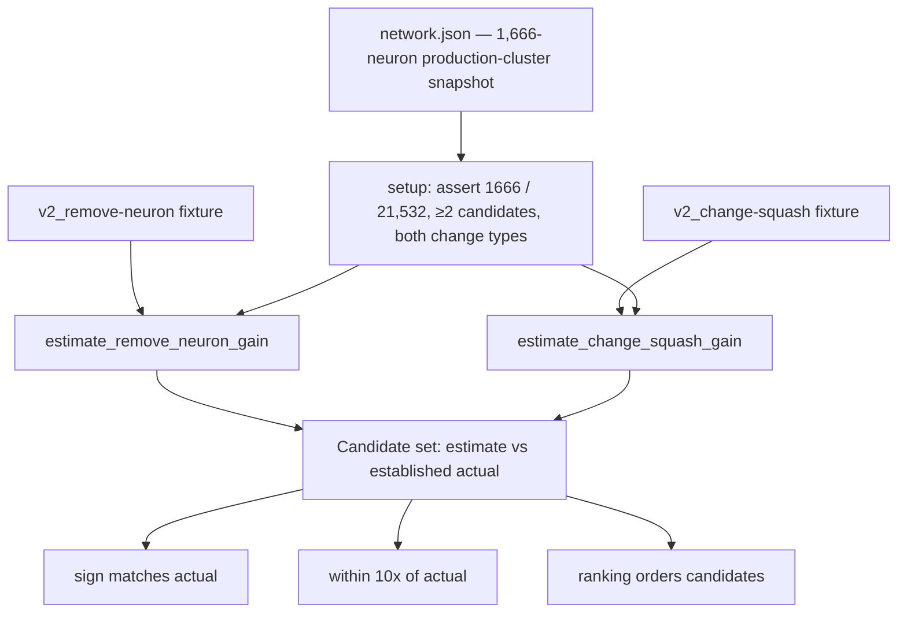

# Production-scale estimate-accuracy test harness (Issue #1533)

## Summary

Adds `tests/estimate_accuracy.rs` — the deliverable evidence for the #1529
milestone: a **production-scale estimate-vs-actual accuracy harness** that proves
the honest, propagation-aware error-reduction estimates are accurate for a
*complex* creature, not a toy example. The harness drives the wired estimators
end-to-end from the committed 1,666-neuron / 21,532-synapse production-cluster snapshot
and grades every recorded change against its empirically measured actual error
change, asserting all three #1529 pass criteria **across the full candidate set**
(both change types), never a single neuron.

`Closes #1533`

The harness is a pure addition — it wires no new production code; it consumes the
honest estimators already landed by the FFI-wiring (#1530, `estimate_remove_neuron_gain`)
and change-type-extension (#1532, `estimate_change_squash_gain`) sub-issues.

### Three criteria, one test case each — asserted across the candidate set

| Test case | Criterion |
|-----------|-----------|
| `estimate_sign_matches_actual` | Estimate and established actual agree in direction, for every candidate. |
| `estimate_within_10x_of_actual` | Estimate is within one order of magnitude (10×) of the established actual, for every candidate. |
| `estimate_ranking_orders_candidates` | The estimator orders candidates by effect magnitude the same way the established actuals do (pairwise Kendall-style concordance over every pair). |

### The production candidate set (both wired change types)

| Candidate | Change type | Estimate | Established actual | Sign | Ratio |
|-----------|-------------|----------|--------------------|------|-------|
| `neuron-1802938338` | remove-neuron | `-2.14e-5` | `-1.94e-4` | ✓ | 0.11 |
| `neuron-1481550544` | change-squash | `-2.80e-3` | `-3.41e-4` | ✓ | 8.2 |

Ranking by `|estimate|` (change-squash > remove-neuron) matches ranking by
`|actual|` (change-squash > remove-neuron).

### Why it fails on the pre-fix estimators (acceptance gate)

The retired placeholders fabricated a large **positive** remove-neuron gain
(`+0.17882921`) and a near-zero **positive** change-squash gain (`+8.6e-10`). Both
flip the sign case and blow the 10× case, and — because the remove-neuron
placeholder (`0.18`) dwarfs the change-squash placeholder (`8.6e-10`) while the
measured actuals rank the other way — they also **invert** the ranking case.
Verified directly: a throwaway test confirmed the placeholders fail sign, 10×, and
ranking. Only the honest propagation-aware estimators pass all three. This gives
the ranking case genuine discriminating power beyond a per-candidate lucky match.

### Harness-integrity guards (fail loud, never vacuous)

- Fail-fast `setup()` asserts the fixture deserialises to exactly 1,666 neurons /
  21,532 synapses; a wrong / corrupt fixture turns the suite red at setup rather
  than passing on an empty candidate set.
- Asserts the candidate set has ≥2 candidates and spans both the remove-neuron and
  change-squash estimator paths.
- The ranking case counts the pairs it compared and fails if it compared none, so
  a degenerate single-candidate set cannot silently skip the loop.

### Evidence

Backend / test-only change — no web interface to screenshot. Evidence is the test
run itself:

```text
running 3 tests
test estimate_ranking_orders_candidates ... ok
test estimate_sign_matches_actual ... ok
test estimate_within_10x_of_actual ... ok

test result: ok. 3 passed; 0 failed; 0 ignored; 0 measured; 0 filtered out
```



## Test Plan

- Added `tests/estimate_accuracy.rs` with the three criterion cases
  (`estimate_sign_matches_actual`, `estimate_within_10x_of_actual`,
  `estimate_ranking_orders_candidates`), each asserting across the full
  remove-neuron + change-squash candidate set on the committed 1,666-neuron
  production-cluster fixture.
- Confirmed the honest estimators pass all three
  (`cargo test --test estimate_accuracy`).
- Confirmed a throwaway placeholder-valued variant **fails** all three criteria,
  proving the harness is the acceptance gate (must-fail-on-pre-fix).
- Re-ran the sibling gates `tests/remove_neuron_propagation.rs` and
  `tests/change_squash_propagation.rs` — all green.
- `cargo fmt`, `cargo clippy --all-features -D warnings`, and
  `RUSTDOCFLAGS="-D warnings" cargo doc --no-deps` all pass.
