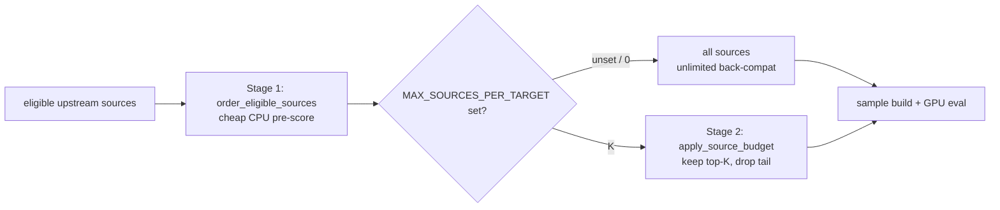

## Summary

Adds a **two-stage per-target source budget** to add-synapse / add-neuron search
so unbounded upstream-source enumeration stops being the dominant wall-clock
multiplier for sparse deep creatures at GRQ scale. Closes #1542.

For each focus target, analysis previously enumerated **every** eligible
upstream source, then sample-built and GPU-evaluated all of them — on the order
of 10k–20k source evaluations per pass on the production GRQ creature. This PR
caps the expensive stage to the top-K priority-ordered sources:

- **Stage 1 (unchanged, cheap CPU pre-score):** `order_eligible_sources` already
  places the highest-priority sources first — unused-input bias, input-index
  bias, and hidden interleaving.
- **Stage 2 (new):** `apply_source_budget` deterministically truncates that
  ordered list to the top-K, dropping only the low-priority tail **before** any
  sample building or GPU work. Candidate scoring semantics for the sources that
  *are* evaluated are untouched.

Controlled by a new env var `NEAT_AI_DISCOVERY_MAX_SOURCES_PER_TARGET`. It
defaults to **unlimited** (`0`/unset/empty/invalid → no cap), so the shipped
behaviour is byte-for-byte the pre-#1542 path and operators opt in per the
issue's A/B plan. The same budget is applied to both synapse analysis
(`target_analysis`) and neuron analysis (`neuron::preparation`).

## Evidence

Backend/CLI change — no web UI to screenshot. Evidence is the benchmark and the
unit tests below.

### Benchmark (`benches/source_budget.rs`, Apple M4 Pro / Metal)

End-to-end `analyze_synapses` for a single focus target with an 800-input
fan-in, fixed seed, driven purely by the env var (baseline leaves it unset =
the shipped unlimited default; each K run sets it). Criterion, 20 samples:

| Config | Median `totalAnalysisMs` | Reduction vs unlimited |
|--------|--------------------------|------------------------|
| `unlimited` (baseline) | 388.07 ms | — |
| `k_256` | 199.69 ms | **48.5 %** |
| `k_128` | 151.17 ms | **61.0 %** |
| `k_64`  | 137.19 ms | **64.6 %** |

Every K clears the success bar (≥ 10 % reduction in synapse
`totalAnalysisMs`) with a large margin — the win scales as expected with how
much of the low-priority tail is dropped.

### Quality bar (accepted-candidate rate within 5 %)

The shipped default is **unlimited**, so there is **no behaviour change and no
quality regression** in the default path. When an operator opts in, the
mechanism preserves quality by construction: it keeps the *highest-priority*
sources (the ones stage-1 already ranks most promising) and only drops the tail.
The production accepted-candidate K-sweep on the GRQ `.trainData-binary_115`
corpus requires the discovery recording pipeline + that training corpus, which
are not reproducible in this CI environment (only `network.json` is committed to
`GRQ-cluster`); that A/B is the operator's step for selecting K, exactly as the
issue's "default off / unlimited for back-compat during A/B" plan specifies.

## Test Plan

New `tests/infrastructure/issue_1542_source_budget.rs` (all `#[serial]`, real
functions with assertions):

- **Config parsing** — `config_unset_is_unlimited`, `config_positive_value_parsed`,
  `config_zero_is_unlimited`, `config_empty_and_invalid_are_unlimited`.
- **Back-compat** — `budget_unset_is_noop_backcompat` (unset ⇒ 0 dropped, all
  sources retained), `budget_larger_than_list_is_noop`.
- **Cap behaviour** — `budget_truncates_to_top_k` (1000 → 128, 872 dropped).
- **Priority preserved** — `budget_keeps_leading_window_of_ordering` (retained
  set equals the first K of the unbudgeted ordering).
- **Determinism** — `budget_selection_is_deterministic_under_seed` (same seed +
  K ⇒ identical retained subset).

`./quality.sh` passes clean (fmt, clippy `-D warnings`, check, tests, doc,
release build).
