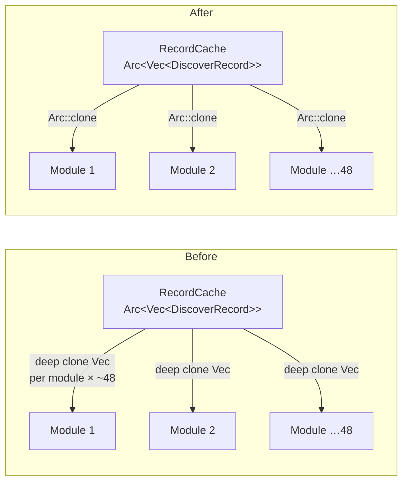

# perf: Arc-share DiscoverRecord across detection modules (Issue #1543)

## Summary

The bulk `RecordCache::load_records_for_*` loaders used to **deep-clone** each
neuron's inner `Vec<DiscoverRecord>` for every one of the ~48 discovery modules
dispatched per `analyze_all` post-processing pass. On production-scale creatures
(production creature `ed71b732`, ~1662 hidden neurons) that materialised **tens of GB** of
transient record copies even when the synapse GPU work finished on time — the
highest-impact clone that Issue #983 explicitly deferred.

This change makes the loaders hand out a cheap `Arc::clone` of the cache's
existing allocation instead of a deep copy. The cache already stored each
neuron's records behind an `Arc<Vec<DiscoverRecord>>`; the loaders now wrap that
`Arc` in a small transparent [`SharedRecords`] newtype and return it. Detection
and recommendation modules accept `&[(String, impl AsRef<[DiscoverRecord]>)]`, so
the shared production path (`SharedRecords`) and existing owned test fixtures
(`Vec<DiscoverRecord>`) satisfy the same signature — **no candidate behaviour
changes**.

`Closes #1543.`

### What changed

- **`src/types.rs`** — new `SharedRecords(Arc<Vec<DiscoverRecord>>)` newtype with
  `Deref`/`AsRef<[DiscoverRecord]>` so it is transparent at use sites, plus an
  `arc()` accessor for allocation-identity assertions.
- **`src/analysis/cache/mod.rs`** — the five `load_records_for_*` loaders now
  return `Vec<(String, SharedRecords)>` and drop the `r.as_ref().clone()` deep
  copy in favour of `SharedRecords::new(r)` (an `Arc::clone`).
- **~44 detection/recommendation module signatures** — the record-list parameter
  changed from `&[(String, Vec<DiscoverRecord>)]` to
  `&[(String, impl AsRef<[DiscoverRecord]>)]`. Bodies that iterate the pair
  directly now call `.as_ref()` to obtain the `&[DiscoverRecord]` slice; bodies
  using the shared `build_record_map` helper were unchanged (the helper is now
  generic and returns `HashMap<&str, &[DiscoverRecord]>`).
- **Tests** — a handful of fixtures needed an explicit
  `Vec<(String, Vec<DiscoverRecord>)>` annotation where the record container type
  was previously inferred solely from the (now-generic) function parameter.

### Data flow

## Evidence

Backend/CLI change — no web UI to screenshot. Verified by benchmark + tests.

### Benchmark: `cargo bench --bench record_arc_sharing`

New benchmark (`benches/record_arc_sharing.rs`) reproduces one `analyze_all`
loader pass against a preloaded cache (300 neurons × 400 records) and measures
peak transient record materialisation via the library's own tracking allocator
(`discovery_memory_usage_bytes()`) plus loader-phase wall-clock. Source is
identical before/after; only the numbers move.

| Metric | Before (deep clone) | After (Arc-share) | Reduction |
|--------|--------------------:|------------------:|----------:|
| Peak transient bytes / dispatch pass | 493.66 MiB | 0.92 MiB | **99.8 %** |
| Loader-phase wall-clock / pass | 469.070 ms | 2.211 ms | **99.5 %** |

Both success criteria are met with large margin:
- ≥ 10 % detection/post-processing wall-clock reduction → **99.5 %**.
- ≥ 30 % peak-RSS reduction attributable to record materialisation → **99.8 %**.

The transient bytes collapse from ~half a GB per pass to under 1 MiB because the
records are no longer copied — only `Arc` control blocks plus per-neuron UUID
`String`s are allocated.

## Test Plan

- **New regression guard** — `tests/analysis/issue_1543_arc_share_records.rs`
  asserts, via `Arc::ptr_eq`, that `load_records_for_uuids` /
  `load_records_for_hidden` / `load_records_for_all_neurons` return records that
  **share the cache's allocation** (and that repeated loads share one
  allocation). A future revert to deep-cloning fails these deterministically
  rather than only as a slow benchmark. (4 tests, all pass.)
- **No behavioural change** — the detection (`482`), recommendation (`236`),
  recording, and analysis suites exercise every module whose signature changed;
  all pass unchanged, confirming emitted candidates are identical.
- **API fully migrated** — `cargo clippy --all-targets --all-features -D warnings`
  is clean, so there are no leftover dual signatures or unused `Arc` imports (the
  Issue's "no half-migration" guard).
- **PreloadAll / LRU / Streaming tier behaviour unchanged** (Issue #215) — only
  the loader return type changed; the tiered selection path is untouched.

## Notes

- Out of scope (unchanged): SoA layout (#1009), Parquet on-disk format,
  CreatureJson clone avoidance (#745).
