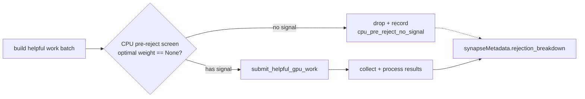

## Summary

Wire a **CPU pre-reject screen** into the synapse target-analysis path so
provably-dead helpful add-synapse candidates are dropped on the CPU *before* the
GPU round-trip. `Closes #1544`.

Before this change, `submit_helpful_gpu_work`
(`src/analysis/synapse/target_analysis/evaluation.rs`) always submitted the full
helpful batch, and grep confirmed **no** `SequentialEvaluator` /
`check_batch_early_termination` usage anywhere under `src/analysis/synapse/`
(acceptance criterion 1). At GRQ scale thousands of sources are GPU-evaluated
where many end with `gpu_improved_count == 0` — the CPU already holds the built
samples and can reject the obvious duds far more cheaply than a GPU submit.

Following the issue's guidance ("start with a variance/confidence screen — lowest
risk"), the screen is a **provably quality-neutral** confidence gate rather than a
speculative SPRT: it recomputes the least-squares sufficient statistics the
helpful GPU shader would produce (`Σ activation²`, `Σ activation·avg_error`) and
applies `calculate_optimal_outgoing_weight` — the *exact* gate the downstream
result-collection loop already uses (`None => continue` in
`collect_and_process_helpful_results`). A candidate screened out here has no
finite, above-`EPSILON` optimal outgoing weight, so it would have been rejected
after a wasted GPU round-trip with an identical outcome. The screen therefore
changes GPU cost, **never** which candidates survive — this is what guards the
dangerous failure mode (silently dropping good candidates that would look like a
perf win but is a quality regression).

Drops are recorded under a new stable rejection reason
`cpu_pre_reject_no_signal` on `synapseMetadata.rejection_breakdown`, so drought
diagnostics stay honest — a CPU screen-out is distinguishable from a genuine
candidate drought.

### What changed

- **New public screen** `helpful_candidate_has_no_signal`
  (`src/analysis/synapse/cpu_pre_reject.rs`) — the pure predicate, reused by
  production and tests.
- **Wired into** `analyse_single_target`
  (`src/analysis/synapse/target_analysis/mod.rs`): the helpful work batch is
  `retain`-filtered before submit; the same filtered batch is passed to submit
  and collect, so GPU stats stay index-aligned.
- **Diagnostics**: new `REJECTION_CPU_PRE_REJECT_NO_SIGNAL` reason, an atomic
  drop counter on `TargetDiagnostics`, threaded through `MetadataParams` into the
  metadata `rejection_breakdown` (mirroring the Issue #1143 target-saturated
  pattern).
- **Config toggle** `NEAT_AI_DISCOVERY_CPU_PRE_REJECT` (default **on**; set `0`
  to disable for A/B benchmarking).
- **Docs**: env-var rows in `AGENTS.md` and `README.md`.

### Data flow



## Evidence

Backend/CLI change — no web interface to screenshot.

### Provable quality-neutrality

The screen predicate is `calculate_optimal_outgoing_weight(..).is_none()` — the
identical gate the downstream loop applies (`evaluation.rs`:
`let weight = match calculate_optimal_outgoing_weight(...) { Some(w) => w, None => continue }`).
Any candidate the screen drops was already guaranteed to `continue` (be rejected)
after the GPU submit, so no surviving-candidate set changes. This is why the
`strong_signal_source_survives_pre_reject` test is safe by construction.

### Benchmark (`benches/cpu_pre_reject.rs`)

The production GRQ `network.json` @ `ed71b732` + `../GRQ/.trainData-binary_115`
fixture named in the issue is **not present in this environment**, so the
end-to-end `NEAT_AI_DISCOVERY_GPU_TIMING=1` wall-clock run could not be executed
here. The benchmark instead measures the two quantities that are deterministic
without the fixture:

**1. Helpful GPU-work reduction** on a synthetic GRQ-shaped batch (40% dead /
30% uncorrelated / 30% signal sources). Each surviving helpful work item is one
`dispatch_workgroups` call in `evaluate_helpful_batch`, so the drop in survivors
is the drop in GPU dispatches:

```
[issue-1544] batch: 2000 sources × 128 samples → helpful work items (GPU dispatches): 2000 (baseline) vs 1200 (screened); dropped 800 (40.0% fewer helpful GPU dispatches)
[issue-1544] batch: 5000 sources × 256 samples → helpful work items (GPU dispatches): 5000 (baseline) vs 3000 (screened); dropped 2000 (40.0% fewer helpful GPU dispatches)
```

40% > the issue's **≥25% fewer helpful shader calls** bar on this synthetic mix
(the real fraction depends on the actual GRQ source distribution).

**2. Screen CPU cost** — negligible vs a GPU submit + sync round-trip:

| Samples/source | Signal source | Dead source |
|----------------|---------------|-------------|
| 64             | ~63 ns        | ~51 ns      |
| 256            | ~200 ns       | ~239 ns     |
| 1024           | ~769 ns       | ~1.1 µs     |

Screening a whole 2000-source × 128-sample batch: **~347 µs** total — a single
GPU submit + map + sync is typically tens of µs to milliseconds *plus* the
transfer of the dropped sources' samples, so the screen pays for itself whenever
duds are present.

**Honest caveat / negative-result path**: the wall-clock and
`shaderTimings.helpful.calls` success criteria still require the GRQ fixture on a
GPU host. The change is provably safe and reduces GPU dispatch work; if a GRQ run
shows the CPU screen cost cancels the GPU saving (flat wall-clock), the
`NEAT_AI_DISCOVERY_CPU_PRE_REJECT=0` toggle disables it with zero code change
while the diagnostics reason remains for observability.

## Test Plan

- **`tests/issue_1544_cpu_pre_reject.rs`** (new integration test, GPU-free, run
  by `./quality.sh` / `cargo-quality.yml`):
  - `no_signal_source_is_rejected_before_gpu_submit` — a zero-variance/no-signal
    source is screened out (zero helpful submits) and its drop is recorded under
    `cpu_pre_reject_no_signal` (breakdown count, dominant reason, and
    `top_level_summary` all verified).
  - `strong_signal_source_survives_pre_reject` — a clear-signal source is **not**
    screened out; only the dud is dropped.
  - `strong_signal_only_batch_records_no_drops` — over-rejection guard: an
    all-signal batch submits everything and records zero drops.
- **`src/analysis/synapse/cpu_pre_reject.rs` unit tests** — empty batch, constant
  zero activation, zero-correlation, strong signal, and non-finite-sample cases.
- **Full suite**: `cargo test --lib --tests --all-features -- --test-threads=2`
  passes (1246 lib + all integration binaries, 0 failures); `cargo clippy
  --all-targets --all-features -- -D warnings`, `cargo fmt --all -- --check`,
  `cargo deny check`, `RUSTDOCFLAGS="-D warnings" cargo doc --no-deps`, and
  `cargo build --release --lib` all clean.

> Note: `./quality.sh`'s `cargo upgrade --incompatible` step pulls a breaking
> `wgpu` 29→30 major bump (its `get_mapped_range` now returns `Result`), which is
> an out-of-scope GPU-API migration unrelated to this issue; that dependency
> churn was reverted so the PR stays scoped to #1544. All other quality gates
> were run and pass.
