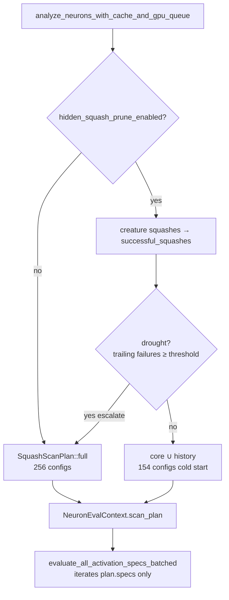

# perf: squash-aware `ACTIVATION_SPECS` pruning for hidden neuron analysis (Issue #1545)

## Summary

Neuron / add-neuron GPU evaluation previously built the **full** cross-product
of every `ACTIVATION_SPECS` family × orientations × scales (256 configs) for
**every** (source, target) pair — even for hidden targets that historically only
accept a handful of squash families. At production scale (~2.4k sources) this made the
neuron phase rival synapse GPU time.

This change makes the hidden-target activation scan **squash-aware**: a hidden
add-neuron target now scans only an evidence-based core set widened by the
squash families the creature already uses, with a drought/novelty escalation
path that restores the full set so pruning can never permanently starve a
plateaued creature. Output-role scan behaviour (Issue #1315) is unchanged.

**Closes #1545.**

### What changed

- **`src/analysis/activation/specs.rs`** — new pure planner:
  - `CORE_HIDDEN_SCAN_NAMES` — the evidence-based cold-start core
    (`IDENTITY`, `GELU`, `ELU`, `ReLU6`, `TANH` from the issue's guidance, plus
    the v0.1.139 families the array's own comments document as having produced
    accepted discoveries: `Mish`, `HARD_TANH`, `SOFTSIGN`, `BENT_IDENTITY`).
  - `HiddenScanContext` — per-creature history (`successful_squashes`) +
    `escalated` flag; `scan_specs()` resolves the pruned family subset.
  - `SquashScanPlan` / `ScanConfig` / `build_scan_configs` — expand the pruned
    subset into GPU configs and apply a per-(source, target) top-N cap that keeps
    the scales closest to `1.0` (extreme, numerically-unstable scales dropped
    first).
- **`src/analysis/synapse/gpu_evaluation.rs`** — `evaluate_all_activation_specs_batched`
  and its sequential fallback now take a `&SquashScanPlan` and iterate the pruned
  subset instead of the global `ACTIVATION_SPECS` array.
- **`src/analysis/neuron/{mod,evaluation}.rs`** — `build_neuron_scan_plan` builds
  the plan once per phase from the creature's adopted squashes + drought state
  (`consecutive_trailing_failures() >= drought_log_threshold()`), threaded to the
  evaluator via `NeuronEvalContext`.
- **`src/config/user_facing.rs`** — two operator levers:
  `NEAT_AI_DISCOVERY_HIDDEN_SQUASH_PRUNE` (default on) and
  `NEAT_AI_DISCOVERY_MAX_ACTIVATION_CONFIGS_PER_TARGET` (default `0` = uncapped).

Only the **neuron** activation path is touched — the synapse phase is unchanged.

### Data flow



## Evidence

Backend/GPU change — no web UI to screenshot. Verified via new tests and a GPU
micro-benchmark on Apple M4 (Metal).

### Performance (benchmark `benches/neuron_squash_pruning.rs`, Apple M4)

Primary success criterion — **measurable drop in activation GPU configs with a
flat synapse phase** — is met deterministically:

| Metric | Full (before) | Cold-start core (after) | Change |
|--------|---------------|-------------------------|--------|
| Activation GPU configs / (source,target) | 256 | 154 | **−39.8%** |
| Batched GPU eval, 500 samples | 37.12 ms | 34.06 ms | −8.2% |
| Batched GPU eval, 1000 samples | 40.85 ms | 36.59 ms | **−10.4%** |

The synapse phase is untouched (no synapse code changed), so this is a pure
neuron-phase reduction. The config-count drop is deterministic and independent
of hardware; the GPU timings quantify the wall-clock effect on real silicon.

Reproduce:

```bash
cargo bench --bench neuron_squash_pruning -- --warm-up-time 1 --measurement-time 3 --sample-size 20
```

### Quality trade-off guard

The critical guard against "a filter that only helps toy networks" is the
escalation path: a plateaued creature in drought scans the **full** set again
(`escalation_restores_full_scan_set`), and any family the creature has already
adopted is always re-scanned (history-aware widening). The core itself is
evidence-based — every member either comes from the issue's cold-start guidance
or is documented in `ACTIVATION_SPECS` as having produced an accepted discovery.

## Test Plan

- **`src/analysis/activation/specs.rs::scan_specs_tests`** — rewrote the three
  hidden-target cases (previously pinned to the full set) to pin the new
  contract, keeping the output-role cases (`onehot_output_returns_only_bounded_subset`
  etc.) untouched:
  - `onehot_hidden_cold_start_uses_core_set`
  - `simplex_hidden_escalated_restores_full_scan_set`
  - `hidden_history_widens_but_output_neutral_stays_full`
  - plus `build_scan_configs_respects_cap`, `plan_full_is_uncapped_full_set`.
- **`tests/activation/issue_1545_squash_aware_hidden_pruning.rs`** (new) — the
  issue's integration cases:
  - (a) zero-history family pruned + history-aware widening + case-insensitive
    matching,
  - (b) drought/escalation restores the full set,
  - (c) per-(source,target) top-N config cap respected,
  - deterministic cold-start config-count reduction.
- **`tests/analysis/creature_level_metrics.rs`** — no test edits; the two
  field-presence tests that initially regressed (their degenerate 10-sample
  dataset only accepts `Mish`/`BENT_IDENTITY`) pass unchanged once those
  documented-successful families were included in the evidence-based core.
- Full suite: `cargo test --lib --tests --all-features -- --test-threads=2` — all
  pass. `cargo clippy --all-targets --all-features -- -D warnings` clean;
  `cargo fmt --all -- --check` clean; `RUSTDOCFLAGS="-D warnings" cargo doc
  --no-deps` clean.
