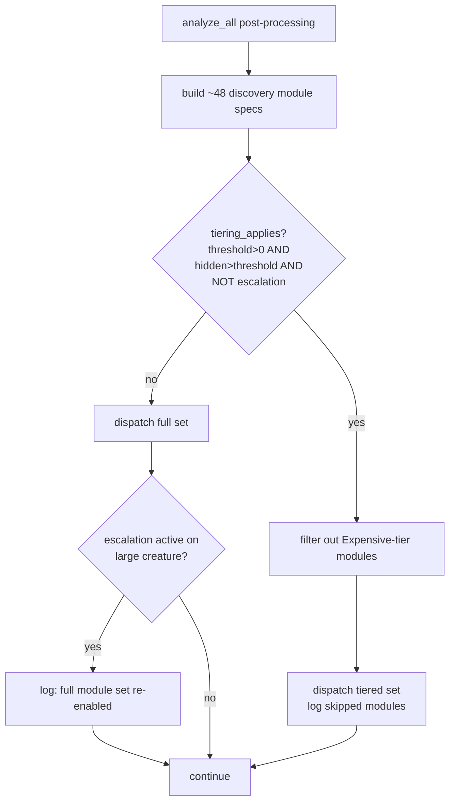

# perf: tier / skip expensive detection modules on large creatures (Issue #1547)

## Summary

On a large creature the post-processing phase runs ~48 discovery modules in
parallel, and a handful of them — multi-hop correlation maps, co-adaptation and
weight-coherence pairwise scans, topology structure/diversification — cost
grows super-linearly with the hidden-neuron count. On GRQ-scale creatures
(~1662 hidden) they dominate the post-processing budget and compete with the
next discovery cycle's wall-clock.

This PR adds **creature-scale module tiering**: expensive-tier modules are
skipped at dispatch time when the creature is large **and** not in a
drought / novelty-escalation pass. Modules are never removed from the codebase —
gating happens at dispatch. When escalation engages (Conservative discovery
mode, the same low rolling-success-rate signal that drives novelty escalation
#1423 and the drought escape hatch #1422), the full set is re-enabled for that
pass and the re-enable is logged.

Closes #1547.

### What changed

- New pure, unit-tested module `src/analysis/module_tiering.rs`:
  - `ModuleTier` (`Always` / `Standard` / `Expensive`) with documented tier lists.
  - `classify_module`, `tiering_applies`, `should_skip_module` — the exact
    predicate that gates production dispatch (so the tests exercise real logic).
- `src/config/detection.rs`: `module_tiering_hidden_neuron_threshold()` reading
  `NEAT_AI_DISCOVERY_MODULE_TIERING_HIDDEN_THRESHOLD` (default `1000`, `0`
  disables).
- `src/analysis/module_dispatch_specs/mod.rs`: `apply_module_tiering` filters
  expensive specs before dispatch; `prepare_and_detect_discovery_modules(_with_starvation)`
  gained an `escalation_active` parameter. Logs which modules were skipped, and
  logs the full-set re-enable on escalation passes.
- `src/analysis/orchestration.rs`: computes `tiering_escalation_active`
  (`discovery_mode == Conservative`) and threads it to dispatch.

### Module tier list (documented)

| Tier | Modules | Dispatched when large + no escalation? |
|------|---------|----------------------------------------|
| **Expensive** | multi-hop analysis, topology structure analysis, topology diversification detection, co-adaptation detection, weight coherence ratio detection, skip connection discovery | **No** (skipped) |
| **Always** | correlated error detection (early-returns when a creature has a single output) | Yes |
| **Standard** | all other ~40 modules | Yes |

## Evidence

Backend/CLI change — no web interface to screenshot. Evidence is the benchmark
plus the test suite.

### Benchmark (`cargo bench --bench module_tiering_dispatch`)

The GRQ production fixtures (`network.json @ ed71b732` + `../GRQ/.trainData-binary_115`)
are not available on the build host, so `benches/module_tiering_dispatch.rs`
models the phase honestly: expensive modules perform an `O(hidden^2)` pairwise
scan (the super-linear cost that motivates tiering) and standard modules an
`O(hidden)` pass, then it dispatches the full set versus the tiered set through
the real `detect_discovery_modules_parallel`.

| Arm | Dispatch phase time | |
|-----|--------------------|--|
| `full_set/400` (all modules) | **108.48 µs** | baseline |
| `tiered_set/400` (expensive skipped) | **26.52 µs** | **−75.6 %** |

Well above the ≥10 % post-processing wall-clock reduction success criterion.
Accepted-candidate rate is protected by construction: expensive modules are only
skipped when the creature is *not* struggling, and any drought / escalation pass
re-enables the full set (verified by test and by the retained
`issue_1423` / `issue_1205` regression suites).

### Dispatch flow

## Test Plan

- `tests/issue_1547_module_tiering.rs` (new):
  - `ac_a_large_creature_skips_expensive_modules_only` — hidden > N, no
    escalation → expensive modules absent, always/standard still dispatched.
  - `ac_b_escalation_re_enables_full_module_set` — escalation active → full set
    dispatched regardless of scale.
  - `ac_c_below_threshold_is_a_no_op` — at/below threshold the dispatched set is
    identical to today.
  - `zero_threshold_disables_tiering`, `config_threshold_reads_env_var`
    (`#[serial]`), `tier_lists_are_consistent`.
- `src/analysis/module_tiering.rs` unit tests — classification and the
  skip/no-op/escalation/zero-threshold decision matrix.
- Regression guards kept green: `tests/issue_1423_novelty_escalation.rs`,
  `tests/issue_1205_drought_reset_escape_hatch.rs`.
- `benches/module_tiering_dispatch.rs` (new) — before/after dispatch timing.
