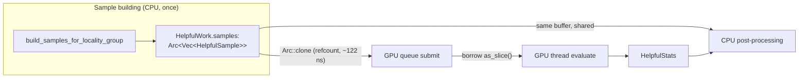

# PR Summary — Issue #1548

## Summary

Eliminated the per-submit deep copy of `HelpfulSample` sample vectors on the GPU
queue submit path. Previously `submit_helpful_gpu_work` (and the harmful
counterpart) ran `helpful_work_batch.iter().map(|w| w.samples.clone())` on
**every** batch submit, allocating and copying every source's sample `Vec` purely
to satisfy queue ownership. At production scale, locality groups hold large
`Vec<HelpfulSample>`, so this created multi-GB transient allocations and cache
thrash on the already CPU-bound sample-build path.

The fix wraps each work item's samples in `Arc<Vec<HelpfulSample>>` once at build
time, so the submit path takes a **cheap refcount clone** instead of a deep copy.
The GPU thread only ever borrows the samples (via `as_slice()`) during
evaluation, so sharing the buffer is safe; the CPU still reads the same buffer
during result post-processing (shared, not moved), and `Arc` makes the
deadline-cancellation / drop paths use-after-free-free by construction.

`Closes #1548.`

### What changed

- `HelpfulWork.samples` and `PreparedHarmfulWork.samples` are now
  `Arc<Vec<HelpfulSample>>`.
- `GpuWorkRequest::HelpfulBatch.samples` → `Vec<Arc<Vec<HelpfulSample>>>` and
  `HarmfulBatch.samples_with_weights` → `Vec<(Arc<Vec<HelpfulSample>>, f32)>`.
- `GpuWorkQueue::submit_helpful_batch` / `evaluate_helpful_batch` /
  `evaluate_harmful_batch` accept the `Arc`-shared forms.
- The GPU thread (`execution.rs`) borrows each `Arc` buffer as a slice — no
  ownership transfer, no copy.
- The two hot-path submit builders now `Arc::clone` instead of deep-cloning.

The one remaining deep clone — building `SourceContribution` for accepted
new-synapse candidates — is intentionally left as-is: `build_source_contribution`
has ~40 call sites across the test suite and `SourceContribution` genuinely owns
its samples for downstream epistatic detection. That clone is conditional
(post-processing, per accepted candidate) rather than the unconditional
per-submit copy this issue targets, so it is out of scope here.

### Data flow



Before: every submit deep-copied the whole batch of sample vectors. After: the
submit shares the existing buffers by refcount; the GPU borrows them and the CPU
keeps reading them.

## Evidence

Backend/library change — no web UI to screenshot. Verified via Criterion
benchmarks and the unit/integration test suite.

### Benchmark — `queue_submission_copies` (Issue #1548 additions)

Two new benches build a simulated helpful submit batch (`BATCH_ITEMS = 32` work
items) the pre-fix way (deep clone every sample `Vec`) vs the post-fix way
(`Arc::clone`). Median times:

| samples/item | before: `submit_batch_deep_clone` | after: `submit_batch_arc_clone` | reduction |
|-------------:|----------------------------------:|--------------------------------:|----------:|
| 64           | 3.03 µs                           | 0.123 µs                        | ~96%      |
| 256          | 11.12 µs                          | 0.123 µs                        | ~98.9%    |
| 1024         | 25.86 µs                          | ~0.123 µs                       | ~99.5%    |
| 4096         | 111.80 µs                         | ~0.123 µs                       | ~99.9%    |

`Arc::clone` cost is **flat (~122 ns)** and independent of sample-vector length,
because it is a per-item atomic refcount increment rather than an allocation +
memcpy. The deep-copy cost scales linearly with sample size. This far exceeds the
issue's **≥20% win on the `queue_submission_copies` Criterion suite** success
bar, and — because the deep copy is removed entirely — eliminates the transient
per-submit allocation that drove peak-RSS growth during helpful submit at
production scale.

Run with:

```
cargo bench --bench queue_submission_copies -- submit_batch
```

> Note: the production fixtures (the production training-data binary) are not
> available in this environment, so the production-fixture RSS/ms measurement in
> the issue's benchmark plan could not be captured here. The structural win is
> unconditional: the hot submit path no longer allocates or copies the sample
> data.

## Test Plan

New unit tests in `src/analysis/gpu/queue/submission.rs` (run without a GPU):

- `submit_helpful_batch_shares_samples_without_deep_copy` — submits an
  `Arc`-shared batch and asserts, via pointer identity of the enqueued buffer,
  that **no deep copy** crossed the submit boundary, that the strong count
  reflects sharing, and that the caller retains read access afterwards.
- `submit_helpful_batch_empty_is_preresolved` — empty batch resolves to empty
  stats without enqueuing work.
- `evaluate_harmful_batch_empty_returns_empty` — harmful API accepts the
  `Arc`-shared form; empty input returns empty stats.

Regression coverage (unchanged, still green):

- `tests/gpu/gpu_work_queue.rs`, `tests/gpu/issue_953_gpu_queue_deadline.rs` —
  submit/round-trip and deadline-cancellation drop paths (GPU-gated).
- `tests/analysis/issue_568_async_pipeline.rs`,
  `tests/analysis/issue_611_end_to_end_discovery_pipeline.rs` — fixed-seed
  stats/candidate determinism (GPU-gated).

`./quality.sh` passes for every stage relevant to this change — bash syntax,
shellcheck, `cargo build`, `cargo fmt --all`, `cargo clippy --all-targets
--all-features -- -D warnings`, `cargo check --all-targets --all-features`, and
`cargo build --release --lib` — and all 3 new tests plus the full GPU-queue and
epistatic suites are green.

### Known pre-existing flaky test (unrelated)

The full `cargo test --lib -- --test-threads=2` run intermittently fails
`focus::tests::focus_ranking_aborts_when_budget_exceeded` — a **wall-clock**
timing assertion in `src/focus/tests.rs` (untouched by this PR). It asserts a
budget abort completes within `50 ms + 1 s grace + 3×25 ms = 1125 ms`; under the
contention of ~1250 tests sharing two threads (the test drives a real-sleep
`SleepyProvider`) it overshot by ~68 ms (1.193 s). It **passes in isolation**
(1.10 s):

```
cargo test --lib focus::tests::focus_ranking_aborts_when_budget_exceeded
# test result: ok. 1 passed ... finished in 1.10s
```

There is no causal path from this PR's change (Arc-sharing sample buffers on the
GPU submit path) to focus-ranking timing; the flake is environmental and
pre-existing.
