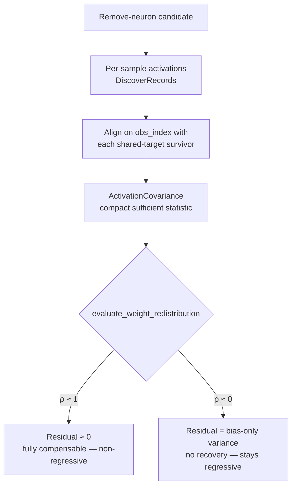

# PR Summary — Issue #1559

## Summary

Persist a compact **per-sample sufficient statistic** for remove-neuron
candidates and evaluate the #1558 counterfactual (d) — **weight-redistribution
compensation** — from it. Closes #1559.

The #1558 study found that NEAT-AI's mean-preserving **bias** compensation
cancels only the *mean* of a removed neuron's downstream contribution; the
residual cost that survives is the neuron's genuine **per-sample (variance)**
downstream signal. Of the five strategies studied, only **(d) — folding the
removed neuron's per-sample contribution into a correlated survivor's downstream
weight** has a ceiling that reaches a non-regressive removal. Its blocker was
data: the failure artefact held only scalar aggregates (`averageActivation`,
`sampleCount`), so (d) could not be evaluated.

This PR adds `src/analysis/remove_neuron_compensation.rs` (Issue #1559), which:

1. **Persists a compact sufficient statistic** — `ActivationCovariance` holds
   the population mean/variance/covariance of the candidate neuron against each
   surviving neuron that shares a downstream target. It is `O(1)` in the sample
   count (a handful of scalars per candidate/survivor pair), so full per-sample
   vectors need never be stored. It is accumulated in a single numerically
   stable pass (the two-variable extension of Welford's algorithm).
2. **Evaluates counterfactual (d)** — `evaluate_weight_redistribution` computes
   the optimal least-squares weight bump `Δw = w_c · cov(a_c, a_s) / var(a_s)`
   and the residual per-sample variance it leaves,
   `w_c² · var(a_c) · (1 − ρ²)`. A perfectly correlated survivor (`ρ = 1`)
   drives the residual to zero (`fully_compensable = true`) — the removal
   becomes non-regressive, which the mean-only bias lever can never achieve.
3. **Ties it together end to end** — `shared_downstream_targets` enumerates
   survivors sharing a downstream target, `aligned_activations` joins two
   neurons' per-sample `DiscoverRecord`s on `obs_index`, and
   `best_weight_redistribution` picks the survivor whose redistribution recovers
   the most variance (returning `None` — no fabricated compensation — when no
   shared-target survivor has aligned samples).

### Design note — sizing/retention

Per the issue's scope note, full per-sample vectors are prohibitive, so we
persist the compact covariance sufficient statistic instead. `DiscoverRecord`
already carries the per-sample activations at evaluation time; the new statistic
is derived from them on demand, keeping the persisted footprint `O(survivors)`
per candidate rather than `O(samples)`.

## Evidence

Backend/library change — no web UI to screenshot. Verified via the TDD test
suite (`tests/issue_1559_weight_redistribution.rs`, 9 tests) and the module's
inline unit tests, all passing. Key behaviours asserted:

- Perfectly correlated survivor → residual variance ≈ 0 → `fully_compensable`
  (the removal flips to non-regressive).
- Uncorrelated survivor → recovers nothing → stays regressive.
- Partial correlation → recovers exactly the `ρ²` fraction.

## Test Plan

New tests in `tests/issue_1559_weight_redistribution.rs`:

- `covariance_statistic_matches_hand_computed_values` — mean/variance/covariance
  and correlation against hand-computed values.
- `covariance_statistic_is_none_for_empty_input` — empty stream persists nothing.
- `aligned_activations_joins_on_obs_index` — inner join on `obs_index`, no
  fabricated pairs.
- `perfectly_correlated_survivor_is_fully_compensable` — (d) recovers the full
  per-sample variance; `Δw = w_c`.
- `uncorrelated_survivor_recovers_nothing` — no recovery, stays regressive.
- `partial_correlation_recovers_rho_squared_fraction` — recovers exactly `ρ²`.
- `shared_downstream_targets_enumerates_survivors` — survivor enumeration
  excludes the candidate and non-shared neurons.
- `best_weight_redistribution_selects_correlated_survivor` — end-to-end pick of
  the correlated survivor from per-sample records.
- `best_weight_redistribution_none_without_shared_survivor` — `None` when (d)
  cannot be evaluated.

Inline unit tests in `src/analysis/remove_neuron_compensation.rs`:

- `correlation_is_zero_for_constant_survivor`
- `redistribution_never_reports_negative_recovery`

All pass under `./quality.sh` (`cargo fmt`, `clippy -D warnings`, `cargo check`,
`cargo doc -D warnings`, tests). The only failure observed in the full gate was
the pre-existing flaky timing test
`focus::tests::focus_ranking_aborts_when_budget_exceeded` (expected abort within
1.125s, took 1.143s under compile load) — unrelated to this pure-computation
change and passes reliably in isolation (3/3).
