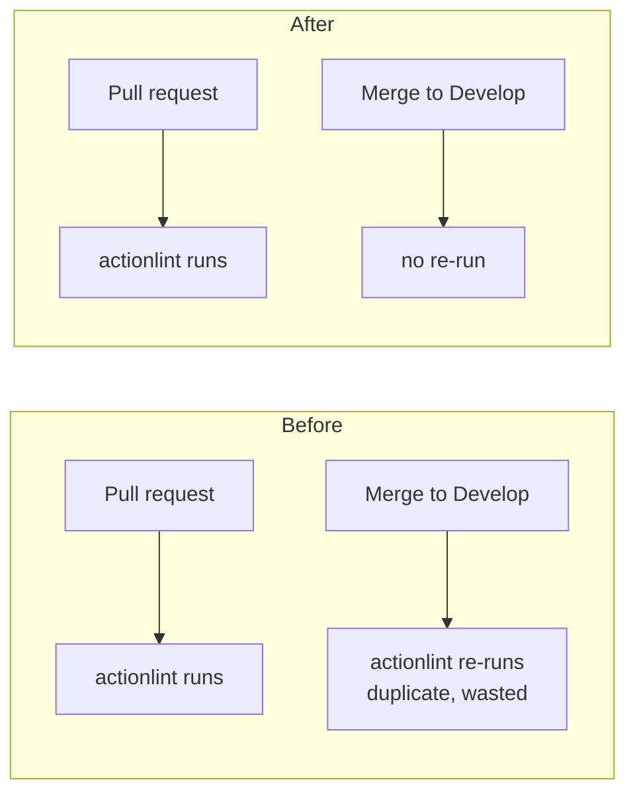

## Summary

`.github/workflows/actionlint.yml` is a **checker** workflow — it lints the
repository's GitHub Actions workflow files. It was triggering on `push` to the
default branch `Develop` (and `main`/`master`), so every merge into `Develop`
re-ran the exact lint that had already gated the pull request. That duplicate
post-merge run wastes CI minutes and can leave a red tick on `Develop` for a
check that already passed on the PR.

This change drops the `push:` trigger entirely, leaving the `pull_request`
trigger so the gate runs on the pull request only. This matches the sibling
checker workflows in this repo (`gitleaks.yml`, `semgrep.yml`, `shellcheck.yml`,
`cargo-quality.yml`), which are all `pull_request`-only. Deploy/publish/release
workflows are unaffected — only this checker changed.

Closes #1563.

## Evidence

Backend/CI-config change — no web UI to screenshot. Verified via the workflow
unit tests in `tests/issue_1292_actionlint_workflow.rs`:

- `actionlint_workflow_triggers_on_pull_request_not_push_develop` — asserts the
  `on:` block keeps `pull_request` and that no `push:` trigger reaches the
  default branch `Develop`. Confirmed it **fails** against the pre-fix workflow
  (with `push: branches: [main, master, Develop]`) and **passes** after the fix
  — a genuine regression test.
- The remaining six structural checks (existence, minimal `permissions:`, SHA
  pinning, job timeout, concurrency, actionlint invocation) still pass
  unchanged.

## Documented business-logic change

Issue #1292's original test `actionlint_workflow_triggers_on_pull_request_and_push`
asserted the workflow triggers on `push`. Issue #1563 intentionally removes that
`push` trigger, so this test was reworked (not deleted) into
`actionlint_workflow_triggers_on_pull_request_not_push_develop`, which now
asserts the checker gates the pull request only and does not re-run on push to
`Develop`. The module doc comment records this supersession.

## Test Plan

- Reworked `tests/issue_1292_actionlint_workflow.rs` trigger test (see above);
  verified fail-before / pass-after.
- `cargo test --test issue_1292_actionlint_workflow` — 7 passed.
- `./quality.sh` — `cargo fmt`, `clippy`, `check` and the release build pass.
  The test run reported **1259 passed, 1 failed**. The single failure is
  `focus::tests::focus_ranking_aborts_when_budget_exceeded` — a timing-sensitive
  regression guard whose ceiling is `budget + grace = 1125ms`; under the loaded
  build machine the abort took 1150ms (a ~25ms scheduling overshoot). It is
  **pre-existing and unrelated to this change**: it reproduces identically on the
  clean base tree (verified via `git stash`), and this PR only edits a workflow
  YAML trigger and its text-only test — nothing that touches `focus` timing.

