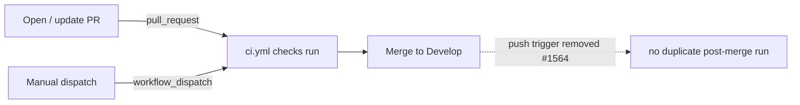

## Summary

`ci.yml` is a test/lint/scan **checker** workflow — every job is guarded
`if: github.event_name == 'pull_request'`. It still triggered on `push:` to the
default branch (`Develop`), so each merge kicked off a post-merge run that only
re-ran checks already gated on the PR (and, given the job guards, started an
otherwise empty run). That wasted runner capacity and risked a stray red tick on
`Develop`.

This PR drops the `push:` trigger from the `on:` block, keeping the
`pull_request:` and `workflow_dispatch:` triggers so PRs are still gated and
manual runs remain available. Deploy/publish/release workflows must keep firing
on push — a checker gates the PR only.

Closes #1564.

## Evidence

Backend/CI-config change — no web interface to screenshot. Verified via new Rust
tests that parse `.github/workflows/ci.yml` (matching the sibling
`issue_1288_workflow_concurrency.rs` text-parsing pattern; no YAML parser is in
the dependency tree) and via `actionlint` (my `on:`-block edit introduced no new
findings).

Before / after `on:` block:

| Trigger            | Before        | After         |
| ------------------ | ------------- | ------------- |
| `push: Develop`    | ✅ (duplicate) | ❌ removed     |
| `pull_request`     | ✅             | ✅ kept        |
| `workflow_dispatch`| ✅             | ✅ kept        |

## Test Plan

Added `tests/issue_1564_ci_no_push_trigger.rs`:

- `ci_yml_has_no_push_trigger` — reproduces #1564: fails against the unfixed
  workflow (a `push:` key exists in the `on:` block), passes after removal.
- `ci_yml_on_block_does_not_reference_develop_push` — guards against a `push:`
  targeting `Develop` sneaking back in.
- `ci_yml_keeps_pull_request_and_dispatch_triggers` — asserts the PR and manual
  triggers are retained.

All three pass; the sibling workflow tests
(`issue_1288_workflow_concurrency`, `issue_1292_actionlint_workflow`) still pass.
The full `./quality.sh` suite passes bar one timing-sensitive flake
(`focus::tests::focus_ranking_aborts_when_budget_exceeded`, 1.189s vs 1.125s
budget) that is unrelated to this YAML change and passes in isolation.
