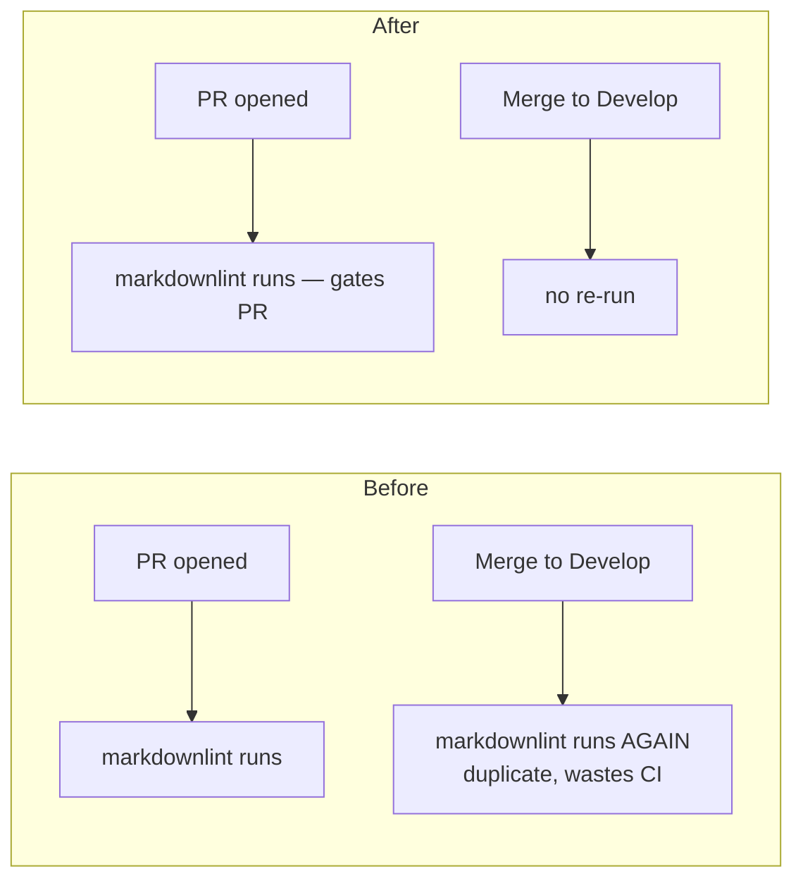

# PR Summary — Issue #1565

## Summary

`.github/workflows/markdown-lint.yml` is a test/lint checker workflow, yet it
still triggered on `push:` to the default branch (`Develop`). Once required as a
status check, every merge into `Develop` re-ran the lint that already gated the
pull request — a duplicate post-merge run that wastes CI minutes and can leave a
stray red tick on the default branch.

This PR drops the `push:` trigger, leaving the workflow to gate the pull request
only. This aligns `markdown-lint.yml` with its sibling checker workflows —
`actionlint.yml` (#1563) and `ci.yml` (#1564) — which are already
`pull_request:`-only. An explanatory comment records the rationale so the
trigger is not re-added.

Closes #1565.

### Before / After

## Evidence

Backend/CI-config change — no web interface to screenshot. Verified via the new
Rust test that parses the workflow's `on:` block:

- `tests/issue_1565_markdown_lint_no_push_trigger.rs` — 3 tests, all passing:
  - `markdown_lint_yml_has_no_push_trigger` — no `push:` key in the `on:` block.
  - `markdown_lint_yml_on_block_does_not_reference_develop_push` — guards against
    a `push:` to `Develop` sneaking back in.
  - `markdown_lint_yml_keeps_pull_request_trigger` — the `pull_request:` trigger
    is retained so PRs are still gated.

The test mirrors the sibling `tests/issue_1564_ci_no_push_trigger.rs`
(plain-text parse, no YAML parser in the dependency tree).

### Note on `quality.sh`

The full quality gate passed except for one pre-existing flaky timing test,
`focus::tests::focus_ranking_aborts_when_budget_exceeded` (expected abort within
1.125s, observed 1.169s under compile load). It is unrelated to this
YAML/test-only change and passes reliably (3/3) when run in isolation.

## Test Plan

- Added `tests/issue_1565_markdown_lint_no_push_trigger.rs` (3 tests) — fails
  against the unfixed workflow (which had `push: branches: [main, master,
  Develop]`) and passes after the `push:` trigger is removed.
- Ran the new test suite: `cargo test --test
  issue_1565_markdown_lint_no_push_trigger -- --test-threads=1` → 3 passed.
