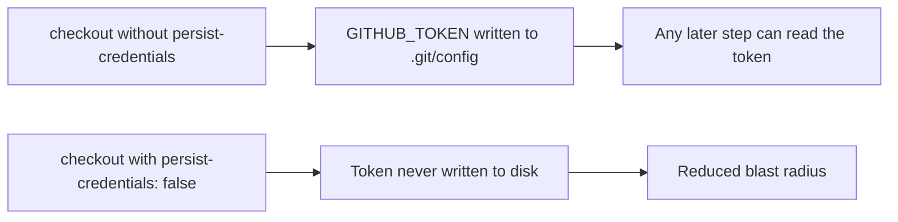

## Summary

Hardened the `actionlint` workflow's checkout step against `GITHUB_TOKEN`
leakage. By default `actions/checkout` persists the workflow token into
`.git/config` as an auth header, where any later step in the job — including a
compromised dependency or injected script — can read it and act as the token.
The `actionlint` job only reads workflow files under `.github/workflows`; it
never pushes back to the repository nor fetches private submodules, so it does
not need the persisted credential. Added `persist-credentials: false` to stop the
token being written to disk, shrinking the blast radius of a compromised step.
Mirrors the sibling fix applied to `cargo-quality.yml` (Issue #1567).

Closes #1566.

## Evidence

Pure CI/workflow change — no application code or web interface to screenshot.
The checkout step now reads:

```yaml
      - uses: actions/checkout@de0fac2e4500dabe0009e67214ff5f5447ce83dd # v6.0.2
        with:
          persist-credentials: false
```



TDD confirmation: the new test `actionlint_workflow_checkout_disables_persist_credentials`
was verified to FAIL against the unfixed workflow and PASS after the fix.

## Test Plan

- Added `tests/issue_1292_actionlint_workflow.rs::actionlint_workflow_checkout_disables_persist_credentials`,
  which parses the checkout step's `with:` block and asserts
  `persist-credentials: false` is present. This addresses the
  `github-actions-audit` finding `BP-PERSIST-CREDS-actionlint-actionlint-0`.
- Ran `cargo test --test issue_1292_actionlint_workflow -- --test-threads=2` —
  all 8 tests pass (7 existing structural checks + the new credential check).
- `cargo fmt --all -- --check` and
  `cargo clippy --test issue_1292_actionlint_workflow --all-features -- -D warnings`
  pass cleanly.

## Note on quality.sh

`./quality.sh` runs `cargo upgrade --incompatible`, which bumps `wgpu` 29→30 —
a breaking API change (`BufferSlice::map_range`/`get_mapped_range` now return
`Result`) that fails to compile. This is a pre-existing dependency-upgrade
breakage unrelated to this YAML/test-only change; the out-of-scope `Cargo.toml`
/ `Cargo.lock` bumps were reverted. The affected files here (`.github/workflows/`,
`tests/`) compile, format, lint, and test cleanly against the pinned dependency set.
