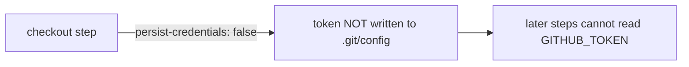

## Summary

Hardened the `actionlint` workflow's checkout step against `GITHUB_TOKEN`
leakage. By default `actions/checkout` persists the workflow token into
`.git/config` as an auth header, where any later step in the job — including a
compromised dependency or injected script — can read it and act as the token.
The `actionlint` job only reads workflow files; it never pushes back to the
repository nor fetches private submodules, so it does not need the persisted
credential. Added `persist-credentials: false` to stop the token being written
to disk, shrinking the blast radius of a compromised step.

Closes #1566.

## Evidence

Pure CI/workflow change — no application code or web interface to screenshot.
Verified locally with `actionlint`:

```
$ actionlint .github/workflows/actionlint.yml
actionlint PASS
```

The checkout step now reads:

```yaml
      - uses: actions/checkout@de0fac2e4500dabe0009e67214ff5f5447ce83dd # v6.0.2
        with:
          persist-credentials: false
```



## Test Plan

- Ran `actionlint .github/workflows/actionlint.yml` — passes, confirming the
  workflow remains syntactically valid after the change.
- Change addresses the `github-actions-audit` finding
  `BP-PERSIST-CREDS-actionlint-actionlint-0` by adding
  `persist-credentials: false` to the flagged checkout step
  (`.github/workflows/actionlint.yml`).
