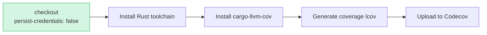

## Summary

Hardened the `coverage` job in `.github/workflows/cargo-quality.yml` by adding
`persist-credentials: false` to its `actions/checkout` step. By default checkout
writes the workflow's `GITHUB_TOKEN` into `.git/config` as an auth header, where
any later step in the job — including a compromised dependency or injected
script — can read it and act as the token. The `coverage` job only reads the
checkout, builds coverage with `cargo llvm-cov`, and uploads the report to
Codecov; it never pushes back to the repository nor fetches a private submodule,
so it does not need the persisted credential. Disabling persistence keeps the
token off disk and narrows the blast radius of a compromised step (defence in
depth, least privilege). Closes #1567.

## Evidence

Backend/CI-only change — no web interface to screenshot. Verification performed:

- `persist-credentials: false` is now present on the `coverage` checkout step
  and is the only checkout in the workflow.
- The workflow YAML parses cleanly (`yaml.safe_load` succeeds).
- The job's remaining steps confirm it neither pushes to the repo nor fetches a
  private submodule, so removing the persisted credential does not break it.

No step after checkout reads `.git/config` credentials — the token is no longer
written to disk.

## Test Plan

- Change is confined to workflow YAML; no Rust source changed, so the Rust
  `quality.sh` gate (fmt/clippy/check/test/build) is not applicable.
- Validated the workflow parses as valid YAML.
- The repository's own `Coverage` workflow runs on this PR and exercises the
  amended checkout end-to-end, confirming the coverage build and Codecov upload
  still succeed without the persisted credential.
