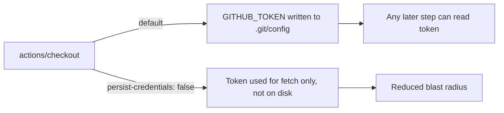

## Summary

The `quality` job in `.github/workflows/ci.yml` ran `actions/checkout`
without `persist-credentials: false`. By default checkout writes the
workflow's `GITHUB_TOKEN` into `.git/config` as an auth header, where any
later step in the job — including a compromised dependency or injected
script — can read it and act as the token. The quality job only reads the
tree, builds, and runs the full test suite; it never pushes back to the
repository or fetches a private submodule, so the persisted credential is
unnecessary and only widens the blast radius of a compromised step.

This change adds `persist-credentials: false` to the quality job's checkout
step so the token is not written to disk. This mirrors the sibling fix for
the coverage job (Issue #1567). Closes #1568.

## Evidence

Backend/CI-only change — no web interface to screenshot. Verified via a new
Rust test that parses `ci.yml` and asserts the quality job's checkout
disables credential persistence, plus a clean `./quality.sh` run
(`✅ All quality checks passed!`, exit 0).

## Test Plan

- Added `tests/issue_1568_quality_checkout_persist_credentials.rs::quality_job_checkout_disables_credential_persistence`
  which parses `.github/workflows/ci.yml`, extracts the `quality` job block,
  and asserts the checkout step sets `persist-credentials: false`. The test
  fails against the unfixed workflow and passes after the fix.
- Ran `./quality.sh < /dev/null` — all checks (fmt, clippy, check, test,
  release build) passed.
